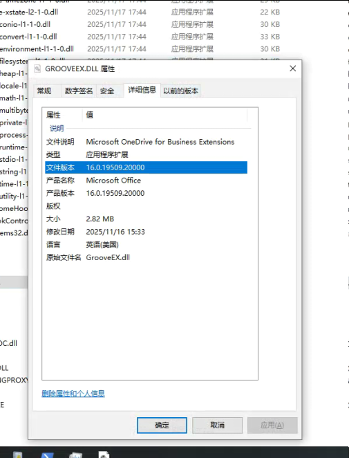
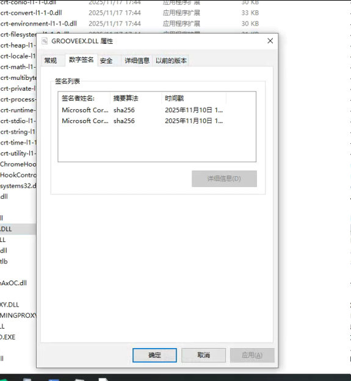

# Office 已知问题 GROOVEEX.DLL 带崩进程

这是一位老师向我反馈的问题，我的一个 WPF 应用程序在他的设备上，任何弹出保存文件对话框或打开文件对话框的功能，都会导致进程闪退。经过进一步调查，我发现他电脑上任何软件弹出文件保存对话框都会闪烁，问题本身和 WPF 无关。最终调查到是 Office 的一个注入组件导致的问题

<!--more-->
<!-- CreateTime:2025/11/20 07:09:34 -->
<!-- 发布 -->
<!-- 博客 -->

问题现象：

任何 32 位应用程序调用 Win32 的保存文件对话框或打开文件对话框时，将会导致进程闪退

问题分析：

通过 procdump 工具，执行如下命令捞取到 DUMP 文件

```
procdump -ma -t 10384
```

更多 procdump 工具介绍和用法，请参阅 [dotnet 代码调试方法](https://blog.lindexi.com/post/dotnet-%E4%BB%A3%E7%A0%81%E8%B0%83%E8%AF%95%E6%96%B9%E6%B3%95.html )

捞取到 DUMP 文件之后，用 7z 压缩传输回我的开发设备，拖入 Visual Studio 开启混合调试模式

<!--  -->


可见进程崩溃的原因是 “该线程尝试读写某个虚拟地址，而它对该地址不具有相应的访问权限” 导致的，如下图所示

<!--  -->


此时的异常堆栈如下

```
>	msvcp140.dll!mtx_do_lock(_Mtx_internal_imp_t * mtx=0x7c041850, const xtime * target=0x00000000) 行 103	C++
 	msvcp140.dll!_Mtx_lock(_Mtx_internal_imp_t * mtx=0x7c041850) 行 176	C++
 	GROOVEEX.DLL!7bdf3702()	未知
 	[下面的框架可能不正确和/或缺失，没有为 GROOVEEX.DLL 加载符号]	
 	GROOVEEX.DLL!7bdfbc8e()	未知
 	GROOVEEX.DLL!7bf05eb8()	未知
 	GROOVEEX.DLL!7bf05643()	未知
 	GROOVEEX.DLL!7bf0a7bb()	未知
 	combase.dll!7656b791()	未知
 	combase.dll!76568951()	未知
 	combase.dll!765688ff()	未知
 	combase.dll!765668bc()	未知
 	combase.dll!76564b85()	未知
 	combase.dll!76572e45()	未知
 	combase.dll!765e2cf5()	未知
 	combase.dll!765e2bad()	未知
 	combase.dll!765e2b31()	未知
 	combase.dll!7657230d()	未知
 	combase.dll!76572b4d()	未知
 	combase.dll!76572314()	未知
 	combase.dll!76572e45()	未知
 	combase.dll!7659a5a2()	未知
 	combase.dll!765dc1f6()	未知
```

异常信息如下

```
0x66A25883 (msvcp140.dll) (3ea524df923b4d8483fedff3e2e4b1a3.dmp 中)处有未经处理的异常: 0xC0000005: 读取位置 0x00000000 时发生访问冲突。
```

通过模块窗口可见 GROOVEEX.DLL 的路径是： C:\Program Files\Microsoft Office\root\vfs\ProgramFilesX86\Microsoft Office\Office16\GROOVEEX.DLL

<!--  -->


出现问题的 GROOVEEX.DLL 文件的版本是 16.0.19509.20000

<!--  -->


查看签名文件确实是微软的签名，预计就是软软写错了什么代码导致的问题

<!--  -->


尝试将 C:\Program Files\Microsoft Office\root\vfs\ProgramFilesX86\Microsoft Office\Office16\GROOVEEX.DLL 文件干掉后重启电脑，就不会出现问题了。如此也可证明确实是 Office 投毒

在网上搜到了对 grooveex.dll 文件的描述：

> The grooveex.dll is an application extension for OneDrive for Business (Groove.exe).
>
> The new OneDrive sync client (OneDrive.exe) doesn’t use this file. As you mentioned that the issue is caused by the grooveex.dll, for this situation, we suggest you exclude the groove.exe when you install Office with Office Deployment Tool. Then you can use the new OneDrive sync client instead of the groove.exe. 

和：

> As Rena mentioned in the former thread, the GROOVEEX.DLL file is related to the legacy OneDrive for Business sync client. Before, this sync client will be automatically installed with the Office suite from Office 365 for Business plans. If it still causes some issues on your computer, you may consider removing it with the steps mentioned in Rena's post. To learn more, see Changes to the previous OneDrive sync client (Groove.exe) in Office 2016 Click-to-Run.

可见这是一个用在 OneDrive 上的组件

类似的 GROOVEEX.DLL 导致其他进程崩溃的记录如下：

- [Grooveex.dll crashing vMix](https://forums.vmix.com/posts/t25524-Grooveex-dll-crashing-vMix )
- [Solved: Re: After effects crashes when the Explorer window... - Page 2 - Adobe Product Community - 9154276](https://community.adobe.com/t5/after-effects-discussions/after-effects-crashes-when-the-explorer-window-opens/m-p/13167454/page/2 )

如此可见 GROOVEEX.DLL 导致崩溃是一直都有人反馈的

特别感谢 [lsj](https://blog.sdlsj.net) 的协助，让我了解了更本质的原因。通过错误堆栈 `msvcp140.dll!_Mtx_lock(_Mtx_internal_imp_t * mtx=0x7c041850)` 在网上搜，可见这是 <https://github.com/microsoft/STL/issues/4730> 问题导致的。我的应用程序是自己带 VC 运行时的，我自己带的 VC 运行时比较旧，而 GROOVEEX.DLL 依赖新的 VC 运行时，此行为触发了此 VC 运行时问题

这就意味着应用程序如果加载了自己带的旧版本的 VC 运行时，那么弹出文件对话框时，加载了 GROOVEEX.DLL 组件，将会由于 VC 版本兼容性问题导致进程崩溃

参考文档：

- [GROOVEEX.DLL file is back in the folder - Microsoft Q&A](https://learn.microsoft.com/en-us/answers/questions/4937952/grooveex-dll-file-is-back-in-the-folder )
- [What does grooveex.dll do exactly? - Microsoft Q&A](https://learn.microsoft.com/en-us/answers/questions/4925333/what-does-grooveex-dll-do-exactly?forum=msoffice-msoffice_onedrivefb-mso_win10-mso_o365b&referrer=answers )

- [VCRuntime incompatibility with older version in mutex code · Issue #4730 · microsoft/STL](https://github.com/microsoft/STL/issues/4730 )

- [Crash on specific builds, when OAL is compiled using VS 2022 with Multithread DLL · Issue #1035 · kcat/openal-soft](https://github.com/kcat/openal-soft/issues/1035 )

- [windows - First std::mutex::lock() crashes in application built with latest Visual Studio 2022 - Stack Overflow](https://stackoverflow.com/questions/78598141/first-stdmutexlock-crashes-in-application-built-with-latest-visual-studio )