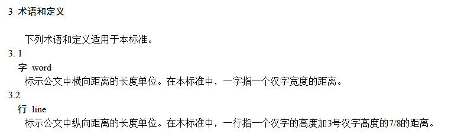
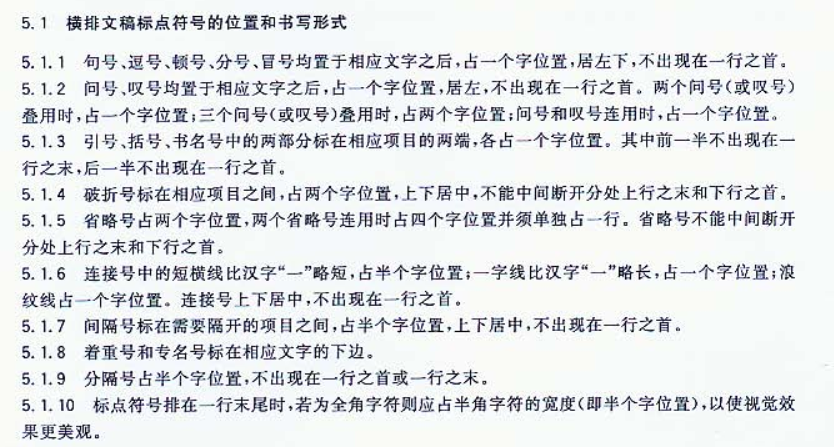

# Office 文档 文本排版布局 中华人民共和国国家标准 标点符号用法

我在做一个和 Office 差很多的文本排版软件，而文本排版软件里面的是有国家标准的，如果不符合标准那么这个排版软件是不专业的，或者说这个软件只是一个纯文本软件，而不是一个能做文档的软件

<!--more-->
<!-- CreateTime:2020/7/17 11:07:53 -->

核心规则如下

<!--  -->

其中标点符号规则相对复杂，规范如下

<!--  -->

详细请看 GB/T 15834 标点符号用法

请自行百度 `GB/T 15834` 就可以找到标准文档

当前支持最好的是 WPS 的文本排版，支持较弱的是 MS Office 的 Word 软件，而我的软件支持更差

 本作品采用<a rel="license" href="http://creativecommons.org/licenses/by-nc-sa/4.0/">知识共享署名-非商业性使用-相同方式共享 4.0 国际许可协议</a>进行许可。欢迎转载、使用、重新发布，但务必保留文章署名[林德熙](http://blog.csdn.net/lindexi_gd)(包含链接:http://blog.csdn.net/lindexi_gd )，不得用于商业目的，基于本文修改后的作品务必以相同的许可发布。如有任何疑问，请与我[联系](mailto:lindexi_gd@163.com)。
