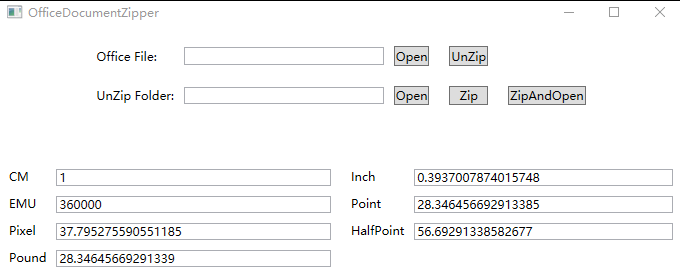

# Office Open XML 的测量单位

本文记录 Office Open XML (OOXML) 的测量单位

<!--more-->


<!-- CreateTime:2020/2/19 16:19:12 -->


在 Office Open XML 默认单位是 dxa 也就是像素点的 20 倍，如 ISO 216 A4 (210x297mm ~ 8.3×11.7in) 的大小可以使用下面代码表示

在页面大小 Page width Page height 和边距 margin 和缩进 tabs 使用

```
<w:pgSz w:w="11906" w:h="16838"/>
```

单位计算可以使用下面公式

```
像素 Points = dxa/20 
英寸 Inches = Points/72
厘米 Centimeters = Inches*2.54
```

在 OpenXML 因为 dxa 是像素点的 20 倍，所以也叫二十分之一点，另外这里说的像素点是 Point 而不是像素 Pixel 哦

缩写如下

- Points:pt
- Inches:in
- Centimeters:cm

以 A4 为例

```
Width = 11906 dxa = 595.3 point = 8.27 in = 21 cm
```

## Half-points

用来表示字体大小的半点，一个点等于两个半点，如表示 12pt 可以这样写

```xml
// run properties
<w:rPr>
  // 24 = 12pt
  <w:sz w:val="24"/>
</w:rPr>
```

## Fiftieths of a Percent

表示百分比相对值，用于表示表格的宽度和相对宽度，他的值和百分比换算如下

```
n/100 * 5000
```

如百分之50可以表示为 50/100 * 5000 pct 的大小，如表格的宽度是百分之50宽度

```xml
<w:tbl>
    <w:tblPr>
      <!-- 表格宽度是百分之50宽度 -->
      <w:tblW w:w="2500" w:type="pct"/>
    </w:tblPr>
    <w:tblGrid/>
    <w:tr>
        <w:tc>
            <w:p>
                <w:r>
                    <w:t>Hello, World!</w:t>
                </w:r>
            </w:p>
        </w:tc>
    </w:tr>
</w:tbl>
```

## English Metric Unit

这也是最常用的单位，使用 EMUs (English Metric Unit) 用来表示图片和其他元素的宽度，换算如下

```
1 in = 914400 EMUs
1 cm = 360000 EMUs
```

如用于 `w:drawing` 绘制，表示绘制画布的宽度 `<wp:extent cx="1530350" cy="2142490"/>` 用这么大的数是可以提高精度和性能，不需要通过浮点计算

关于 EMU 的定义，请看 ECMA 376 的 20.1.2.1 内容

## 开源库

我开源了 [dotnetCampus.OpenXMLUnitConverter](https://github.com/dotnet-campus/dotnetCampus.OfficeDocumentZiper) 包含了本文的转换方法

<!--  -->


工具获取方法是通过以下命令安装 dotnet 工具

```
dotnet tool update -g dotnetCampus.OfficeDocumentZipper
```

启动工具方法是在命令行输入下面代码

```
OfficeDocumentZipper
```

另外，在项目使用，可以通过 NuGet 安装 dotnetCampus.OpenXMLUnitConverter 这个库

```
dotnet add package dotnetCampus.OpenXMLUnitConverter
```

这个库同时包含使用 [SourceYard](https://github.com/dotnet-campus/SourceYard) 打包的源代码 NuGet 包，可以使用下面代码安装

```
dotnet add package dotnetCampus.OpenXMLUnitConverter.Source
```

也可以在 csproj 添加下面代码

```xml
<PackageReference Include="dotnetCampus.OpenXMLUnitConverter.Source" Version="1.0.2-alpah01">
  <PrivateAssets>all</PrivateAssets>
  <IncludeAssets>runtime; build; native; contentfiles; analyzers</IncludeAssets>
</PackageReference>
```

更多请看 [Office 使用 OpenXML SDK 解析文档博客目录](https://blog.lindexi.com/post/Office-%E4%BD%BF%E7%94%A8-OpenXML-SDK-%E8%A7%A3%E6%9E%90%E6%96%87%E6%A1%A3%E5%8D%9A%E5%AE%A2%E7%9B%AE%E5%BD%95.html )


<a rel="license" href="http://creativecommons.org/licenses/by-nc-sa/4.0/"></a><br />本作品采用<a rel="license" href="http://creativecommons.org/licenses/by-nc-sa/4.0/">知识共享署名-非商业性使用-相同方式共享 4.0 国际许可协议</a>进行许可。欢迎转载、使用、重新发布，但务必保留文章署名[林德熙](http://blog.csdn.net/lindexi_gd)(包含链接:http://blog.csdn.net/lindexi_gd )，不得用于商业目的，基于本文修改后的作品务必以相同的许可发布。如有任何疑问，请与我[联系](mailto:lindexi_gd@163.com)。