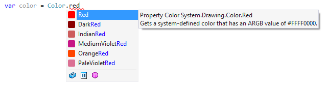

# ReSharper 显示使用的颜色

在代码里面输入类似于 Colors.Red 的代码，将会自动在代码后面显示一个对应颜色的小方块。本文将告诉大家这个功能的开关在哪里

<!--more-->

<!-- CreateTime:2024/05/08 07:29:54 -->

<!-- 发布 -->
<!-- 博客 -->

如 ReSharper 的[官方文档](https://www.jetbrains.com.cn/en-us/help/resharper/Coding_Assistance__Color_Assistance.html)描述，此功能的效果如下

<!--  -->

或如下

<!--  -->

此功能名叫 “Highlight color usages” 可以对代码里面的颜色进行颜色标识，比如在代码提示或在编写完成里显示代码的颜色对应的颜色方块。可在 ReShaprer 的选项的 Code Inspection 的 Settings 里面，通过勾选或去掉勾选 Highlight color usages 来决定功能的开关

<!--  -->

更多 ReSharper 相关，请参阅我的 [博客导航](https://blog.lindexi.com/post/%E5%8D%9A%E5%AE%A2%E5%AF%BC%E8%88%AA.html )

 本作品采用<a rel="license" href="http://creativecommons.org/licenses/by-nc-sa/4.0/">知识共享署名-非商业性使用-相同方式共享 4.0 国际许可协议</a>进行许可。欢迎转载、使用、重新发布，但务必保留文章署名[林德熙](http://blog.csdn.net/lindexi_gd)(包含链接:http://blog.csdn.net/lindexi_gd )，不得用于商业目的，基于本文修改后的作品务必以相同的许可发布。如有任何疑问，请与我[联系](mailto:lindexi_gd@163.com)。