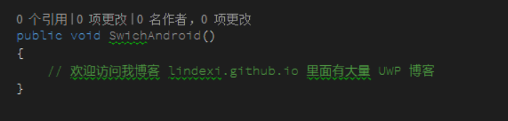
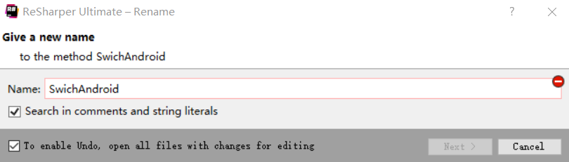
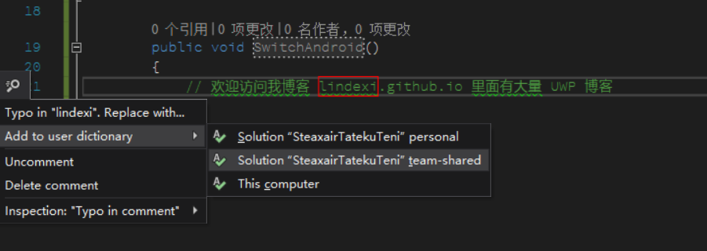
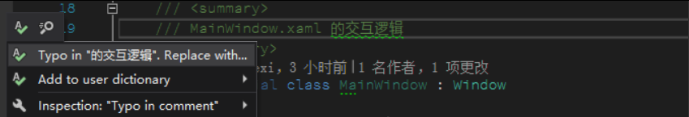
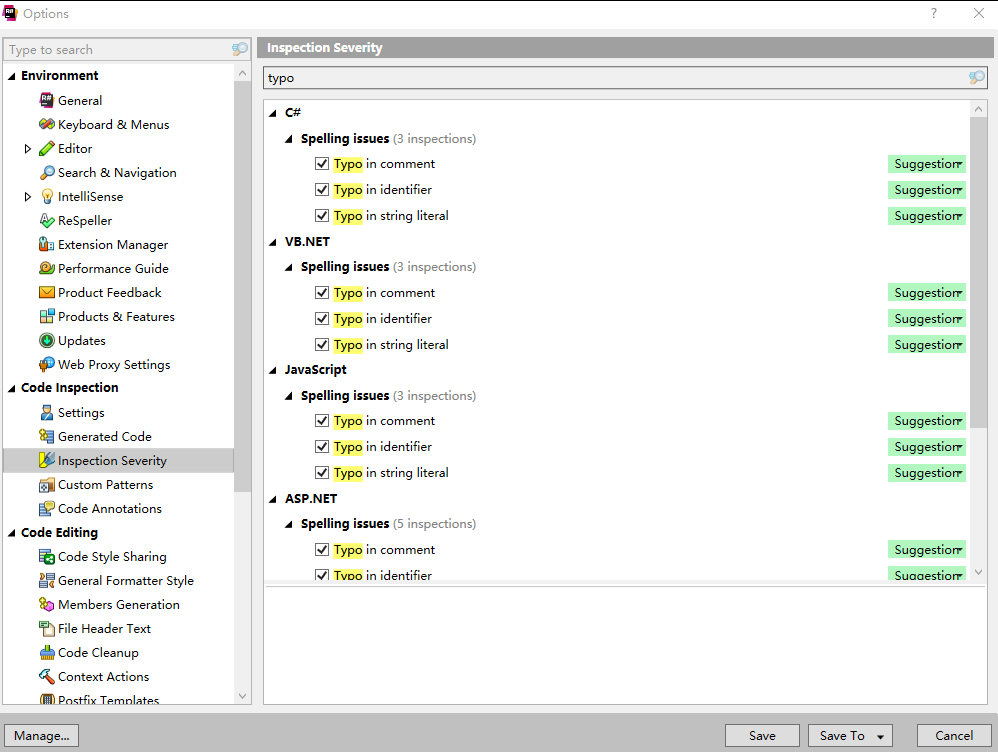
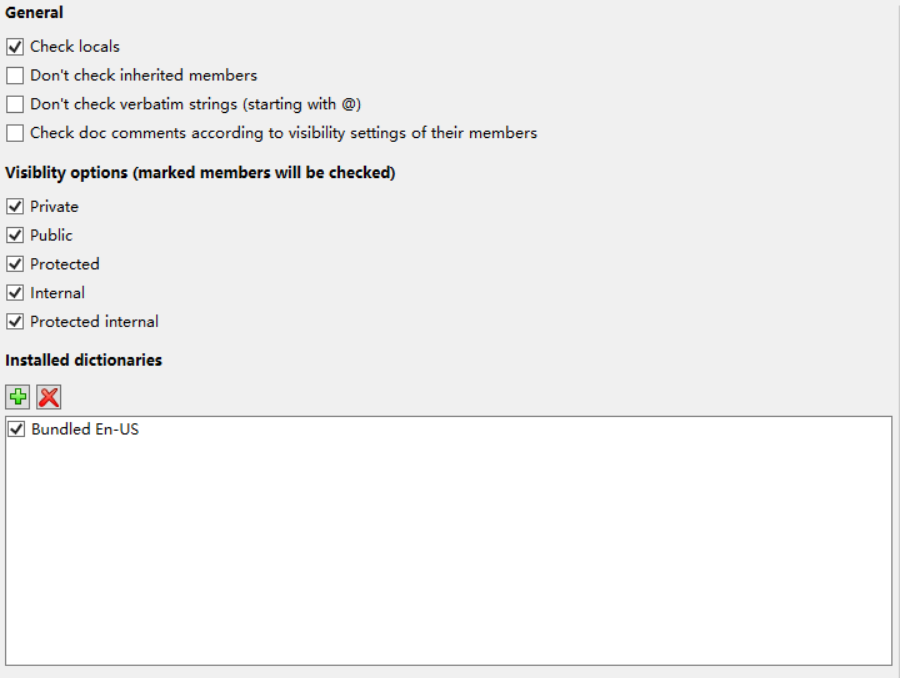

# Resharper 去掉注释拼写

最近在 Resharper 的 2018.2.1 的版本，提供了单词拼写功能，如果自己写错了单词，可以在 Resharper 提示

<!--more-->
<!-- CreateTime:2019/11/26 8:42:05 -->

<!-- 标签：resharper -->

## Resharper 的拼写

在 Resharper 的 2018.2.1 的版本可以自动找出单词拼写，包括注释的单词，命名空间，属性字段命名，方法命名和方法内的局部变量。

通过 Resharper 修改变量命名也很简单

如我写出下面的函数

<!--  -->

这时我的 `switch` 单词写不对，从上面图片可以看到单词下面有下划线，通过在下划线按 `alt+enter` 就看可以看到 Resharper 的提示

<!--  -->

这时可以通过 Resharper 的拼写重新命名，注意现在的 Resharper 还不会自动帮你选择一个单词，需要自己修改单词。

<!--  -->

如果单词是自己创建的，可以使用添加到字典，可以添加到自己的设备的设置，可以添加到项目的私人配置，可以添加到项目的团队配置。

<!--  -->

如果添加到团队的设置，就可以使用 git 同步到团队的仓库

但是很多时候在注释都使用中文，而现在的拼写还没支持好中文，所以下面告诉大家如何在 Resharper 关闭提示

## 关闭拼写

很多时候在注释都使用中文，也只有中文的注释需要关闭

<!--  -->

现在在 Resharper 默认就打开这个功能，需要点击 Resharper 选择 Option 在 `Code Inspection->inspection severity` 输入 `typo` 搜索

可以看到下面界面

<!--  -->

这时去掉 `Typo in comment` 就可以不在中文注释提示

这个功能虽然比较好，但是很多时候会发现有很多自己需要的单词是他找不到的，下面告诉大家如何添加字典

## 添加字典

可以从下面的链接找到大量的字典，但是没有包括中文的字典，我暂时也不想去做中文的字典

[dictionaries/dictionaries at master · wooorm/dictionaries](https://github.com/wooorm/dictionaries/tree/master/dictionaries )

在下载完成字典之后，只需要使用 Resharper 的 Option 的 Environment 的 ReSpeller 页面选择安装字典，点击加号添加字典就可以

<!--  -->

参见 [Integrated spell checking with ReSpeller in ReSharper and Rider - .NET Tools Blog.NET Tools Blog](https://blog.jetbrains.com/dotnet/2018/07/10/integrated-spell-checking-respeller-resharper-rider/ )

[Spell Checking with ReSpeller - Help](https://www.jetbrains.com/help/resharper/Spell_Checking.html )

[hunspell/hunspell: The most popular spellchecking library.](https://github.com/hunspell/hunspell )

[https://stackoverflow.com/q/52158837/6116637](https://stackoverflow.com/q/52158837/6116637)

 本作品采用<a rel="license" href="http://creativecommons.org/licenses/by-nc-sa/4.0/">知识共享署名-非商业性使用-相同方式共享 4.0 国际许可协议</a>进行许可。欢迎转载、使用、重新发布，但务必保留文章署名[林德熙](http://blog.csdn.net/lindexi_gd)(包含链接:http://blog.csdn.net/lindexi_gd )，不得用于商业目的，基于本文修改后的作品务必以相同的许可发布。如有任何疑问，请与我[联系](mailto:lindexi_gd@163.com)。
