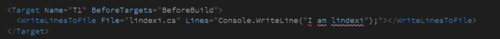
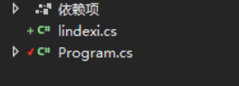

# Roslyn how to use WriteLinesToFile to write the semicolons to file

As you know, the WriteLinesToFile will separate the item by semicolons. How can we use WriteLinesToFile to write the semicolons to file?

<!--more-->
<!-- CreateTime:2019/11/6 19:13:42 -->

<!-- csdn -->

<!-- 标签：Roslyn,MSBuild,编译器 -->


For example, we need to write the code below to file.

```csharp
Console.WriteLine("I am lindexi");
```

As you can see, we can find some problems in the code.

The first thing is the code include quotation mark that we can not write the code directly.

<!--  -->


We can use property item with "CDATA" that CDATA is defined as blocks of text that are not parsed by the parser. 

```xml
    <PropertyGroup>
      <SomeThing>
       <![CDATA[
                Console.WriteLine("I am lindexi");
       ]]>
      </SomeThing>
    </PropertyGroup>
    <WriteLinesToFile File="lindexi.cs" Lines="$(SomeThing)"></WriteLinesToFile>
```

You can find that your content in the file misses the semicolons character.

We can use `%3b` to replace the semicolons. 

```xml
    <PropertyGroup>
      <SomeThing>
       <![CDATA[
                Console.WriteLine("I am lindexi")%3b
       ]]>
      </SomeThing>
    </PropertyGroup>
    <WriteLinesToFile File="lindexi.cs" Lines="$(SomeThing)"></WriteLinesToFile>
```

After you run the target, you can find a file named lindexi.cs added in your project.

```xml
 <Project Sdk="Microsoft.NET.Sdk">

  <PropertyGroup>
    <OutputType>Exe</OutputType>
    <TargetFramework>netcoreapp2.1</TargetFramework>
  </PropertyGroup>

  <Target Name="T2" BeforeTargets="BeforeBuild">
    <PropertyGroup>
      <SomeThing>
       <![CDATA[
                Console.WriteLine("I am lindexi")%3b
       ]]>
      </SomeThing>
    </PropertyGroup>
    <WriteLinesToFile File="lindexi.cs" Lines="$(SomeThing)"></WriteLinesToFile>
  </Target>

 </Project>
``` 

<!--  -->


Please open the file and then you can find the content in the file include the semicolons character.

We can set the property in the WriteLinesToFile task to Overwrite the file.

You can copy the code below to your project file and then run your project. You will see the console output something interesting.

```xml
  <Target Name="T1" BeforeTargets="BeforeBuild">
    <PropertyGroup>
      <SomeThing>
        <![CDATA[
using System%3b

namespace CeseacooteeGowgu
{
    class Program
    {
        static void Main(string[] args)
        {
            Console.WriteLine("I am lindexi")%3b
        }
    }
}
       ]]>
      </SomeThing>
    </PropertyGroup>
    <WriteLinesToFile File="lindexi.cs" Lines="$(SomeThing)" Overwrite="true"></WriteLinesToFile>
    <ItemGroup>
      <Compile Remove="@(Compile)"></Compile>
      <Compile Include="lindexi.cs"></Compile>
    </ItemGroup>
  </Target>
```

I remove all your code and replace the code to the content in SomeThing property. And then I add the code that named lindexi.cs to compile.

## Using MSBuild Escape

We can find this way should change the code. We can not copy the code in other to write to file and we should replace all the semicolons to `%3b` that is hard to change all the code.

We can use MSBuild Escape to escape the semicolons and you can see the code.

```xml
  <Target Name="T1" BeforeTargets="BeforeBuild">
    <PropertyGroup>
      <SomeThing>
        <![CDATA[
using System;

namespace CeseacooteeGowgu
{
    class Program
    {
        static void Main(string[] args)
        {
            Console.WriteLine("I am lindexi");
        }
    }
}
       ]]>
      </SomeThing>
    </PropertyGroup>
    <WriteLinesToFile File="lindexi.cs" Lines="$([MSBuild]::Escape($(SomeThing)))" Overwrite="true"></WriteLinesToFile>
    <ItemGroup>
      <Compile Remove="@(Compile)"></Compile>
      <Compile Include="lindexi.cs"></Compile>
    </ItemGroup>
  </Target>
```

The `[MSBuild]::Escape` can use [property function](https://docs.microsoft.com/en-us/visualstudio/msbuild/property-functions?wt.mc_id=MVP) to escape strings. 

[How to: Escape Special Characters in MSBuild - Visual Studio](https://docs.microsoft.com/en-us/visualstudio/msbuild/how-to-escape-special-characters-in-msbuild?wt.mc_id=MVP )


In the CDATA section that follows, 
             
- `%40` = `@`
- `%25` = `% `
- `%3B` = `;`
- `%24` = `$`