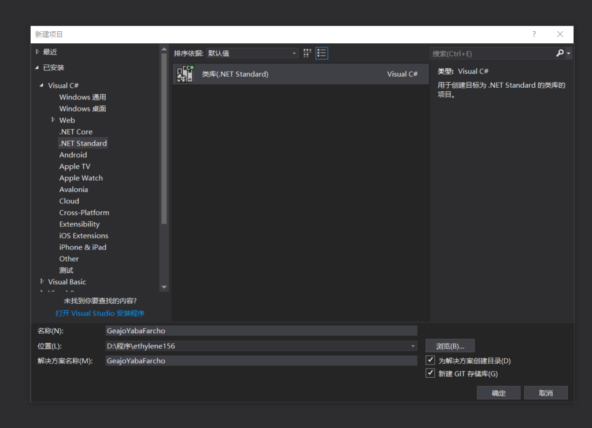

# Roslyn 使用 Directory.Build.props 文件定义编译

本文告诉大家 Directory.Build.props 是什么有什么优点？如何使用 Directory.Build.props 文件定义编译

<!--more-->
<!-- CreateTime:2019/11/29 8:58:55 -->

<!-- csdn -->
<!-- 标签：Roslyn,MSBuild,编译器 -->

在 MSBuild 的 15 之后，也就是安装了 VisualStudio 2017 就可以使用的新功能，支持新的 csproj 格式。如何把以前的格式升级为 VisualStudio 2017 的新格式请看[从以前的项目格式迁移到 VS2017 新项目格式](https://blog.lindexi.com/post/%E4%BB%8E%E4%BB%A5%E5%89%8D%E7%9A%84%E9%A1%B9%E7%9B%AE%E6%A0%BC%E5%BC%8F%E8%BF%81%E7%A7%BB%E5%88%B0-VS2017-%E6%96%B0%E9%A1%B9%E7%9B%AE%E6%A0%BC%E5%BC%8F.html )

在 MSBuild 15 的一个新的功能就是让开发者可以自己定义项目信息放在一个文件，这个文件会在 `Microsoft.Common.props` 引用，而且会在`csproj`项目文件所在的文件夹开始寻找，只要找到存在`Directory.Build.props`文件就会自动导入里面的内容。

除了定义`Directory.Build.props`之外，还可以定义 `Directory.Build.targets` 文件，不同的只是这个文件是在 `Microsoft.Common.targets`使用。

## 入门

最简单的方法是在 `Directory.Build.props` 定义一个随意的值，通过这个值可以用来处理多个项目引用相同的版本。例如我有 3 个不同的项目，我需要把这三个项目打包，但是我需要让这三个项目的版本保持一样，这时需要怎么做？

最简单的方法是我在每个项目的项目文件里面写版本，但是我有3个项目，每次修改版本就需要修改三个文件，这样的写法感觉一点都不好。

如果我有 100 个项目，那么我一定也不想去修改。所以下面来告诉使用`Directory.Build.props`定义版本。

虽然上面说了很多东西，但是不要忘了，还没有创建3个项目。

首先打开宇宙第一IDE某个在i7固态打开需要10分钟的工具，使用随意的变量做3个项目


<!--  -->


通过上面的方式创建 3 个项目 GeajoYabaFarcho，SeepoHairsarsawjoo，KawkasDrurxere现在项目可以右击打包


<!--  -->

可以看到现在打包的版本是 1.0 ，随意打开一个项目的文件，可以看到还没指定版本

```csharp
<Project Sdk="Microsoft.NET.Sdk">

  <PropertyGroup>
    <TargetFramework>netstandard2.0</TargetFramework>
  </PropertyGroup>

</Project>
```

现在可以尝试添加 `Directory.Build.props` 文件，在 sln 文件所在的文件夹创建文件，请看下图


<!--  -->

创建的 `Directory.Build.props` 文件只需要写很少的代码

```csharp
<Project>
  <PropertyGroup>
    <Version>1.2.0</Version>
  </PropertyGroup>
</Project>
```

现在才是在三个项目右击打包，可以在对应的 `bin\Debug\` 的文件夹找到下面的文件

- GeajoYabaFarcho.1.2.0.nupkg

- KawkasDrurxere.1.2.0.nupkg

- SeepoHairsarsawjoo.1.2.0.nupkg

在需要修改版本号的时候就只需要修改	`Directory.Build.props` 文件版本

## 好处

可以提供多个项目使用统一的设置，如上面提高的修改版本号。或者统一的输出文件夹，上面有3个项目，打包的时候是输出到3个不同的文件夹，能不能都输出到相同的文件夹？使用 `Directory.Build.props` 可以指定所有项目相同的输出文件夹。

怎么做呢？肯定我会这里告诉大家，不然会被打的

打开  `Directory.Build.props` 在里面添加下面代码

```csharp
<Project>
  <PropertyGroup>
    <Version>1.2.0</Version>
    <OutputPath>$(MSBuildThisFileDirectory)bin\$(Configuration)\</OutputPath>
  </PropertyGroup>
</Project>
```

如果真的有看上面的代码，就会看到实际上添加的代码只有下面一句

```csharp
    <OutputPath>$(MSBuildThisFileDirectory)bin\$(Configuration)\</OutputPath>

```

这里的`$(MSBuildThisFileDirectory)`就是获得当前文件所在的文件夹，也就是`Directory.Build.props`所在文件夹的`bin`文件夹

更多关于编译变量请看[项目文件中的已知属性（知道了这些，就不会随便在 csproj 中写死常量啦） - walterlv](https://walterlv.github.io/post/known-properties-in-csproj.html )

不同的项目之间可以通过快速复制`Directory.Build.props`的方法统一配置，很经常我在写的时候需要打包 nuget 就需要很多常用的属性，如

```csharp
    <Authors>lindexi</Authors>
```

现在可以把这个代码写在 `Directory.Build.props` 放在最外层，这样创建一个新的项目可以通过这个方法复制这个文件，就不需要自己再写很多属性

还可以通过安装 Nuget 的方法自动安装添加这个文件到最顶层文件夹，这时更新属性就通过更新 Nuget 的方式

## 寻找方式

只需要把 `Directory.Build.props` 放在文件夹，就会自动去找到这个文件，使用属性。但是如果我再创建一个文件夹`DeahelSuceamor`在这个文件夹里创建一个项目，并且在这个文件夹放一个 `Directory.Build.props` 猜猜现在会使用哪个 `Directory.Build.props` 文件。

是不是会和 `.gitignore` 一样继承？骚年，想太多，自己写去吧。之后找到最靠近项目的第一个 `Directory.Build.props` 使用这个文件，只要找到第一个文件就不会继续从上面继续找。

从`$(MSBuildProjectFullPath)`开始找，那么`$(MSBuildProjectFullPath)`是哪个文件夹？骚年，是不是没有认真看博客，本渣已经说了这个知识在[项目文件中的已知属性（知道了这些，就不会随便在 csproj 中写死常量啦） - walterlv](https://walterlv.github.io/post/known-properties-in-csproj.html )，自己点去看

例如这个项目是在`D:\lindexi\GeajoYabaFarcho\DeahelSuceamor\SalisHayjuGiszea`，寻找顺序是

```csharp
D:\lindexi\GeajoYabaFarcho\DeahelSuceamor\SalisHayjuGiszea
D:\lindexi\GeajoYabaFarcho\DeahelSuceamor\
D:\lindexi\GeajoYabaFarcho\
D:\lindexi\
D:\
```

## 不使用这个功能

通过设置`ImportDirectoryBuildTargets` 为 false 可以不使用这个功能

## 合并多个文件

刚刚是不是告诉大家，在找到第一个 Directory.Build.props 就不会继续往上找，如果需要合并多个 Directory.Build.props 文件就需要写一些代码，这个代码有些长，例如在`D:\lindexi\GeajoYabaFarcho\DeahelSuceamor`文件夹下有  Directory.Build.props 文件，需要在这个文件继续引用上一层的  Directory.Build.props 文件，就需要添加下面代码

```csharp
  <Import Project="$([MSBuild]::GetPathOfFileAbove('Directory.Build.props', '$(MSBuildThisFileDirectory)../'))" />

```

这个代码写在哪？就在那个需要和上一层的 Directory.Build.props 合并的 Directory.Build.props 里

```csharp
<Project>
  <Import Project="$([MSBuild]::GetPathOfFileAbove('Directory.Build.props', '$(MSBuildThisFileDirectory)../'))" />
  <PropertyGroup>
    <Authors>lindexi</Authors>
    <Version>1.5.0</Version>
  </PropertyGroup>
</Project>
```

这样写就会找到第一个 Directory.Build.props 还继续在上一层找另外一个   Directory.Build.props 文件，把两个文件的属性合并。如果有严谨看上面代码，会发现多了一个属性`Version`，还记得刚刚上一层的 Directory.Build.props 定义的属性？里面也包含了 Version ，如果两个 Directory.Build.props 都定义 Version 是使用哪个？

估计是来打一下，看哪个文件赢就使用哪个文件，不过在这里不需要打，因为这个值使用的是哪一个和写 Import 的地方有关，在上面的代码是处于最里层的 Directory.Build.props 赢，最后的版本就是 1.5 。但是如果使用下面的代码，就是上层的 Directory.Build.props 修改属性，最后版本是 1.2 ，因为最后出手的才是有用的。 

```csharp
<Project>
  <PropertyGroup>
    <Authors>lindexi</Authors>
    <Version>1.5.0</Version>
  </PropertyGroup>
  <Import Project="$([MSBuild]::GetPathOfFileAbove('Directory.Build.props', '$(MSBuildThisFileDirectory)../'))" />
</Project>
```

因为 Import 就是导入另一个 Directory.Build.props ，如果之前已经有定义一个值，在导入时发现相同的值就替换。


参见：

https://docs.microsoft.com/en-us/visualstudio/msbuild/what-s-new-in-msbuild-15-0

<a rel="license" href="http://creativecommons.org/licenses/by-nc-sa/4.0/"></a><br />本作品采用<a rel="license" href="http://creativecommons.org/licenses/by-nc-sa/4.0/">知识共享署名-非商业性使用-相同方式共享 4.0 国际许可协议</a>进行许可。欢迎转载、使用、重新发布，但务必保留文章署名[林德熙](http://blog.csdn.net/lindexi_gd)(包含链接:http://blog.csdn.net/lindexi_gd )，不得用于商业目的，基于本文修改后的作品务必以相同的许可发布。如有任何疑问，请与我[联系](mailto:lindexi_gd@163.com)。
