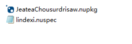
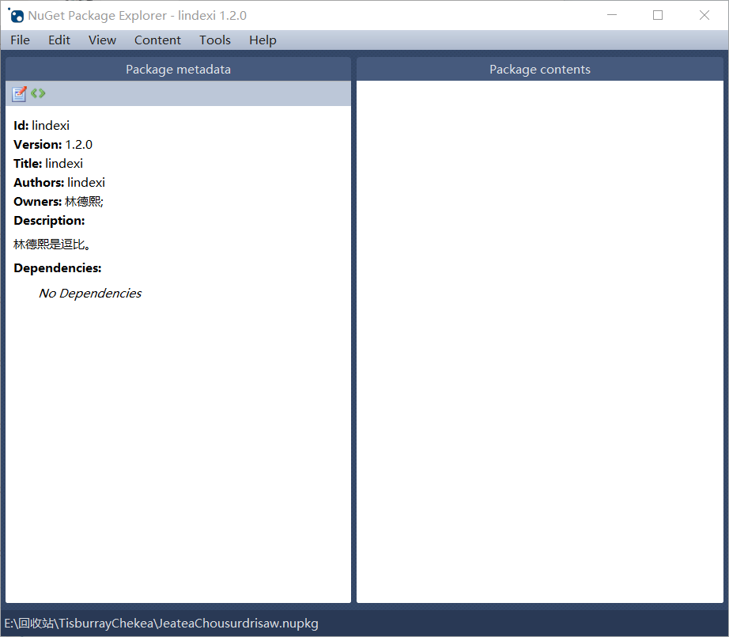
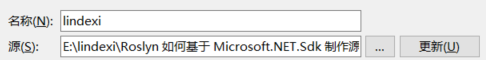
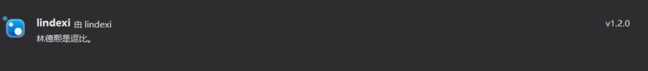
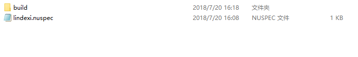
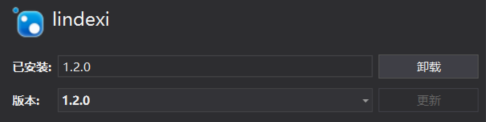
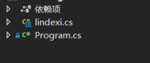
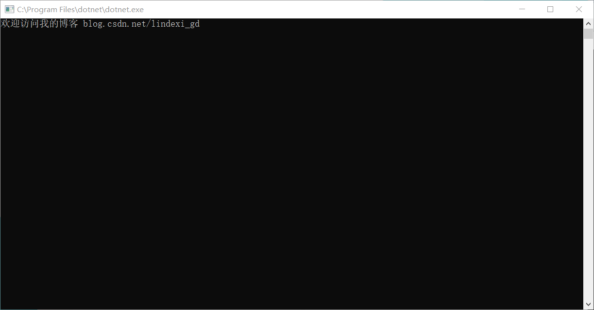

# Roslyn 如何基于 Microsoft.NET.Sdk 制作源代码包

本文告诉大家如何做源代码包，源代码包的意思是安装的包不是安装dll的方式，而是使用源代码的方式。也就是最后是编译包的源代码而不是添加dll，这个方式是解决想要把项目分小，功能分细，但是不希望项目有很多的 dll，因为如果项目有很多 dll 会让软件打开的时间比较长

<!--more-->
<!-- CreateTime:2020/2/29 10:58:20 -->

<!-- csdn -->
<div id="toc"></div>
<!-- 标签：Roslyn,MSBuild,编译器 -->

先来告诉大家做这个包的目的，如果是使用分开很多项目，一个项目会创建一个 dll ，在客户端的软件，用户很希望软件点击就打开。但是如果 dll 多了，读取dll文件的时间，加上加载 dll 的时间就会很长，这时用户就需要等待软件启动的时间就比较长。

但是从软件开发的功能，不同的功能应该使用不同的项目，这样才可以尽可能复用代码。为了让项目可以分细，而且减少创建的 dll 库，就需要使用本文的技术。

使用源代码的项目而不是引用 dll 的方法实际上在 Chrome 就是这样做，谷歌的开发就是有很多，大概有几百个项目，但是编译出来的 dll 只有一两个，所以他才有一点击就打开。

## 准备工作

在开始读本文之前，希望大家先了解一些概念，请看[理解 C# 项目 csproj 文件格式的本质和编译流程 - walterlv](https://walterlv.github.io/post/understand-the-csproj.html )，这一个文章告诉了大家一些基础，不然在看本文的时候会不知道为什么我需要这样写。

本文使用了修改编译，方法是 [如何编写基于 Microsoft.NET.Sdk 的跨平台的 MSBuild Target - walterlv](https://walterlv.github.io/post/write-msbuild-target.html )，从这个文章可以知道如何修改msbuild的编译

## 最简单的引用方法

[将 .NET Core 项目打一个最简单的 NuGet 源码包，安装此包就像直接把源码放进项目一样 - walterlv](https://walterlv.github.io/post/the-simplest-way-to-pack-a-source-code-nuget-package.html )

## 手工打包 Nuget 引用代码

如果看到了上面的博客，会发现实际上自己的需求还不是这么简单，如果需要真正做一个源码包，那么手动写 nuget 打包还是有必要的。

但是写一个手动打包的 Nuget 程序会占用本文太多的内容，所以我就不使用任何的代码进行打包，使用一步步告诉大家如何打包 nuget 的方法。

### 准备

首先需要有一个压缩工具，因为 nuget 的包 nupkg 就是一个压缩包

在应用商店搜索 nuget 可以安装 nuget package explorer ，或者点击[安装](https://www.microsoft.com/store/productId/9WZDNCRDMDM3)

SublimeText 或 记事本，用来编辑文件

### 文件夹方式

一个可以解析的 nuget 包是需要包括指定的一些文件的，最主要就是`.nuspec`文件，其他的文件都不是必要的

下面来告诉大家做一个空白的 nuget 包

### 创建空白的 nuget 包

首先创建一个空白文件，文件的后缀名是 nuspec ，文件名就是打包名

下面我创建 `lindexi.nuspec` 这个将会打出空白的 nuget 包

使用 SublimeText 打开 lindexi.nuspec 输入下面内容

```
<?xml version="1.0"?>
<package>
  <metadata>
    <id>lindexi</id>
    <version>1.2.0</version>
    <title>lindexi</title>
    <authors>lindexi</authors>
    <owners>林德熙;</owners>
    <description>林德熙是逗比。</description>
  </metadata>
</package>
```

标准的 nuget 包的 id 和 titile 、作者都是必须的，如果没有输入这些就无法打包

压缩一下，把后缀名修改为 nupkg 然后尝试使用 nuget package explorer 打开。

<!--  -->


<!--  -->


从图片可以看到压缩这个文件的压缩包的名字可以随便写，但是建议格式是 包的 id 加上 包的版本号，这样在垃圾 VisualStudio 才可以找到，不然总是会出现找不到包

现在尝试在 VisualStudio 设置包所在的路径，设置的方法我就不在这里告诉大家了，因为这时入门就需要知道的

<!--  -->


在我设置了 nupkg 文件所在的文件夹之后，就可以在 VisualStudio 点击浏览，可以找到打出来的 nuget 包

<!--  -->


现在需要在这个空白的 nuget 包添加多一些东西

## 添加 build 修改编译过程

刚才是不是觉得太简单了，下面就来告诉大家一些难度比较高的做法。

请严格按照本渣的方法来做，建议先自己走一次，发现成功了，再自己尝试修改，在本渣开始使用做源码包时，遇到了很多问题，所以我会在很多博客告诉大家。但是我不会在这个博客说道，这些知识很乱，而且和具体的 VisualStudio 版本有关，最近在给 MSBuild 修改，可能在大家用到就不会遇到这些坑。

如果大家觉得我这么辛苦，既要写文档又要给微软修vs那么就多给本渣点几个赞吧

现在把 nuget 的包的名字修改为清真的名字，现在的这个包是 `lindexi.1.2.0.nupkg` 这样就可以统一变量。

现在在 `lindexi.nuspec` 相同文件夹创建一个文件夹 `build` 注意大小写，现在的文件看起来就是这样

<!--  -->


打开 build 文件夹，创建两个文件，需要注意这两个文件的文件名都需要保持和我一样，如果你修改为其他的文件名，没有开过光就无法使用

```csharp
lindexi.props
lindexi.targets
```

<!--  -->


现在还不需要在这两个文件里面写东西，先来写一下需要引用的源代码

## 引用的源代码

为了方便告诉大家源代码包是如何做的，这里就不需要创建一个工程来写源代码，只需要在 `lindexi.nuspec` 相同文件夹创建一个文件夹 `src` 这个文件夹可以不注意大小写。在这个文件夹创建一个文件 `lindexi.cs` 在里面写下面的代码

```csharp
using System;

namespace lindexi
{
    class lindexi
    {
        public void Doubi()
        {
            Console.WriteLine("欢迎访问我的博客 blog.csdn.net/lindexi_gd");
        }
    }
}
```

如果你先把这个代码修改了也可以，这个代码的内容不需要和我一样

现在的文件结构是

```csharp
├─build
├──lindexi.props
├──lindexi.targets
├─src
├──lindexi.cs
└─lindexi.nuspec
```

## 使用源代码

打开 build 文件夹的 lindexi.props 文件添加下面代码

```
<?xml version="1.0" encoding="utf-8"?>
<Project>
  <ItemGroup>
    <Compile Include="$(MSBuildThisFileDirectory)..\src\lindexi.cs" ></Compile>
  </ItemGroup>
</Project>
```

然后打开 lindexi.targets 添加下面代码

```
<?xml version="1.0" encoding="utf-8"?>
<Project>

</Project>
```

现在把整个文件夹压缩起来，然后修改压缩文件名 `lindexi.1.2.nupkg` 注意这个名字一定需要和我一样

现在就可以在 VisualStudio 安装刚才的包，看到这里就是已经告诉大家做的源码包的最简单方法

## 安装源码包

打开 VisualStudio 创建一个新的项目，在 nuget 设置刚才的 nuget 包所在文件夹，然后点击浏览就可以安装

<!--  -->


安装之后可以看到 VisualStudio 多了一个文件

<!--  -->


在主函数写下面代码，运行可以看到

```csharp
            var lindexi = new lindexi.lindexi();
            lindexi.Doubi();
```

<!--  -->


现在可以告诉大家源码包就这样做好了，使用这个方式就可以把自己的库作为源代码发给大家，这样即使很小的工具都可以做为一个nuget，而且安装也不需要担心 dll 太多软件启动比较慢。

但是可以看到这个方法都是需要自己对一个项目去写，如果想要自动去打包，请看 [dotnet-campus/SourceYard: Add a NuGet package only for dll reference? By using dotnetCampus.SourceYard, you can pack a NuGet package with source code. By installing the new source code package, all source codes behaviors just like it is in your project.](https://github.com/dotnet-campus/SourceYard )

如果使用上面的方法会发现自己的资源是找不到，包括 xaml 也是无法编译，在 xaml 里面引用资源也是找不到，不过这些问题我都会在 SourceYard 解决

## 原理

刚才大家可以看到我没有在 nuspec 添加引用，但是我可以使用这个源代码，原理就是新的 VisualStudio 格式可以在安装 Nuget 包自动寻找 build 文件夹的 `包id.props` 和 `id.targets` 文件，自动引用这两个文件

通过引用这两个文件可以发现文件里有下面代码

```
<Project>
  <ItemGroup>
    <Compile Include="$(MSBuildThisFileDirectory)..\src\lindexi.cs" ></Compile>
  </ItemGroup>
</Project>
```

从 [理解 C# 项目 csproj 文件格式的本质和编译流程 - walterlv](https://walterlv.github.io/post/understand-the-csproj.html ) 可以知道，添加的集合就可以在编译引用

上面代码就是添加了`lindexi.cs`文件作为编译，上面用到常量，请看[项目文件中的已知属性（知道了这些，就不会随便在 csproj 中写死常量啦） - walterlv](https://walterlv.github.io/post/known-properties-in-csproj.html )

所以在使用这个包就可以自动添加代码

### 自定义打包

虽然本金鱼在上面告诉大家这些变量的名字都需要保持和我说的一样，但是实际大家都想自定义

知道了原理是不是大家就可以写出其他代码，例如我的代码有两个文件 `lindexi.cs` 和 `walterlv.cs` 难道我需要使用两个代码

```csharp
<Project>
  <ItemGroup>
    <Compile Include="$(MSBuildThisFileDirectory)..\src\lindexi.cs" ></Compile>
    <Compile Include="$(MSBuildThisFileDirectory)..\src\walterlv.cs" ></Compile>
  </ItemGroup>
</Project>
```

实际上我只需要一句代码，请看下面

```csharp
<Project>
  <ItemGroup>
    <Compile Include="$(MSBuildThisFileDirectory)..\src\*.cs" ></Compile>
  </ItemGroup>
</Project>
```

如果我还有文件夹，文件夹里有一些代码，我可以这样写

```csharp
<Project>
  <ItemGroup>
    <Compile Include="$(MSBuildThisFileDirectory)..\src\**\*.cs" ></Compile>
  </ItemGroup>
</Project>
```

现在可以使用所有的 cs 文件了，但是存在的 xaml 文件还没有解决，而且我也不能让开发者去编辑引用的代码

虽然编译引用的代码是可以修改，但是这个修改会在升级版本之后就被去掉，也就是开发者以为自己修改代码解决一个问题，实际上在他升级库的时候会发现自己没有解决。因为这个代码引用的是 nuget 的文件，所以其他的开发者拉代码也会发现没有解决问题

所以这时需要设置 `Visible="False"` ，请看代码

```csharp
<Project>
  <ItemGroup>
    <Compile Include="$(MSBuildThisFileDirectory)..\src\**\*.cs" Visible="False"></Compile>
  </ItemGroup>
</Project>
```

这样就可以让开发者在 VisualStudio 无法看到源代码，但是还是可以通过 Resharper 的方法跳转到源代码，如果他这么做了，我也没有办法

对于 xaml 资源，我需要在 props 文件使用下面代码才可以让 xaml 可以使用

```csharp
    <Compile Update="$(MSBuildThisFileDirectory)..\src\**\*.xaml.cs" Visible="False">
      <DependentUpon>%(Filename)</DependentUpon>
    </Compile>
    <Page Include="$(MSBuildThisFileDirectory)..\src\**\*.xaml" Visible="False">
      <SubType>Designer</SubType>
      <Generator>MSBuild:Compile</Generator>
    </Page>
```

对于资源文件，例如 WaterEffect.ps 因为资源是需要使用路径才可以使用，如果直接引用源代码会发现资源的路径是找不到，使用下面的代码就可以找到资源

```csharp
    <Resource Include="$(MSBuildThisFileDirectory)..\src\Effects\WaterEffect.ps" Link="Effects\WaterEffect.ps" Visible="False">
      <CopyToOutputDirectory>PreserveNewest</CopyToOutputDirectory>
    </Resource>
```

需要注意，对于资源不能使用 `*.ps` 的方法，也就是通配是无法使用的，如果在`Link`里使用了 `*` 那么就会发现无法编译

这个问题已经告诉了垃圾微软，不知道会不会在 VisualStudio 去修复。

资源问题坑了[黄腾霄](https://huangtengxiao.gitee.io/ )两天，坑了我一天，所以我才把这个问题在这里和大家说，如果大家使用了上面说道的工具，就不需要了解这么多，做源代码包很简单

## 解决 xaml 找不到方法问题

如果使用的是 WPF 程序，就需要额外添加一些代码，在 csproj 文件的开始和最后添加这样的代码

可以解决找不到xx类，或找不到 xx 方法或 `CS1061` xx 未包含 xx 的定义，并且找不到可接受的第一个 xx 参数的可访问扩展方法

```xml
<Project Sdk="Microsoft.NET.Sdk" ToolsVersion="15.0">
  <Import Condition="Exists('obj\xxx.csproj.nuget.g.props') " Project="obj\$(MSBuildProjectName).csproj.nuget.g.props" />

  其他代码

  <Import Condition="Exists('obj\xxx.csproj.nuget.g.targets') " Project="obj\$(MSBuildProjectName).csproj.nuget.g.targets" />
</Project>
```

这里 xxx.csproj.nuget.g.targets 的 xxx 就是项目名，注意此时不能使用 `$(MSBuildProjectName)` 代替项目名，因为在编译过程是 `xxx_一段我看不懂的字符_wpftmp.csproj` 而不是直接的 `xxx` 项目

也就是 `$(MSBuildProjectName).csproj.nuget.g.targets)` 是不对的，因为 `$(MSBuildProjectName)` 是延迟计算，在 Import 还没有计算出来值

当然我不会让大家从零开始打包，我开源 [dotnet-campus/SourceYard](https://github.com/dotnet-campus/SourceYard ) 可以将项目的源代码打包为 NuGet 包，使用非常方便，只需要在项目里面安装 SourceYard 库，然后重新打包就可以看到创建了 xx.Source.nupkg 包含源代码的库

[MSBuild/Roslyn 和 NuGet 的 100 个坑 - walterlv](https://walterlv.com/post/problems-of-msbuild-and-nuget.html )

<a rel="license" href="http://creativecommons.org/licenses/by-nc-sa/4.0/"></a><br />本作品采用<a rel="license" href="http://creativecommons.org/licenses/by-nc-sa/4.0/">知识共享署名-非商业性使用-相同方式共享 4.0 国际许可协议</a>进行许可。欢迎转载、使用、重新发布，但务必保留文章署名[林德熙](http://blog.csdn.net/lindexi_gd)(包含链接:http://blog.csdn.net/lindexi_gd )，不得用于商业目的，基于本文修改后的作品务必以相同的许可发布。如有任何疑问，请与我[联系](mailto:lindexi_gd@163.com)。  
