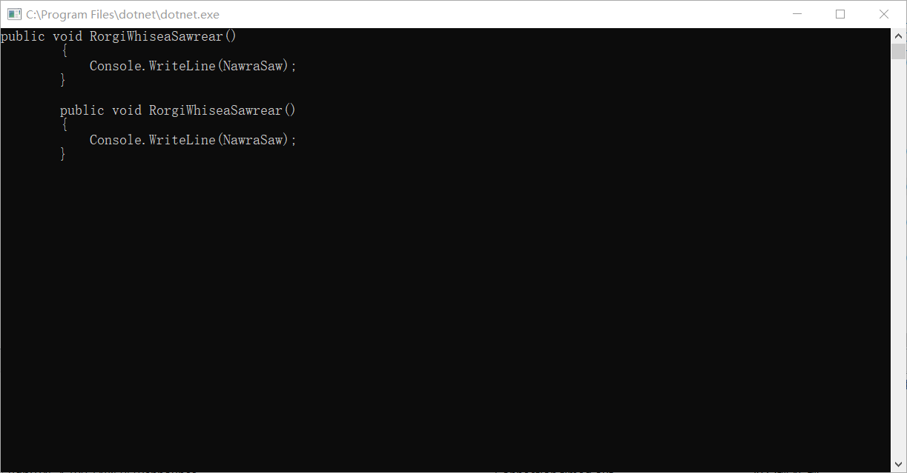

# Roslyn 节点的 Span 和  FullSpan 有什么区别

本文告诉大家在使用 Roslyn 分析代码时，使用的 Span 和 FullSpan 有什么区别

<!--more-->
<!-- CreateTime:2018/8/10 19:16:52 -->

<!-- csdn -->
<!-- 标签：Roslyn,MSBuild,编译器 -->
<div id="toc"></div>

在开始读本文之前，希望大家已经了解部分关于 Roslyn 的知识，如果是通过搜索进来的，大概就是已经知道基础的写法了。如果是通过本渣的推荐看到本文，本渣会详细告诉大家如何做。

## 准备

先写出一个简单的类用来分析

```csharp
using System;

namespace BebehersoSerdar
{
    class Foo
    {
        /// <summary>
        /// 设置或获取NawraSaw
        /// </summary>
        public string NawraSaw { get; set; }

        public void RorgiWhiseaSawrear()
        {
            Console.WriteLine(NawraSaw);
        }

        public void TurlouDismemteeka()
        {
            // 输出一个值
            Console.WriteLine(NawraSaw);// 代码需要多写没有用的注释

            // 下一句代码
        }
    }
}
```

## 创建语法树

把前面这个文件拿出来，用这个文件来创建语法树

```csharp
            var file = new FileInfo(@"D:\lindexi\roslyn\BebehersoSerdar\BebehersoSerdar\Foo.cs");

            string content;

            using (var stream = new StreamReader(file.OpenRead()))
            {
                content = stream.ReadToEnd();
            }

            var tree = CSharpSyntaxTree.ParseText(content);
```

文件的路径就是刚才写的代码文件

通过 `CSharpSyntaxTree.ParseText` 就可以拿到语法树

## 访问语法树

为了访问语法树，需要创建一个类继承 CSharpSyntaxWalker 这里创建的类是 DowkurTicesoo 请看代码

```csharp
    public class DowkurTicesoo : CSharpSyntaxWalker
    {

    }
```

本文说道了这里还没有告诉大家 Span 是什么，这个属性就是对应文本的第多少个字符开始和字符的长度。通过 Span 可以找到代码对应的文本。

所以在这里需要多创建一个方法，用来把 Span 转换为字符串

```csharp
        public DowkurTicesoo(string content, SyntaxWalkerDepth depth = SyntaxWalkerDepth.Node) : base(depth)
        {
            Content = content;
        }

        private string Content { get; }

        public string GetText(TextSpan span)
        {
            return Content.Substring(span.Start, span.Length);
        }
```

## 访问方法

这里直接就告诉大家如何访问方法，因为只有在方法里面才可以比较直观看到 Span 和 FullSpan 的不同

通过重写方法就可以拿到一个类的所有方法，请看代码

```csharp
        public override void VisitMethodDeclaration(MethodDeclarationSyntax node)
        {
            base.VisitMethodDeclaration(node);
        }
```

在方法这里打断点可以看到进来两次，因为存在两个方法 RorgiWhiseaSawrear 和 TurlouDismemteeka 会进来两遍

先直接把方法的 Span 和 FullSpan 输出出来，请看代码

```csharp
        public override void VisitMethodDeclaration(MethodDeclarationSyntax node)
        {
            Console.WriteLine(GetText(node.Span));
            Console.WriteLine(GetText(node.FullSpan));
            base.VisitMethodDeclaration(node);
        }
```

这时运行可以看到这个输出

<!--  -->


可以看到 Span 和 FullSpan 的一个不同是 Span 是从方法的第一个代码字符开始，和 Span 不同的是 FullSpan 是从方法的距离上一个代码结束开始的字符到方法结束的最后的字符

## 访问表达式

在另一个方法 TurlouDismemteeka 可以看到两个属性拿到的值的不同，因为这个方法里调用表达式，所以需要使用下面的方法拿到值

```csharp
        public override void VisitExpressionStatement(ExpressionStatementSyntax node)
        {
            Console.WriteLine(GetText(node.Span));
            Console.WriteLine(GetText(node.FullSpan));
            base.VisitExpressionStatement(node);
        }
```

对于 RorgiWhiseaSawrear 方法，两个属性的输出只有很少的不同

```csharp
Console.WriteLine(NawraSaw);
            Console.WriteLine(NawraSaw);
\r\n
```

也就是 Span 就是去掉了 RorgiWhiseaSawrear 的前后空白，上面的 `\r\n` 是告诉大家这里还有一个换行符

但是对于 TurlouDismemteeka 就可以看到明显的不相同，第二个属性可以拿到注释

```csharp
Console.WriteLine(NawraSaw);
            // 输出一个值
            Console.WriteLine(NawraSaw);// 代码需要多写没有用的注释
\r\n
```

在 VisualStudio 可以看到的转换 FullSpan 的值是 `"            // 输出一个值\r\n            Console.WriteLine(NawraSaw);// 代码需要多写没有用的注释\r\n"`

可以看到注释下一句代码没有被引用，但是如果在 TurlouDismemteeka 的第一句代码多加一些换行，在 FullSpan 是可以转换

```csharp
        public void TurlouDismemteeka()
        {
            
            // 输出一个值
            Console.WriteLine(NawraSaw);// 代码需要多写没有用的注释

            // 下一句代码
        }
```

这时从 VisualStudio 转换是多了换行`"\r\n            // 输出一个值\r\n            Console.WriteLine(NawraSaw);// 代码需要多写没有用的注释\r\n"`，也就是引号后面多了`\r\n`的换行

## 不同

实际上在很多的方法里，使用 Span 和 FullSpan 都是没有什么区别。

用一句话来说明就是 Span 就只包括代码，而 FullSpan 包括了代码和代码附近的注释。

对于不同的结点的 Span 是不会存在值的冲突，但是对于 FullSpan 是存在多个节点的覆盖。

实际上使用 Span 转换字符串和使用 FullSpan 转换字符串的方法就和使用 ToString 差不多，请看 [Roslyn NameSyntax 的 ToString 和 ToFullString 的区别](https://lindexi.github.io/lindexi/post/Roslyn-NameSyntax-%E7%9A%84-ToString-%E5%92%8C-ToFullString-%E7%9A%84%E5%8C%BA%E5%88%AB.html )

参见：[Use the .NET Compiler Platform SDK syntax model](https://docs.microsoft.com/en-us/dotnet/csharp/roslyn-sdk/work-with-syntax )

[Roslyn](https://github.com/dotnet/roslyn/wiki/Roslyn-Overview )

<a rel="license" href="http://creativecommons.org/licenses/by-nc-sa/4.0/"></a><br />本作品采用<a rel="license" href="http://creativecommons.org/licenses/by-nc-sa/4.0/">知识共享署名-非商业性使用-相同方式共享 4.0 国际许可协议</a>进行许可。欢迎转载、使用、重新发布，但务必保留文章署名[林德熙](http://blog.csdn.net/lindexi_gd)(包含链接:http://blog.csdn.net/lindexi_gd )，不得用于商业目的，基于本文修改后的作品务必以相同的许可发布。如有任何疑问，请与我[联系](mailto:lindexi_gd@163.com)。
