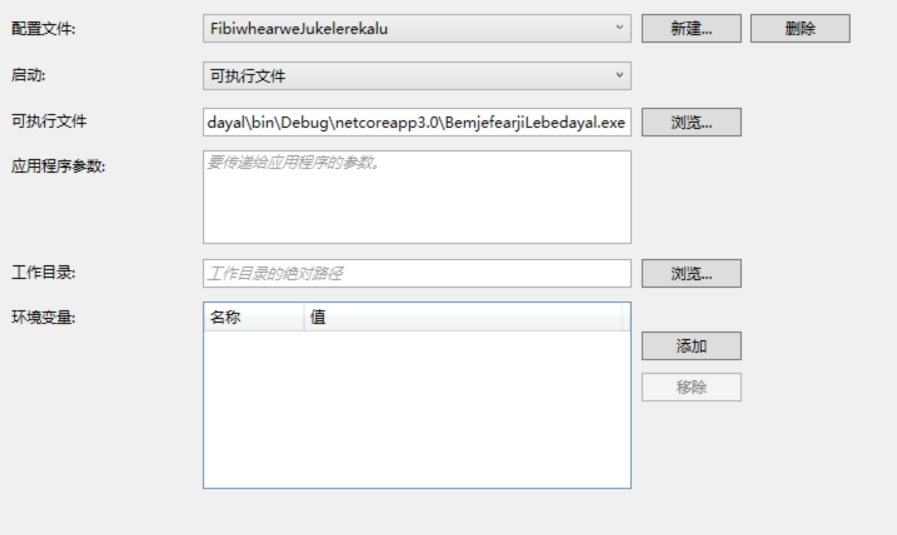

# Roslyn 让 VisualStudio 急速调试底层库方法

我有一个很大的项目，这个项目里面包含了很多小的底层库。有一天我发现了某个底层库可能有小伙伴挖了一个坑，我期望调试这个底层库，但是我一点都不想编译整个大项目，因为底层库被太多的项目应用，一点点修改都需要编译很久。本文提供一个简单的方法让大家可以通过修改项目文件，让 VisualStudio 可以急速调试底层库，每次更改底层库只需要重新编译底层库就可以

<!--more-->
<!-- CreateTime:2019/5/29 20:02:09 -->

<!-- csdn -->

本文提供的方法和[通过外部调试方法快速调试库代码](ttps://blog.lindexi.com/post/VisualStudio-%E9%80%9A%E8%BF%87%E5%A4%96%E9%83%A8%E8%B0%83%E8%AF%95%E6%96%B9%E6%B3%95%E5%BF%AB%E9%80%9F%E8%B0%83%E8%AF%95%E5%BA%93%E4%BB%A3%E7%A0%81.html ) 说到的方法几乎相同，只是通过上面文章的方法会让输出的时候带了底层库依赖的库文件会影响软件的正常运行

假设我有一个大的项目和一个底层库，大的项目是 BemjefearjiLebedayal 底层库是 FibiwhearweJukelerekalu 具体的代码我都放在 [github](https://github.com/lindexi/lindexi_gd/tree/423f7de145212d75ada919bbef7e0ff50fac0777/BemjefearjiLebedayal) 欢迎小伙伴关注

在 BemjefearjiLebedayal 大项目里面引用了底层库，在底层库里面我需要调试一个 Foo 的类

```csharp
    public class Foo
    {
        public string GetFoo()
        {
            return "林德熙是逗比";
        }
    }
```

在主项目的主函数是这样使用的

```csharp
        static void Main(string[] args)
        {
            var foo = new Foo();
            Console.WriteLine(foo.GetFoo());

            Console.Read();
        }
```

我需要在 GetFoo 函数里面使用断点，我需要修改返回值，小伙伴使用的方法是先修改 GetFoo 方法里面的代码，然后点击启动大项目。这样就需要从底层库编译到主项目，需要等待很长的编译时间。不过小伙伴会在这段时间里面水了很多 QQ 群，所以我才会一天都看到一些小伙伴都在群里说话

从[通过外部调试方法快速调试库代码](ttps://blog.lindexi.com/post/VisualStudio-%E9%80%9A%E8%BF%87%E5%A4%96%E9%83%A8%E8%B0%83%E8%AF%95%E6%96%B9%E6%B3%95%E5%BF%AB%E9%80%9F%E8%B0%83%E8%AF%95%E5%BA%93%E4%BB%A3%E7%A0%81.html ) 可以知道，想要让 VisualStudio 调试库的代码只需要将对应的 dll 文件和符号文件放在了需要调试的大项目的文件夹里面就可以了。

这个方法通过重定向输出文件夹可以做到，但是我的底层库会依赖很多特殊的库，这些库和主项目使用到的库可能不相同，此时重定向整个输出文件夹会让主项目无法进行调试

解决方法就是在编译完成的时候，通过[MSBuild Copy 复制文件](https://blog.lindexi.com/post/Roslyn-%E5%A6%82%E4%BD%95%E4%BD%BF%E7%94%A8-MSBuild-Copy-%E5%A4%8D%E5%88%B6%E6%96%87%E4%BB%B6.html ) 将输出的库文件复制到主项目的文件夹，这样就可以做到每次更改只编译库的代码，提升了调试速度

右击 FibiwhearweJukelerekalu 底层库的csproj编辑文件，在 2019 可以通过双击进入编辑

```csharp
    <PropertyGroup>
        <MainProjectPath>..\BemjefearjiLebedayal\bin\Debug\netcoreapp3.0\</MainProjectPath>
    </PropertyGroup>

    <Target Name="CopyOutputLibToFastDebug" AfterTargets="AfterBuild">
        <ItemGroup>
            <OutputFileToCopy Include="$(OutputPath)$(AssemblyName).dll"></OutputFileToCopy>
            <OutputFileToCopy Include="$(OutputPath)$(AssemblyName).pdb"></OutputFileToCopy>
        </ItemGroup>
        <Copy SourceFiles="@(OutputFileToCopy)" DestinationFolder="$(MainProjectPath)"></Copy>
    </Target>
```

请将 MainProjectPath 里面的代码替换为你实际的项目的代码，请将上面代码放在底层库的项目文件里面

将会在编译完成的时候会将输出的文件从底层库的输出文件夹复制到 MainProjectPath 设置的文件夹

现在还差一步就是启动调试，通过右击底层库，点击属性，点击调试，点击可执行文件，输入主项目的启动程序

<!--  -->


此时就可以在底层库里面点击运行进行调试，同时可以做二进制兼容的改动。关于二进制兼容请看[VisualStudio 通过外部调试方法快速调试库代码](ttps://blog.lindexi.com/post/VisualStudio-%E9%80%9A%E8%BF%87%E5%A4%96%E9%83%A8%E8%B0%83%E8%AF%95%E6%96%B9%E6%B3%95%E5%BF%AB%E9%80%9F%E8%B0%83%E8%AF%95%E5%BA%93%E4%BB%A3%E7%A0%81.html )

写到这里的代码已经放在 [github](https://github.com/lindexi/lindexi_gd/tree/423f7de145212d75ada919bbef7e0ff50fac0777/BemjefearjiLebedayal) 如果小伙伴还不知道上面的步骤，可以下载代码自己运行一下

当然每次都这样做还是比较不清真，因为编辑项目文件的时候的提示很少，很容易写错，所有的底层库写的代码都差不多，是不是可以做一个 NuGet 库帮助写代码

没错，我创建了项目 [dotnet-campus/UsingMSBuildCopyOutputFileToFastDebug: 通过复制输出文件让 VisualStudio 外部启动快速调试底层库 Using MSBuild Copy Output File To Fast Debug](https://github.com/dotnet-campus/UsingMSBuildCopyOutputFileToFastDebug ) 欢迎小伙伴关注

## 使用方法

### 安装

在需要调试的底层库项目安装 NuGet 库 [dotnetCampus.UsingMSBuildCopyOutputFileToFastDebug](https://www.nuget.org/packages/dotnetCampus.UsingMSBuildCopyOutputFileToFastDebug)

### 配置

配置有两个方法

基础方法：

通过右击底层库属性，点击调试，设置为可执行文件，路径修改为主项目的启动程序。就可以在底层库点击调试运行主项目调试，同时支持打断点和进行二进制兼容的更改

高级方法：

编辑底层库项目的 csproj 文件，添加下面代码

```csharp
    <PropertyGroup>
        <MainProjectPath>主项目的输出文件夹</MainProjectPath>
    </PropertyGroup>
```

请注意 主项目的输出文件夹 的路径最后使用 `\` 结束，如 `C:\lindexi\doubi\` 如果是将底层库放在其他文件夹，请将 主项目的输出文件夹 修改为实际的文件夹

## 推荐使用方法

如果是小项目进行调试，推荐修改库的demo或添加单元测试进行测试

如果是需要调试具体状态，而不方便写demo等推荐使用此工具提升调试效率，可以将此工具在各个底层库安装

如果是需要做比较大的更改，如接口修改，推荐使用 [dotnet-campus/DllReferencePathChanger: VS DLL引用替换插件](https://github.com/dotnet-campus/DllReferencePathChanger ) 插件

小伙伴也可以看到，使用此方法的优点就是可以启动底层库的 sln 文件，通过右击属性调试设置启动为主项目，这样运行一个底层库的速度会比运行主项目快。如果此时的主项目包含了pdb文件，也就是放在 debug 构建出来的，那么将可以在底层库里面调试主项目的代码

但是存在的问题是要求底层库构建的 dll 能替换主项目里面的对应的 dll 文件，如果存在二进制不兼容，也就是无法替换 dll 那么将无法使用本文方法。推荐的是了解当前主项目用到的底层库的版本，将底层库切换到主项目使用的版本，然后进行调试。但是现在遇到的问题是如何确定底层库被引用的版本？推荐每个发布的NuGet包都包含对应的 Tag 号，这样方便切换

但是要让小伙伴记得每次发布都打Tag号好像比较坑，一个推荐的方法是推 Tag 打包的方法，通过 Tag 触发自动构建，在这里自动创建 NuGet 库。有一个开源的库 [dotnetCampus.TagToVersion](https://github.com/dotnet-campus/dotnetCampus.TagToVersion ) 能够在自动构建时通过 Tag 修改版本号然后打包，这样打包就对应版本号

## 原理

在软件运行的时候依然可以移动 dll 或 exe 的路径，而此工具将底层库项目的输出 dll 和 pdb 文件拷贝到主项目的文件夹或 MainProjectPath 设置的文件夹，将原本的dll和pdb重命名，然后通过调试的可执行文件方式启动主项目

此时的主项目将会加载新的dll文件，同时因为存在 pdb 文件也能进去代码调试

通过将原本dll重命名的方式可以解决主项目执行的文件占用问题

此调试方式要求对底层库的更改满足二进制兼容

关于二进制兼容请看 [VisualStudio 通过外部调试方法快速调试库代码](ttps://blog.lindexi.com/post/VisualStudio-%E9%80%9A%E8%BF%87%E5%A4%96%E9%83%A8%E8%B0%83%E8%AF%95%E6%96%B9%E6%B3%95%E5%BF%AB%E9%80%9F%E8%B0%83%E8%AF%95%E5%BA%93%E4%BB%A3%E7%A0%81.html )

## 感谢

感谢 https://github.com/kkwpsv/lsjutil 提供 json 解析

[VisualStudio 通过外部调试方法快速调试库代码](ttps://blog.lindexi.com/post/VisualStudio-%E9%80%9A%E8%BF%87%E5%A4%96%E9%83%A8%E8%B0%83%E8%AF%95%E6%96%B9%E6%B3%95%E5%BF%AB%E9%80%9F%E8%B0%83%E8%AF%95%E5%BA%93%E4%BB%A3%E7%A0%81.html )

[Roslyn 如何使用 MSBuild Copy 复制文件](https://blog.lindexi.com/post/Roslyn-%E5%A6%82%E4%BD%95%E4%BD%BF%E7%94%A8-MSBuild-Copy-%E5%A4%8D%E5%88%B6%E6%96%87%E4%BB%B6.html )

<a rel="license" href="http://creativecommons.org/licenses/by-nc-sa/4.0/"></a><br />本作品采用<a rel="license" href="http://creativecommons.org/licenses/by-nc-sa/4.0/">知识共享署名-非商业性使用-相同方式共享 4.0 国际许可协议</a>进行许可。欢迎转载、使用、重新发布，但务必保留文章署名[林德熙](http://blog.csdn.net/lindexi_gd)(包含链接:http://blog.csdn.net/lindexi_gd )，不得用于商业目的，基于本文修改后的作品务必以相同的许可发布。如有任何疑问，请与我[联系](mailto:lindexi_gd@163.com)。
