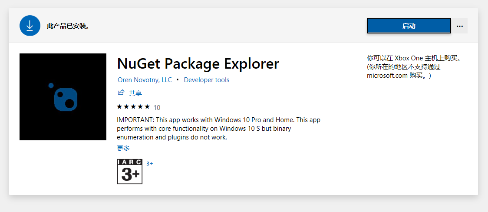
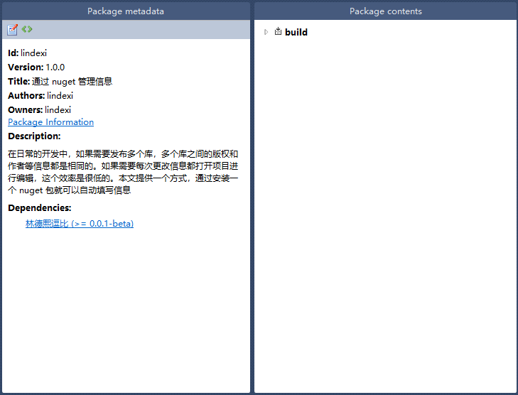
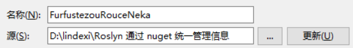
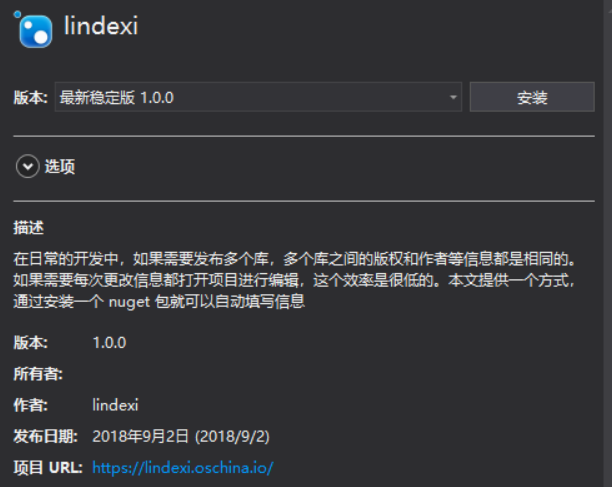
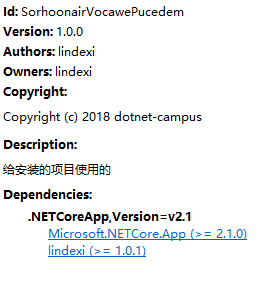

# Roslyn 通过 nuget 统一管理信息

在日常的开发中，如果需要发布多个库，多个库之间的版权和作者等信息都是相同的。如果需要每次更改信息都打开项目进行编辑，这个效率是很低的。本文提供一个方式，通过安装一个 nuget 包就可以自动填写信息。

<!--more-->
<!-- CreateTime:2018/9/4 8:55:19 -->

<!-- csdn -->

<!-- 标签：Roslyn，MSBuild,编译器,nuget,打包 -->

最近我多发布了一些项目，但是发布一个项目需要在 nuget 添加的信息有很多，如 authors 、 owners 、 Company 、 Copyright 而本渣很容易就忘记添加了一些值。

于是我就想，如何才可以让 Roslyn 自动帮我添加一些信息，特别是 Copyright ，因为一年就需要更新时间。

我就想在一个地方更新时间，然后在其他的地方都可以通过安装 nuget 的方式自动更新或通过更新 nuget 的方式更新。

特别是对新人，我就不需要告诉他发布一个 nuget 需要填哪些东西，也不需要担心因为他写错公司，只要他去安装 nuget 就可以。


在本文开始之前需要告诉大家，通过这个方式只能用来打开新的 VisualStudio 2017 格式的，而且是直接通过项目打包的方式，对于之前的格式不是很好用。

先创建一个空白的文件夹，现在是不需要通过 VisualStudio 创建项目，当然最后还是创建一个测试的项目，通过这个测试的项目可以 知道是不是成功让项目的信息管理。

创建的新的文件夹需要包含下面的文件

```csharp
├── lindexi.nuspec
│
├─ build
├─────── lindexi.props
└─────── lindexi.targets
```
这里的文件包含的内容很少

一个可以使用的包需要包括下面内容

 - id 也就是唯一表示的字符串

 - version 版本

 - authors 作者

 - description 描述

```xml
<?xml version="1.0" encoding="utf-8"?>
<package xmlns="http://schemas.microsoft.com/packaging/2013/05/nuspec.xsd">
	  <metadata>
	  	  <id>lindexi</id>
	  	  <version>1.0.0</version>
	  	  <title>通过 nuget 管理信息</title>
	  	  <authors>lindexi</authors>
	  	  <projectUrl>https://lindexi.oschina.io/</projectUrl>
	  	  <description>在日常的开发中，如果需要发布多个库，多个库之间的版权和作者等信息都是相同的。如果需要每次更改信息都打开项目进行编辑，这个效率是很低的。本文提供一个方式，通过安装一个 nuget 包就可以自动填写信息</description>
	  </metadata>
</package>
```

现在右击将文件压缩为压缩包就可以做出一个 nuget 包了，只需要将 zip 后缀修改为 nupkg 就可以了。

现在使用 nuget 管理软件打开就可以看到了，通过应用商店搜索 nuget 就可以安装

<!--  -->


或者点击下面的链接安装 https://www.microsoft.com/store/productId/9WZDNCRDMDM3

打开文件可以看到下面界面

<!--  -->


如果可以看到这个界面就是成功创建了，当然引用 `林德熙逗比` 包是不可能的，但是如果是按照我上面的方法写的话是不会看到引用的。

现在需要在 build 文件夹的两个文件添加一些内容

```csharp
lindexi.props

<Project>
	<PropertyGroup>
		<Authors>lindexi</Authors>
        <Company>dotnet-campus</Company>
        <Description>给安装的项目使用的</Description>
        <Copyright>Copyright (c) 2018 dotnet-campus</Copyright>
        <RepositoryUrl>https://lindexi.oschina.io/</RepositoryUrl>
	</PropertyGroup>
</Project>
```

```csharp
lindexi.targets
<Project>
	
</Project>
```

可以看到 targets 只是空白的文件

现在重新压缩一下，修改后缀名

注意压缩需要将文件包含在根目录，也就是不能包一个文件夹再放文件

## 安装本地包

做出来 nuget 需要安装在一个项目，下面先创建一个控制台的项目，在这个项目设置 nuget 安装

右击项目nuget点击设置，然后点击添加

<!--  -->


在添加的下面写出本地打包的文件，也就是 `lindexi.1.0.0.nupkg` 文件所在的文件夹和随意的一个命名

<!--  -->


记得点击更新保存，然后再选择刚才设置的文件夹

<!--  -->


现在点击浏览就可以看到刚才的 nuget 包

<!--  -->


安装之后右击项目打包，就可以看到创建的项目打包，而且里面的信息就是刚才设置的信息

<!--  -->


如果需要替换某个信息，例如修改 Description 的信息，就可以通过右击修改项目文件添加 Description 的设置就替换了默认的值。

使用这个方法就可以通过安装 nuget 的方式修改信息。

代码 [Roslyn 通过 nuget 统一管理信息-CSDN下载](https://download.csdn.net/download/lindexi_gd/10641158 )

更多请看[手把手教你写 Roslyn 修改编译](https://lindexi.oschina.io/lindexi/post/roslyn.html )

<a rel="license" href="http://creativecommons.org/licenses/by-nc-sa/4.0/"></a><br />本作品采用<a rel="license" href="http://creativecommons.org/licenses/by-nc-sa/4.0/">知识共享署名-非商业性使用-相同方式共享 4.0 国际许可协议</a>进行许可。欢迎转载、使用、重新发布，但务必保留文章署名[林德熙](http://blog.csdn.net/lindexi_gd)(包含链接:http://blog.csdn.net/lindexi_gd )，不得用于商业目的，基于本文修改后的作品务必以相同的许可发布。如有任何疑问，请与我[联系](mailto:lindexi_gd@163.com)。  
