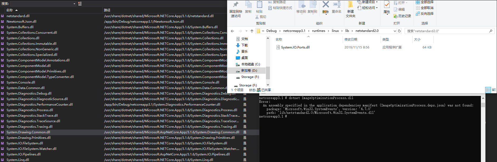

# Roslyn 解决 dotnet core 应用进程间引用找不到 runtimeconfig 依赖文件

我有一个强大的功能，这个功能就是在 Linux 下使用 GDI 转换 EMF 格式图片为 png 图片，但是有一些有趣的图片会让转换的进程炸掉。因此我就想让转换服务放在独立的进程，通过进程间调用，也就是命令行调用传入参数的方式，让另一个进程转换图片。而此时就会遇到一个问题，如何让这个进程也被构建，然后输出到输出路径

<!--more-->


<!-- CreateTime:2020/9/3 17:05:44 -->


<!-- 发布 -->

在 .NET Core 里面，如果想要让输出文件夹包含两个不同的进程入口文件，最简单的方法是让一个项目引用另一个项目。这个做法在 .NET Framework 里面很好用，因为此时将会在输出文件夹里面包含两个项目的输出文件。也就解决了如果让另一个进程也被构建的问题

不过在 dotnet core 里面将会存在一个文件，如果项目引用了一个输出为 exe 的项目，此时想要让这个可执行程序运行，将会遇到这样的坑，在 .NET Core 里面规定了可执行程序需要有两个配置文件，而默认项目引用将会缺少这两个配置文件

- .deps.json
- .runtimeconfig.json

在默认构建一个可执行程序，如 exe 程序的 .NET Core 项目，将可以在输出路径看到 xx.deps.json 文件和 xx.runtimeconfig.json 两个文件。如果没有这两个文件会如何？在运行可执行程序将会提示下面代码

```
A fatal error was encountered. The library 'hostpolicy.dll' required to execute the application was not found in 'C:\
Failed to run as a self-contained app. If this should be a framework-dependent app, add the C:\
```

提示找不到 `The library 'hostpolicy.dll' required to execute the application was not found` 的原因就是因为不存在 runtimeconfig.json 文件

那么这两个文件的作用是什么，请看 [深入理解.NET Core的基元: deps.json, runtimeconfig.json, dll文件 - LamondLu - 博客园](https://www.cnblogs.com/lwqlun/p/9704702.html )

而如果我单个项目构建的时候，其实是可以在项目输出文件夹看到这两个配置文件。但是如果被引用了，那么将找不到这两个文件

解决方法就是在被引用的项目的 csproj 文件里面添加如下代码

```csharp
     <Target Name="AddRuntimeDependenciesToContent" Condition=" '$(TargetFrameworkIdentifier)' == '.NETCoreApp'" BeforeTargets="GetCopyToOutputDirectoryItems" DependsOnTargets="GenerateBuildDependencyFile;GenerateBuildRuntimeConfigurationFiles" >
        <ItemGroup>
            <ContentWithTargetPath Include="$(ProjectDepsFilePath)" CopyToOutputDirectory="PreserveNewest" TargetPath="$(ProjectDepsFileName)" />

            <ContentWithTargetPath Include="$(ProjectRuntimeConfigFilePath)" CopyToOutputDirectory="PreserveNewest" TargetPath="$(ProjectRuntimeConfigFileName)" />
        </ItemGroup>
    </Target>
```

上面代码的含义是什么？其实就是将这两个配置文件加入到 `ContentWithTargetPath` 项，将会被其他项目放在输出文件夹里面

上面代码的 `AddRuntimeDependenciesToContent` 是一个随意的名字，小伙伴可以根据自己的需求随意更改

而核心的逻辑是在 `BeforeTargets="GetCopyToOutputDirectoryItems" DependsOnTargets="GenerateBuildDependencyFile;GenerateBuildRuntimeConfigurationFiles"` 这里

在 BeforeTargets 也就是说明这个 Target 在构建过程的执行时机是需要在 `GetCopyToOutputDirectoryItems` 执行之前，这个 `GetCopyToOutputDirectoryItems` 就是决定有哪些内容将会需要输出到最终输出文件夹里面。因此需要在他之前之前，给他设置需要输出的内容

然后在 `DependsOnTargets="GenerateBuildDependencyFile;GenerateBuildRuntimeConfigurationFiles"` 是因为在 `GenerateBuildDependencyFile` 之后才输出 .deps.json 文件，在 `GenerateBuildRuntimeConfigurationFiles` 才输出 .runtimeconfig.json 文件

如果没有写 DependsOnTargets 那么将会构建提示 `error MSB3030` 找不到复制文件

```csharp
error MSB3030: 无法复制文件“C:\lindexi\bin\Release\netcoreapp3.1\lindexi.runtimeconfig.json”，原因是找不到该文件
```

而如果后续你觉得这个原本是输出为可执行文件的进程不想继续作为输出为 exe 了，将 OutputType 修改为库，那么请记得删除上面的代码，因此此时的输出里面将没有包含配置文件

更多关于 Roslyn 请看 [手把手教你写 Roslyn 修改编译](https://blog.lindexi.com/post/roslyn.html )

如果不想使用引用项目的方法，还有其他方法可以做到，让多个项目没有依赖，但是都能构建。请看 [三种方法设置 .NET/C# 项目的编译顺序，而不影响项目之间的引用 - walterlv](https://blog.walterlv.com/post/affects-project-building-order.html )

本文的方法存在的不足是，如果最后是作为框架依赖发布的，那么也许会遇到这样的问题，实际安装的库被作为框架的一部分，此时引用路径将会不相同。构建的项目里面依赖的是本地的 lib 文件的路径，而框架发布的项目使用的是 ref 的文件夹路径。如 GDI 库的实现里面，在运行的时候将会看到输出是找不到

```csharp
dotnet ImageOptimizationProcess.dll
Error:
  An assembly specified in the application dependencies manifest (ImageOptimizationProcess.deps.json) was not found:
    package: 'Microsoft.Win32.SystemEvents', version: '4.7.0'
    path: 'lib/netstandard2.0/Microsoft.Win32.SystemEvents.dll'
```

<!--  -->


原因是可执行项目输出的配置文件内容如下

```json
      "System.Drawing.Common/4.7.0": 
       {
        "dependencies": 
        {
          "Microsoft.NETCore.Platforms": "3.1.0",
          "Microsoft.Win32.SystemEvents": "4.7.0"
        },
        "runtime": 
        {
          "lib/netstandard2.0/System.Drawing.Common.dll": 
          {
            "assemblyVersion": "4.0.0.1",
            "fileVersion": "4.6.26919.2"
          }
        },
        "runtimeTargets": 
        {
          "runtimes/unix/lib/netcoreapp3.0/System.Drawing.Common.dll": 
          {
            "rid": "unix",
            "assetType": "runtime",
            "assemblyVersion": "4.0.2.0",
            "fileVersion": "4.700.19.56404"
          },
          "runtimes/win/lib/netcoreapp3.0/System.Drawing.Common.dll": 
          {
            "rid": "win",
            "assetType": "runtime",
            "assemblyVersion": "4.0.2.0",
            "fileVersion": "4.700.19.56404"
          }
        }
      }
```

但是实际的 GDI 的库是作为框架共享的，放在 `/usr/share/dotnet/shared/Microsoft.AspNetCore.App/3.1.6/System.Drawing.Common.dll` 路径，因此找不到库，进程执行失败


<a rel="license" href="http://creativecommons.org/licenses/by-nc-sa/4.0/"></a><br />本作品采用<a rel="license" href="http://creativecommons.org/licenses/by-nc-sa/4.0/">知识共享署名-非商业性使用-相同方式共享 4.0 国际许可协议</a>进行许可。欢迎转载、使用、重新发布，但务必保留文章署名[林德熙](http://blog.csdn.net/lindexi_gd)(包含链接:http://blog.csdn.net/lindexi_gd )，不得用于商业目的，基于本文修改后的作品务必以相同的许可发布。如有任何疑问，请与我[联系](mailto:lindexi_gd@163.com)。