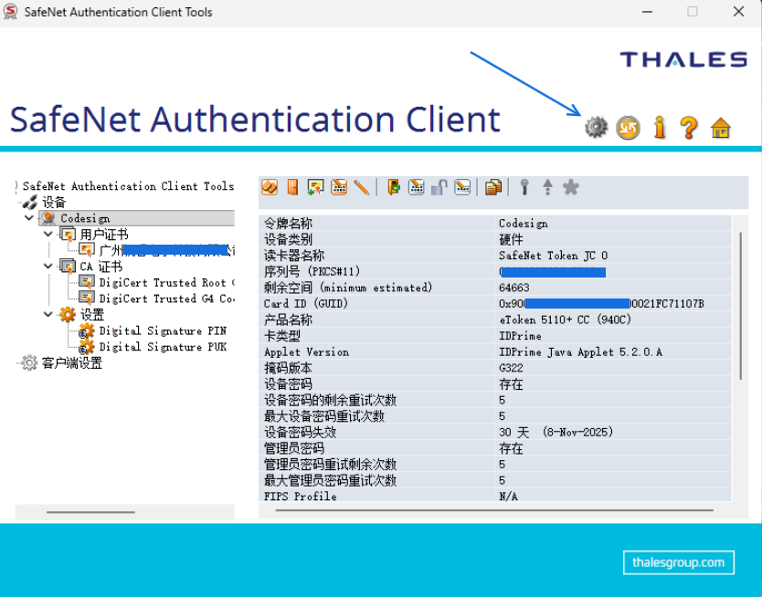
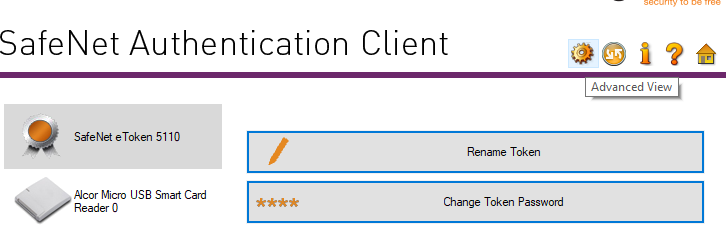
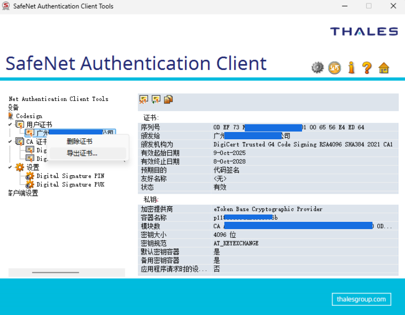
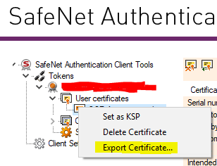
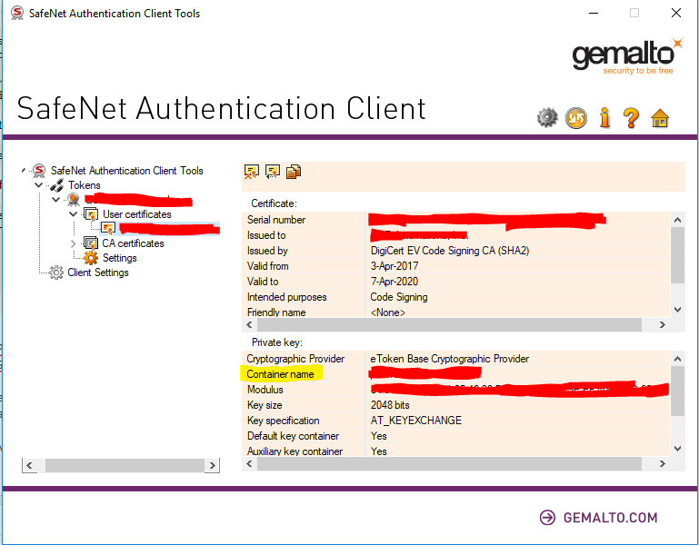
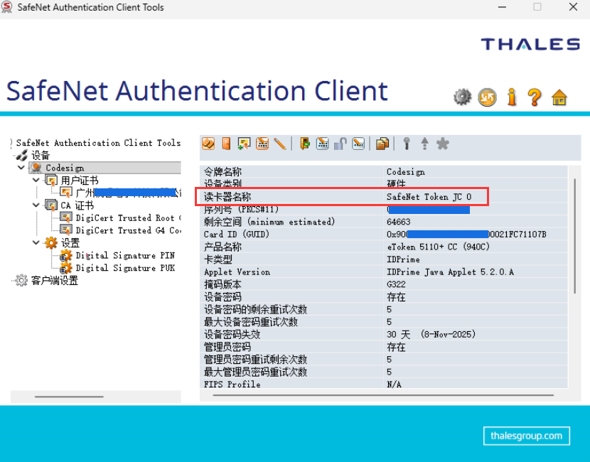
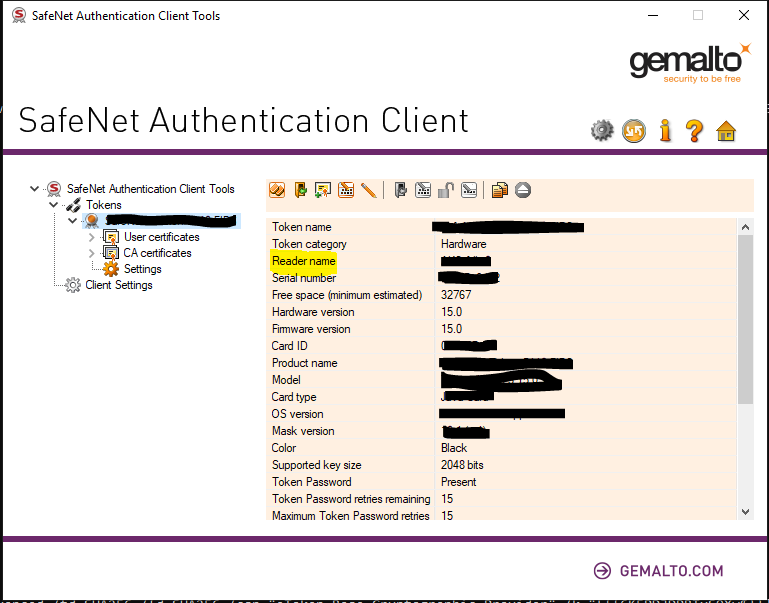
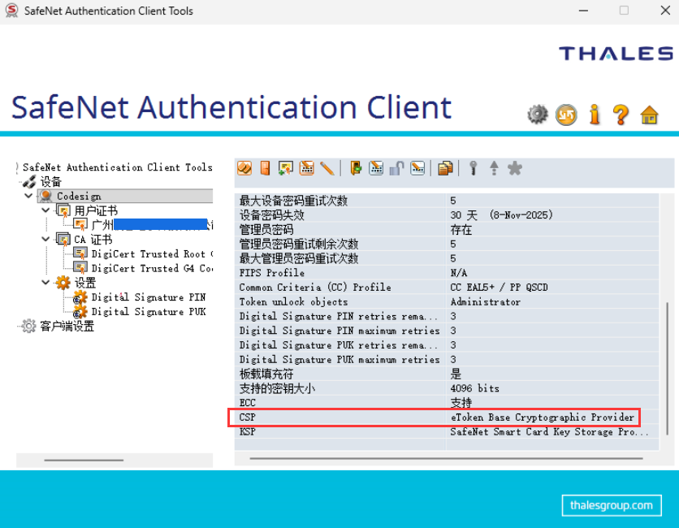

# SignTool 使用 SafeNet eToken 硬证书进行代码签名

现在软件代码签名已经不能用 pfx 软证书了，需要搭配 FIPS140-2 Level2、Common Criteria EAL4级以上或者同等认证级别的硬件，如 USB 令牌、硬件安全模块 HSM 等才能完成签名

<!--more-->


<!-- CreateTime:2025/10/11 07:11:53 -->

<!-- 发布 -->
<!-- 博客 -->

根据CA/B联盟国际标准要求，从 2022 年 11 月 15 日起，即使是 OV 代码签名证书，也需要将私钥存储在FIPS140-2 Level2、Common Criteria EAL4级以上或者同等认证级别的硬件，如 USB 令牌、硬件安全模块 HSM 等。原本之前只有 EV 证书才有此要求，现在代码签名也需要如此。我司购买的证书刚好最近差不多快过期了，续签的证书从原本的很方便的 PFX 软证书，换成使用带 HSM 硬件设备的硬证书

换成带 HSM 硬件设备的硬证书之后，依然可以使用 SignTool 进行自动化签名。和之前的软证书 PFX 文件只有命令行参数的差别了。本文将记录如何修改 SignTool 签名命令适配硬证书

我所在的团队是从天威诚信购买的证书，没有议价，稍贵。但他们的售后服务还不错，会给一些指导。但天威诚信推荐的是用他们的 iTrusSignTool.exe 工具，而非微软官方提供的 SignTool 工具，不利于我的自动化打包平台接入

好在天威诚信购买的证书使用的是 SafeNet 工具，依然可以从堆栈网找到 `SafeNet eToken` 的 SignTool 命令行签名方法，整个不会被弹出要求输入密码的对话框。堆栈网上给的是 EV 证书签名，且也没有中文截图。为了防止其他伙伴踩坑，我重新跑了一遍，编写了本文，包含详细的步骤，步骤里包含中文和英文界面的截图。详细堆栈网的地址是： <https://stackoverflow.com/questions/17927895/automate-extended-validation-ev-code-signing-with-safenet-etoken/47894907#47894907>

先使用天威诚信供应商提供的口令和安装方法进行安装，这个步骤完成按照他们的文档就可以了，十分简单。唯一需要小心的是，这个过程里面不能使用远程桌面连接，哪怕用向日葵都可以，尽管在打包服务器部署向日葵是十分不安全的

详细配置文档请参阅 [天威诚信代码签名证书安装配置指南（Digicert） 代码签名部署文档](https://www.itrus.cn/support/help-document/daimabushu/795.html )

如从其他供应商购买，还请自行参阅其他供应商提供的方法。如 <https://www.geocerts.com/support/digicert-usb-etoken-installation-guide>

完成证书下载任务之后，接下来即可进行本文的步骤了。本文以下步骤里面，我所有写入的我的密码等，都不是我所在团队真正使用的密码，还请大家不用担心我泄露密码，但却都是符合真实格式的内容，便于大家明确了解各个参数应该从哪里拿到

0 首先点击齿轮键进入高级模式，其高级模式界面如下

<!--  -->


<!--  -->


1 导出证书为 Codesign.cer 文件。右击对应的证书，选择导出，保存到文件即可。导出的 cer 格式的证书文件将不包含私钥，需要使用以下步骤获取 CSP 名和其对应的私钥容器名参数才能让 SignTool 从硬件设备获取私钥用于签名

<!--  -->


<!--  -->


2 记住证书的容器名。将其记录到记事本里，后续命令将会用到。如我的是 Container name 容器名是 `p11#59336aa23069996b`

<!--  -->


<!--  -->


3 获取设备的 CSP 名和读卡器名称

读卡器名称：

<!--  -->


<!--  -->


CSP 名：

CSP 名和读卡器名称在相同一页，只是内容比较多，需要滚动一下滚动条才能看到。额外地，在菜单栏也提供了复制的按钮，不需要真自己一个个字符抄

<!--  -->


如我的读卡器名 reader 为 `SafeNet Token JC 0`

我的 CSP 名为 `eToken Base Cryptographic Provider`

4 拼接私钥容器名参数

eToken CSP 具有隐藏（或者至少没有广泛宣传）的功能，可以从容器名称中解析出令牌密码。尽管 <https://stackoverflow.com/questions/17927895/automate-extended-validation-ev-code-signing-with-safenet-etoken/47894907#47894907> 说明包含四个可选项，但实际我测试了，最稳妥的是最为复杂的写法项

为了让我的博客引擎开森，我将以下代码的两个连在一起的花括号替换为全角的花括号。自己使用的时候，还请替换全角的花括号为半角的花括号

```
[reader｛｛password｝｝]=ContainerName
```

其各个参数含义如下

- reader： 读卡器名。第 3 步获取到的，如我的是 `SafeNet Token JC 0`
- password： 下载证书过程中，自己设置的证书密码，如我的是 `Lindexi123`
- ContainerName： 证书的容器名。第 2 步获取的，如我的是 `p11#59336aa23069996b`

重点说明，以上格式的两个连续花括号是必需的部分，这属于语法的一部分，还请不要省略

拼接之后的私钥容器名参数如下

```
/k "[SafeNet Token JC 0｛｛Lindexi123｝｝]=p11#59336aa23069996b"
```

5 完全的签名参数

按照微软的官方文档，可以知道其核心参数如下

- `/f` ： 导出的 Codesign.cer 签名证书文件，此证书文件没有包含私钥。私钥是存放在硬件设备里面。如后续步骤错误，将收到 SignTool Error: No private key is available 错误提示
- `/csp` ： 步骤 3 获取的 CSP 名。只有 csp 不配合 `/k` 参数，则将收到 SignTool Error: The /csp option requires the /k option. 错误
- `/k` ： 从步骤 4 拼接到的。等同于 `/kc` 参数，即写 `/k` 或 `/kc` 都可以

非核心的日常参数如下，以下参数相对固定，正常不用更改

- `/td` ：将此选项与 `/tr` 选项一起使用可请求 RFC 3161 时间戳服务器使用的摘要算法。正常现在只能用 `/td sha256`
- `/tr` ：指定 RFC 3161 时间戳服务器的 URL 地址。如用 digi 的服务器 `/tr http://timestamp.digicert.com`
- `/fd` ：指定要用于创建文件签名的文件摘要算法。正常现在只能用 `/fd sha256`

- `/as` ：追加此签名。如果不存在主签名，则改为使此签名成为主签名

以下是我的示例签名命令，对 Test1.exe 文件进行签名

```
SignTool sign /f "Codesign.cer" /td sha256 /as /fd sha256 /tr http://timestamp.digicert.com /csp "eToken Base Cryptographic Provider" /k "[SafeNet Token JC 0｛｛Lindexi123｝｝]=p11#59336aa23069996b" Test1.exe
```

以上签名命令里面，为了让我的博客引擎开森，我将两个连在一起的花括号替换为全角的花括号，还请自行替换为半角花括号。额外地，大家所设置的密码，即 `Lindexi123` 部分，以及证书的容器名，即 `p11#59336aa23069996b` 部分，都是和我不相同的，还请大家自行替换为自己的密码和证书的容器名

以上签名命令里面，证书文件写的是相对路径，如遇到证书找不到的问题，还请自行修改为你的正确证书文件路径。证书文件 `/f` 参数也可传入绝对路径，正常在打包过程中，传入绝对路径更好，避免工作路径干扰

在此过程里面，都需要保持签名设备没有远程桌面 RDP 连接，否则将会签名失败。如签名成功，将会看到大概如下的控制台输出内容

```
Done Adding Additional Store
Successfully signed: Test1.exe
```

签名成功之后，右击被签名的文件的属性，可以从数字签名界面看到签名内容。大家可以先尝试命令行参数，确定能够正常签名之后，再接入到自己的打包平台里面。对每个文件的签名，也只有传入的文件路径不相同而已，其他参数都是一样的，换句话说只要自己能拼接出一次正确的命令参数，接下来的其他文件的签名都可以复用这些参数

参考文档

- [Digicert代码签名证书助手操作指南 代码签名部署文档](https://www.itrus.cn/support/help-document/daimabushu/214.html )
- [天威诚信代码签名证书安装配置指南（Digicert） 代码签名部署文档](https://www.itrus.cn/support/help-document/daimabushu/795.html )
- <https://www.gworg.com/code/1627.html>
- [使用 SignTool 对文件进行签名 - Win32 apps Microsoft Learn](https://learn.microsoft.com/zh-cn/windows/win32/seccrypto/using-signtool-to-sign-a-file )
- [SignTool - Win32 apps - Microsoft Learn](https://learn.microsoft.com/zh-cn/windows/win32/seccrypto/signtool )


<a rel="license" href="http://creativecommons.org/licenses/by-nc-sa/4.0/"></a><br />本作品采用<a rel="license" href="http://creativecommons.org/licenses/by-nc-sa/4.0/">知识共享署名-非商业性使用-相同方式共享 4.0 国际许可协议</a>进行许可。欢迎转载、使用、重新发布，但务必保留文章署名[林德熙](http://blog.csdn.net/lindexi_gd)(包含链接:http://blog.csdn.net/lindexi_gd )，不得用于商业目的，基于本文修改后的作品务必以相同的许可发布。如有任何疑问，请与我[联系](mailto:lindexi_gd@163.com)。