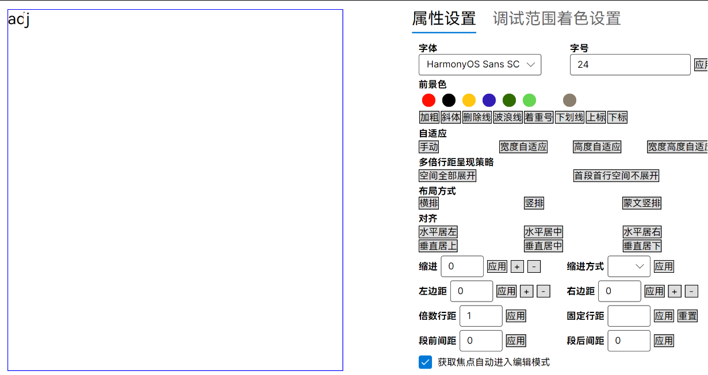

# Skia 在龙芯搭景嘉微显卡设备 某些字体会渲染相互覆盖

此问题是先在 Avalonia 应用上发现的，后续调查了解到是 Skia 底层的问题。本文将记录此问题和提供规避方法

<!--more-->


<!-- CreateTime:2025/11/12 07:23:38 -->

<!-- 发布 -->
<!-- 博客 -->

以下是我的一个 Avalonia 应用上的文本渲染效果。使用 HarmonyOS Sans SC 鸿蒙字体，在龙芯 Loongson-3A6000 搭配景嘉微 JM9100 显卡的设备上，将渲染出的字体相互渲染覆盖的情况。如下图所示，可见 `j` 字符覆盖了 `d` 字符

<!--  -->


具体的设备信息如下

```
$ lspci
08:00.0 VGA compatible controller: Jingjia Microelectronics Co Ltd JM9100 (rev 01)
...
```

```
$ cat /proc/cpuinfo
system type             : generic-loongson-machine
processor               : 0
package                 : 0
core                    : 0
cpu family              : Loongson-64bit
model name              : Loongson-3A6000
CPU Revision            : 0x00
FPU Revision            : 0x00
CPU MHz                 : 2500.00
BogoMIPS                : 5000.00
TLB entries             : 2112
Address sizes           : 48 bits physical, 48 bits virtual
isa                     : loongarch32 loongarch64
features                : cpucfg lam ual fpu lsx lasx crc32 lvz lbt_x86 lbt_arm lbt_mips
hardware watchpoint     : yes, iwatch count: 8, dwatch count: 4
...
```

```
$ cat /proc/gpuinfo_0
Vendor                      : Changsha JingJia Microelectronics Co.
Vendor ID                   : 0731
Device ID                   : 9100
GPU                         : JM9100
Bus Type                    : PCIE3.0 x8
Number of Stream Processors : 256
Memory Type                 : LPDDR4
Memory Size                 : 2048 MB
Memory Remain Size          : 382 MB
Memory Bit Wide             : 64
Memory Frequence            : 800 MHz
Memory Transfer Rate        : 3200 MB/s
Core Frequence              : 560 MHz
2D Frequence                : 1200 MHz
Kernel Version              : 1.5.7
Firmware Version            : jm9100lpfirmware-1.2.0-20230325.0004
ODM Manufacture             : Yeston
Realtime Temperature        : 57.92 Degree Centigrade
...
```

显卡驱动版本是 1.5.7-0kylin1

核心出现问题的代码是设置了 `SKFontEdging.SubpixelAntialias` 给到 SKFont 导致的

解决方法：

~~最佳解决方法是更新显卡驱动。我的伙伴 [SeWZC](https://github.com/SeWZC) 联系了景嘉微厂商，拿到了更新的 1.5.11-YK.u1-0kylin1 驱动版本，安装之后稍微解决部分问题~~

以下是安装之后的显卡驱动版本

```
mwv207-dev                                          1.5.11-YK.u1-0kylin1                      loongarch64  MWV207 driver for Xorg and GL package. Build by ChangSha JingJia Micro Company.
```

如无法更新显卡驱动，可以尝试更改 SKFontEdging 选项为非 SubpixelAntialias 枚举值。如果使用 Avalonia 框架，则这部分是改不动的。详细请看 https://github.com/AvaloniaUI/Avalonia/blob/dfd3b8864dd1abc06995eabf2ab225a85c00deb2/src/Skia/Avalonia.Skia/GlyphRunImpl.cs#L65

```csharp
namespace Avalonia.Skia
{
    internal class GlyphRunImpl : IGlyphRunImpl
    {
        public GlyphRunImpl(...)
        {
            ...
            // Ideally the requested edging should be passed to the glyph run.
            // Currently the edging is computed dynamically inside the drawing context, so we can't know it in advance.
            // But the bounds depends on the edging: for now, always use SubpixelAntialias so we have consistent values.
            // The resulting bounds may be shifted by 1px on some fonts:
            // "F" text with Inter size 14 has a 0px left bound with SubpixelAntialias but 1px with Antialias.
            using var font = CreateFont(SKFontEdging.SubpixelAntialias);
            ...
        }
    }
}
```

要么就是修改字体大小，让字体大小大于 48 号。即使是 48.001 也是可以规避此问题的

要么是更换字体，自己测试哪个字体不会存在相互覆盖的问题，且干掉斜体效果。此问题和 HarmonyOS Sans SC 鸿蒙字体没有强关系，其他多个字体也能复现问题

此问题我也在 Avalonia 报告，详细请看 <https://github.com/AvaloniaUI/Avalonia/issues/20035>


<a rel="license" href="http://creativecommons.org/licenses/by-nc-sa/4.0/"></a><br />本作品采用<a rel="license" href="http://creativecommons.org/licenses/by-nc-sa/4.0/">知识共享署名-非商业性使用-相同方式共享 4.0 国际许可协议</a>进行许可。欢迎转载、使用、重新发布，但务必保留文章署名[林德熙](http://blog.csdn.net/lindexi_gd)(包含链接:http://blog.csdn.net/lindexi_gd )，不得用于商业目的，基于本文修改后的作品务必以相同的许可发布。如有任何疑问，请与我[联系](mailto:lindexi_gd@163.com)。