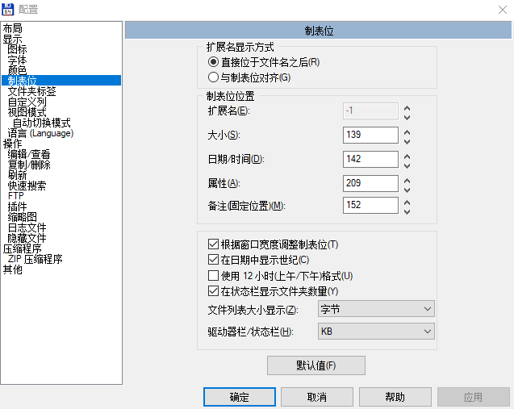

# Total Commander 显示文件包含文件名扩展

在默认的 Total Commander 是分开文件名和文件扩展，如果想要让文件名同时显示扩展，可以通过设置合并文件名和扩展两列

<!--more-->
<!-- CreateTime:2019/5/21 11:37:06 -->

<!-- 标签：TotalCommander，软件 -->

点击配置，在选项的制表修改显示

<!--  -->

[How to configure Total Commander to show files with their extensions? - Super User](https://superuser.com/a/238121/769791 )

[How to make total commander show file name with extensions? - Super User](https://superuser.com/a/329293/769791 )

 本作品采用<a rel="license" href="http://creativecommons.org/licenses/by-nc-sa/4.0/">知识共享署名-非商业性使用-相同方式共享 4.0 国际许可协议</a>进行许可。欢迎转载、使用、重新发布，但务必保留文章署名[林德熙](http://blog.csdn.net/lindexi_gd)(包含链接:http://blog.csdn.net/lindexi_gd )，不得用于商业目的，基于本文修改后的作品务必以相同的许可发布。如有任何疑问，请与我[联系](mailto:lindexi_gd@163.com)。  
