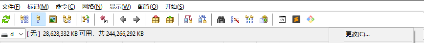
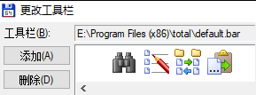
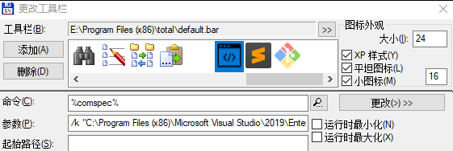
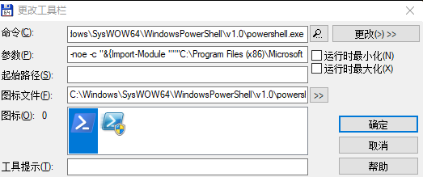

# TotalCommander 设置 VisualStudio 开发者命令行

在使用 TotalCommnader 可以设置工具的快捷图标，可以用来启动一些工具。而在进行开发，需要使用的命令行推荐使用 VisualStudio 开发命令行，因为在开发者命令行 Developer Command Prompt 提供了很多预定义的命令，包括 NuGet 和 MSBuild 这些命令

<!--more-->
<!-- CreateTime:2020/1/3 8:19:59 -->

<!-- 发布 -->

在TotalCommander的工具右击点击更改

<!--  -->


点击添加按钮

<!--  -->


此时通过开始菜单，搜寻 Developer Command Prompt 右击打开所在文件夹，可以找到快捷方式

右击快捷方式找到启动项

```
%comspec% /k "C:\Program Files (x86)\Microsoft Visual Studio\2019\Enterprise\Common7\Tools\VsDevCmd.bat"
```

我是使用 VisualStudio 2019 企业版，如果是其他的版本，那么上面的代码和我不相同

这里的 `%comspec%` 的意思就是 `cmd.exe` 也就是通过命令行执行脚本

复制上面的代码放在 TotalCommnader 将 `%comspec%` 和参数分开

<!--  -->


此时在 TotalCommnader 进入文件夹，可以点击命令行图标进入开发者命令行，同时自动设置了命令行当前文件夹是进入的文件夹

对熟悉 PowerShell 的小伙伴，可以将命令行修改为 PowerShell 命令

还是和上面步骤相同，找到 PowerShell 版本的 Developer PowerShell for VS 2019 快捷方式，右击属性可以看到下面代码

```
C:\Windows\SysWOW64\WindowsPowerShell\v1.0\powershell.exe -noe -c "&{Import-Module """C:\Program Files (x86)\Microsoft Visual Studio\2019\Enterprise\Common7\Tools\Microsoft.VisualStudio.DevShell.dll"""; Enter-VsDevShell e847a152}"
```

注意我使用 VisualStudio 2019 企业版，如果是其他的版本，那么上面的代码和我不相同

将上面代码的 `C:\Windows\SysWOW64\WindowsPowerShell\v1.0\powershell.exe` 和参数放在工具的命令和参数，同时参数需要加上 `; cd %P` 才能让 PowerShell 跳转到文件夹

这里的 `; cd %P` 是通过 ; 让 PowerShell 执行多语句，而 `%P` 是 TotalCommander 的命令会替换为当前文件夹

```
-noe -c "&{Import-Module """C:\Program Files (x86)\Microsoft Visual Studio\2019\Enterprise\Common7\Tools\Microsoft.VisualStudio.DevShell.dll"""; Enter-VsDevShell e847a152}"  ; cd %P
```

需要注意上面的命令需要用你自己的路径，不要直接复制上面代码

<!--  -->


<a rel="license" href="http://creativecommons.org/licenses/by-nc-sa/4.0/"></a><br />本作品采用<a rel="license" href="http://creativecommons.org/licenses/by-nc-sa/4.0/">知识共享署名-非商业性使用-相同方式共享 4.0 国际许可协议</a>进行许可。欢迎转载、使用、重新发布，但务必保留文章署名[林德熙](http://blog.csdn.net/lindexi_gd)(包含链接:http://blog.csdn.net/lindexi_gd )，不得用于商业目的，基于本文修改后的作品务必以相同的许可发布。如有任何疑问，请与我[联系](mailto:lindexi_gd@163.com)。
