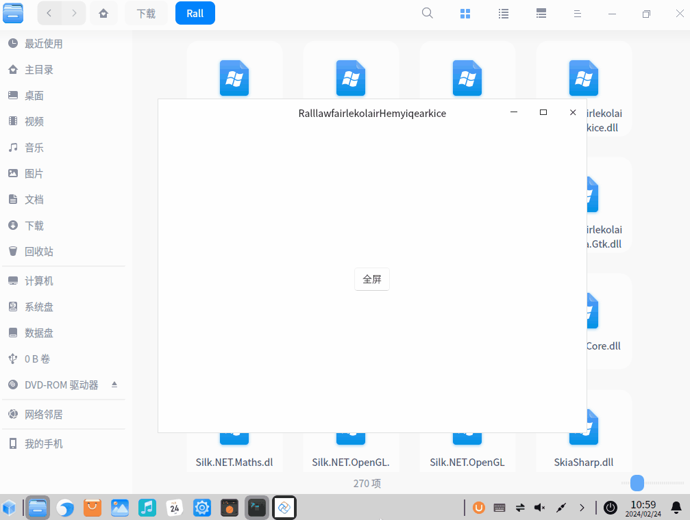

# UNO 设置平台进入全屏窗口模式的方法

本文记录在 UNO Platform 的桌面窗口项目里，进入和退出全屏窗口的方法，此方法包括 UNO 的 WPF 和 GTK 和 WinUI 版本的实现

<!--more-->
<!-- CreateTime:2024/2/23 20:43:35 -->
<!-- 发布 -->
<!-- 博客 -->

在 2024.06 的 5.2.139 的 UNO 版本里面，可通过如下简单方法进入全屏

```csharp
Microsoft.UI.Xaml.Window window = ...
window.AppWindow.SetPresenter(AppWindowPresenterKind.FullScreen);
```

通过如上方式即可让某个窗口进入全屏

以下为旧实现方法

---

实现思路是添加抽象的 IPlatformProvider 接口，在接口里面分别添加进入全屏和退出全屏的方法，如以下代码。接着再分别在 Skia.GTK 和 Skia.WPF 和 WinUI 平台上实现对接方法。所谓跨平台，就是各个平台都实现一遍

```csharp
public interface IPlatformProvider
{
    void EnterFullScreen();
    void ExitFullScreen();
}
```

为了方便让 UNO 统一平台的项目可以方便使用，再定义一个静态类，用于注入 IPlatformProvider 的各个平台的实现。此处如果依赖注入机制方便对接的话，也可以对接一份进入到容器里，如果不方便对接，那就继续沿用静态类型

```csharp
public static class PlatformHelper
{
    public static IPlatformProvider? PlatformProvider
    {
        get => _platformProvider;
        set
        {
            if (_platformProvider != null)
            {
                throw new InvalidOperationException("PlatformProvider can only be set once");
            }

            _platformProvider = value;
        }
    }

    private static IPlatformProvider? _platformProvider;
}
```

以下是各个平台的具体实现

在 WPF 平台下的实现，我使用的是 [WPF 稳定的全屏化窗口方法](https://blog.lindexi.com/post/WPF-%E7%A8%B3%E5%AE%9A%E7%9A%84%E5%85%A8%E5%B1%8F%E5%8C%96%E7%AA%97%E5%8F%A3%E6%96%B9%E6%B3%95.html ) 博客里面提供的方式进行全屏，以下代码省略 FullScreenHelper 的代码，大家可以在本文末尾获取到全部代码

```csharp
public class PlatformProvider : IPlatformProvider
{
    public PlatformProvider(Window window)
    {
        _window = window;
    }

    private readonly Window _window;

    public void EnterFullScreen()
    {
        FullScreenHelper.StartFullScreen(_window);
    }

    public void ExitFullScreen()
    {
        FullScreenHelper.EndFullScreen(_window);
    }
}
```

如果想要达成更好的效果，可以使用以下 [walterlv](https://blog.walterlv.com ) 大佬提供的方法，额外设置 WindowChrome 修复边框白边

```csharp
    internal class WindowPlatformProvider : IPlatformProvider
    {
        private readonly Window _window;
        private readonly WindowChrome _windowChrome;

        public WindowPlatformProvider(Window window)
        {
            _window = window;
            _windowChrome = new WindowChrome
            {
                GlassFrameThickness = WindowChrome.GlassFrameCompleteThickness,
                CaptionHeight = 32,
                CornerRadius = new CornerRadius(),
                ResizeBorderThickness = new Thickness(6),
                UseAeroCaptionButtons = false,
            };
            WindowChrome.SetWindowChrome(_window, _windowChrome);
        }

        public bool IsFullScreen { get; private set; }

        public void EnterFullScreen()
        {
            IsFullScreen = true;
            _window.WindowStyle = WindowStyle.None;
            WindowChrome.SetWindowChrome(_window, null);
            FullScreenHelper.StartFullScreen(_window);
        }

        public void ExitFullScreen()
        {
            IsFullScreen = false;
            _window.WindowStyle = WindowStyle.SingleBorderWindow;
            WindowChrome.SetWindowChrome(_window, _windowChrome);
            FullScreenHelper.EndFullScreen(_window);
        }
    }
```

对接的代码放在 App.xaml.cs 的 构造 里面，如以下代码

```csharp
public partial class App : WpfApp
{
    public App()
    {
        var host = new WpfHost(Dispatcher, () => new AppHead());
        host.Run();
        PlatformHelper.PlatformProvider = new PlatformProvider(MainWindow!);
    }
}
```

下面是 WinUI 项目里面的定义，代码如下

```csharp
internal class PlatformProvider : IPlatformProvider
{
    public PlatformProvider(Window window)
    {
        _window = window;
    }

    private readonly Window _window;

    public void EnterFullScreen()
    {
        _window.AppWindow.SetPresenter(AppWindowPresenterKind.FullScreen);
    }

    public void ExitFullScreen()
    {
        _window.AppWindow.SetPresenter(AppWindowPresenterKind.Default);
    }
}
```

对应的对接代码需要编写在 AppHead.xaml.cs 的 OnLaunched 里面，如以下代码

```csharp
    protected override void OnLaunched(LaunchActivatedEventArgs args)
    {
        base.OnLaunched(args);
#if WINDOWS10_0_17763_0_OR_GREATER
        PlatformHelper.PlatformProvider = new PlatformProvider(MainWindow!);
#endif
        MainWindow.SetWindowIcon();
    }
```

额外的关于 UWP 的全屏，请参阅 [win10 UWP 全屏](https://blog.lindexi.com/post/win10-UWP-%E5%85%A8%E5%B1%8F.html )

最后是 GTK 项目的平台定义，代码如下

```csharp
public class GtkPlatformProvider : IPlatformProvider
{
    public GtkPlatformProvider(GtkHost gtkHost)
    {
        _gtkHost = gtkHost;
    }

    private readonly GtkHost _gtkHost;

    public void EnterFullScreen()
    {
        _gtkHost.Window?.Fullscreen();
    }

    public void ExitFullScreen()
    {
        _gtkHost.Window?.Unfullscreen();
    }
}
```

对应的 GTK 对接代码如下

```csharp
    public static void Main(string[] args)
    {
        ExceptionManager.UnhandledException += delegate (UnhandledExceptionArgs expArgs)
        {
            Console.WriteLine("GLIB UNHANDLED EXCEPTION" + expArgs.ExceptionObject.ToString());
            expArgs.ExitApplication = true;
        };

        var host = new GtkHost(() => new AppHead());
        PlatformHelper.PlatformProvider = new GtkPlatformProvider(host);
        host.Run();
    }
```

如果仅需更改 GTK 窗口尺寸，请参阅 [UNO.Skia.Gtk 设置窗口尺寸变化方法](https://blog.lindexi.com/post/UNO.Skia.Gtk-%E8%AE%BE%E7%BD%AE%E7%AA%97%E5%8F%A3%E5%B0%BA%E5%AF%B8%E5%8F%98%E5%8C%96%E6%96%B9%E6%B3%95.html )

以上代码就完成了 UNO 的 WPF 和 GTK 和 WinUI 桌面平台的窗口全屏的实现。为了测试效果，进入 MainPage.xaml 里面添加一个 ToggleButton 按钮，用来控制进入和退出全屏，界面代码如下

```xml
    <ToggleButton x:Name="FullScreenButton" HorizontalAlignment="Center" VerticalAlignment="Center" Click="FullScreenButton_OnClick">全屏</ToggleButton>
```

后台代码如下

```csharp
    private void FullScreenButton_OnClick(object sender, RoutedEventArgs e)
    {
        var toggleButton = (ToggleButton) sender;
        if (toggleButton.IsChecked is true)
        {
            PlatformHelper.PlatformProvider?.EnterFullScreen();
        }
        else
        {
            PlatformHelper.PlatformProvider?.ExitFullScreen();
        }
    }
```

完成代码之后，分别切换到 UNO 的 WPF 和 GTK 和 WinUI 平台上，进行构建和运行项目。测试点击全屏按钮时，是否能够符合预期的进入和退出全屏模式。如下图是在 UOS 上使用 Skia.GTK 的测试效果

<!--  -->


代码放在 [github](https://github.com/lindexi/lindexi_gd/tree/0b1371317210b0a5e000484d57ee3ae7fc844e24/RalllawfairlekolairHemyiqearkice) 和 [gitee](https://gitee.com/lindexi/lindexi_gd/tree/0b1371317210b0a5e000484d57ee3ae7fc844e24/RalllawfairlekolairHemyiqearkice) 上，可以使用如下命令行拉取代码

先创建一个空文件夹，接着使用命令行 cd 命令进入此空文件夹，在命令行里面输入以下代码，即可获取到本文的代码

```
git init
git remote add origin https://gitee.com/lindexi/lindexi_gd.git
git pull origin 0b1371317210b0a5e000484d57ee3ae7fc844e24
```

以上使用的是 gitee 的源，如果 gitee 不能访问，请替换为 github 的源。请在命令行继续输入以下代码，将 gitee 源换成 github 源进行拉取代码

```
git remote remove origin
git remote add origin https://github.com/lindexi/lindexi_gd.git
git pull origin 0b1371317210b0a5e000484d57ee3ae7fc844e24
```

获取代码之后，进入 RalllawfairlekolairHemyiqearkice 文件夹，即可获取到源代码