# UOS 开启 VisualStudio 远程调试 .NET 应用之旅

本文记录的是在 Windows 系统里面，使用 VisualStudio 2022 远程调试运行在 UOS 里面 dotnet 应用的配置方法

<!--more-->


<!-- CreateTime:2024/03/21 07:05:36 -->

<!-- 发布 -->
<!-- 博客 -->

本文写于 2024.03.19 如果你阅读本文的时间距离本文编写的时间过于长，那本文可能包含过期的知识

我将以我的 UOS 虚拟机作为例子告诉大家如何在 Windows 系统里面，使用 VisualStudio 2022 远程调试运行在 UOS 里面 dotnet 应用。这里的 dotnet 应用不仅包含纯控制台即可实现的 ASP.NET Core 也包括带 GUI 的程序，包括 CPF 、 UNO/MAUI、 Avalonia 等 UI 框架上构建的可运行在 UOS Linux 系统上的应用

## 准备

第一步是保证 UOS 和 Windows 构成局域网网络，或可直接联通的网络。这一步可自行了解网络配置，只要双方网络能互通即可，挂在一个局域网内相同网段是最好的选择

<!-- 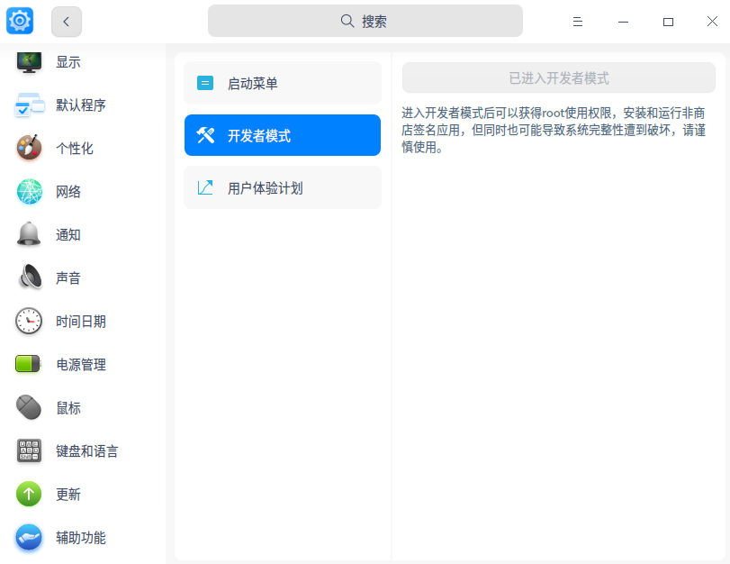 -->


其次是在 UOS 里面开启开发者模式，开启方法请参阅 [如何打开开发者模式？-UOS官方文档](https://doc.chinauos.com/content/poVHjoEBplouMytzM6i8)

准备工作就此两步，接下来就是进行配置

## 配置

接着的配置步骤可以分为两大块，分别是 SSH 的开启以及 VisualStudio 的连接

### 开启 SSH 的支持

默认的 UOS 是没有开启 SSH 的支持的，本文将使用 Tame-complexity 大佬在博客园里面的写的 [Linux开启ssh - Tame-complexity - 博客园](https://www.cnblogs.com/linshengqian/p/15065571.html ) 博客里面的部分方法开启 ssh 连接，具体步骤如下

先修改sshd服务配置文件，修改此文件需要权限

```
sudo su
> 输入你的密码
vi /etc/ssh/sshd_config
```

<!-- 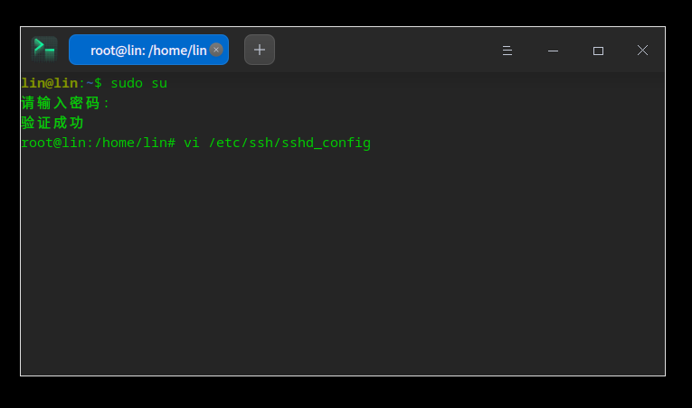 -->


进入 `sshd_config` 编辑入以下代码，这里有一个可简化的输入方法，那就是一般此文件里面只是包含大量被注释掉的配置，只需要找到对应的配置，解开注释即可

```
Port 22
ListenAddress 0.0.0.0
ListenAddress ::

PermitRootLogin yes
PasswordAuthentication yes
```

<!-- 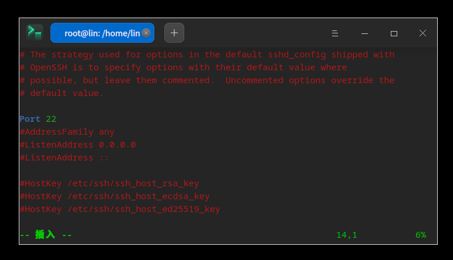 -->


相信阅读到这里的伙伴是知道 vim 的基础操作的，如果不了解的话，还请自行查阅一下 vim 如何编辑文件以及如何保存退出哈。简单说就是按下 `i` 键进入编辑模式，然后使用 `esc` 键盘退出编辑模式，再输入 `:wq` 即可完成保存退出

如果是解开注释的话，需要小心 PermitRootLogin 配置项默认是 prohibit-password 的值，需要改为 yes 才对

<!-- 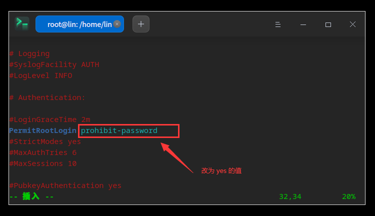 -->


配置完成之后，使用以下命令了解一下 ssh 的运行情况

```
/etc/init.d/ssh status
```

<!-- 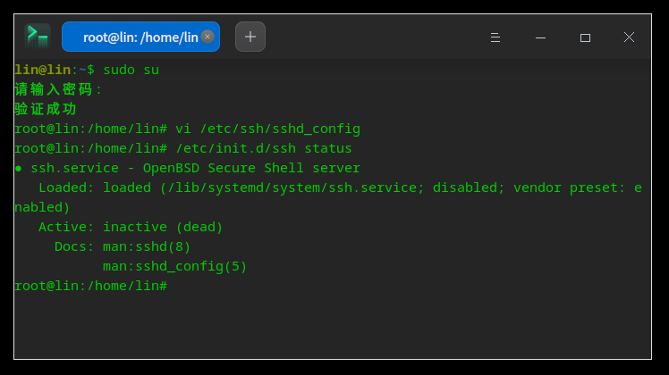 -->


默认新装的 UOS 都是关闭的状态，请使用以下代码进行开启

```
/etc/init.d/ssh start
```

<!-- 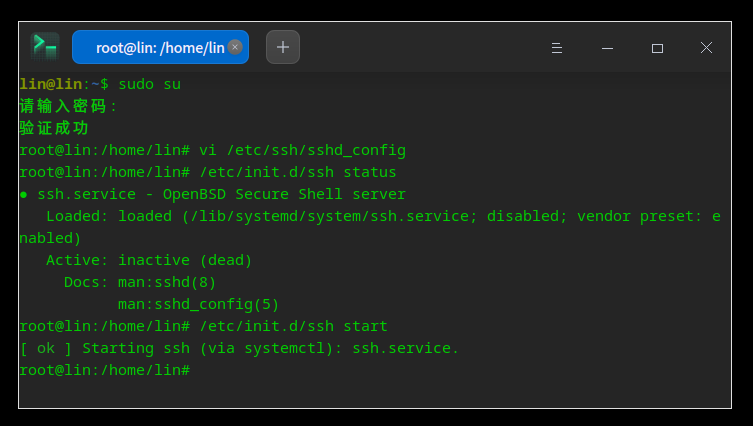 -->


开启之后，继续使用 `/etc/init.d/ssh status` 命令了解一下状态，预期是能够正确开启。如果不能正确开启，再根据错误信息，自行解决

<!-- 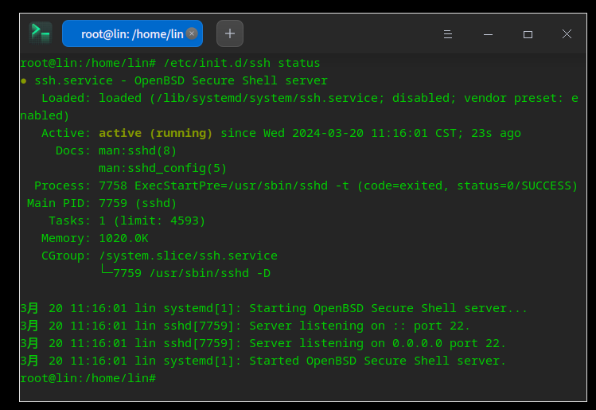 -->


### 使用 VisualStudio 连接

打开一个 VisualStudio 2022 用于尝试附加调试连接

点击调试里面的附加进程

<!-- 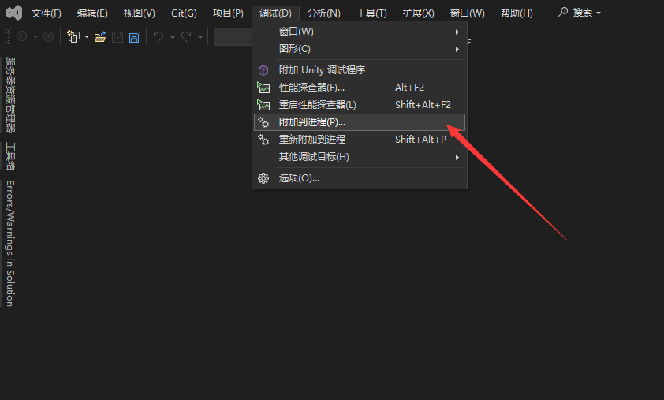 -->


点击连接类型，切换到 ssh 类型

<!-- 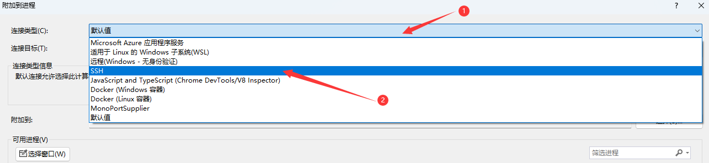 -->


在连接目标里面输入 UOS 的网络地址，这里支持 IP 或域名，如果开启的 SSH 端口非 22 端口，这里也可以不用输入端口，可以在后续界面再输入。输入完成之后按回车，或者点查找按钮，但查找按钮有时候会不工作，推荐还是按回车好

<!-- 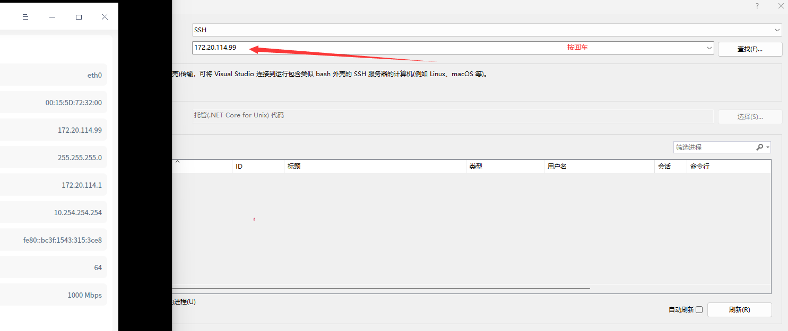 -->


按下回车之后，可以看到如下界面，输入你的端口和用户名密码，即可点击连接

<!-- 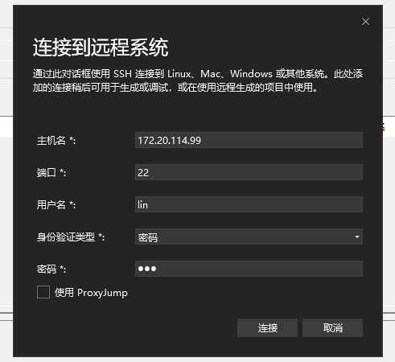 -->


如果能够看到提示是否要继续连接，请点击 是 按钮

<!-- 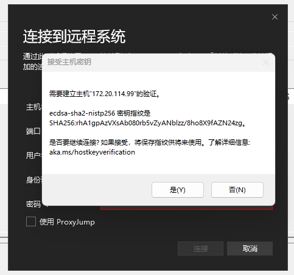 -->


预期是能够看到以下调试界面，如能看到则表示连接成功，如果连接失败，请回到上一步，确定自己配置正确了 SSH 连接

<!-- 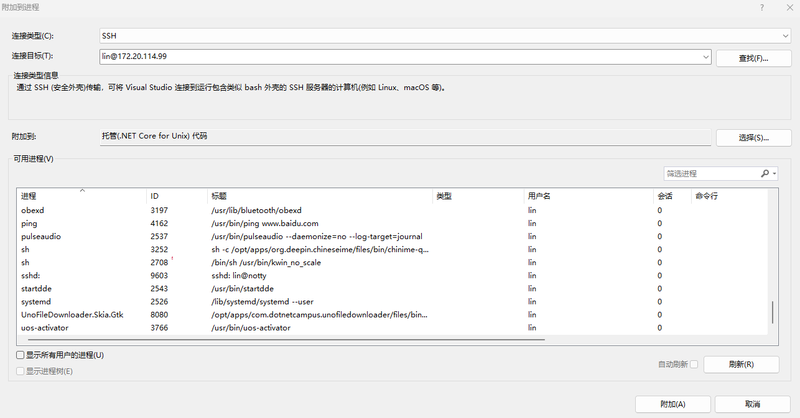 -->


常见的错误就是网络连不通，以及输入错账号密码等

## 开启调试

接下来将使用 dotnet-campus 开源的下载器项目作为调试的例子

先从可用进程选中将要调试的应用，接着的细节是点击附加到里面，选择手动以及选择 托管(.NET Core for Unix)代码 选项。这是因为默认的 VisualStudio 的自动选择经常不工作

<!-- 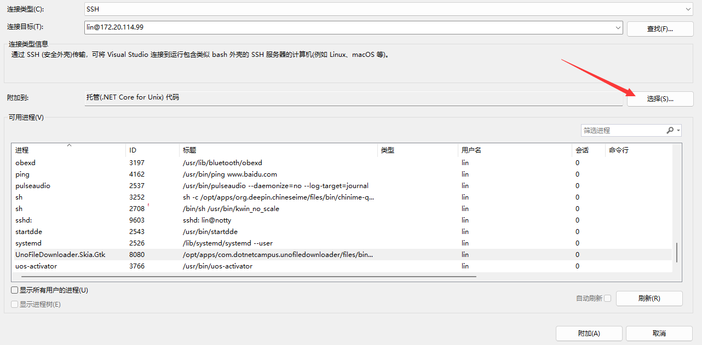 -->


点击调试以下代码类型，然后选择 托管(.NET Core for Unix)代码 即可

<!-- 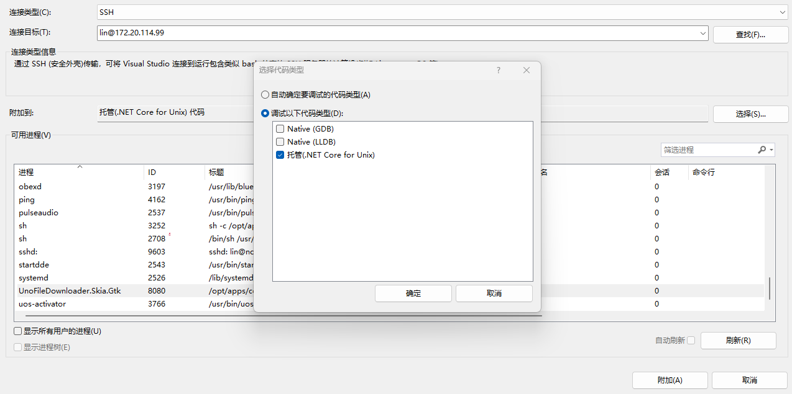 -->


如果大家看到附加按钮是禁用状态，也可以尝试以上的选择 托管(.NET Core for Unix)代码 步骤

完成配置之后，即可点击附加按钮，基本都能成功

但如果有遇到以下失败的，提示 未能启动调试适配器，可在输出窗口查看额外的信息

> Unable to find debugger script at 'home/lin/.vs-debugger'.

<!-- 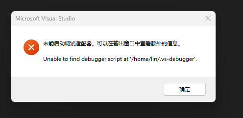 -->


看到错误有以下代码

```
[ERROR] 灾难性故障 (异常来自 HRESULT:0x8000FFFF (E_UNEXPECTED))
```

也有类似如下错误输出信息

```
11:34:39:958	未能启动调试适配器“coreclr”。
11:34:39:958	Unable to find debugger script at '/home/lin/.vs-debugger'.
11:34:39:958	
11:34:39:958	
11:34:39:959	初始化日志:
11:34:39:959	Determining user folder on remote system...
11:34:39:959	Checking for existing installation of debugging tools...
11:34:39:959	Downloading debugger launcher...
11:34:39:959	Creating debugger installation folder: /home/lin/.vs-debugger
11:34:39:959	Failed: 无法创建或访问指定的目录 /home/lin/.vs-debugger。
11:34:39:959	参数名: path
11:34:39:959	Unable to find debugger script at '/home/lin/.vs-debugger'.
11:34:39:959	Failed: Unable to find debugger script at '/home/lin/.vs-debugger'.
```

那就是 VisualStudio 创建 `.vs-debugger` 文件夹失败

或提示 Failed: The specified directory /home/lin/.vs-debugger could not be created or accessed. 等信息

可使用以下方法解决。回到 UOS 命令行里面，退出 sudo su 状态，使用用户权限创建 `~/.vs-debugger` 文件夹

```
exit

cd ~

mkdir .vs-debugger
```

<!-- 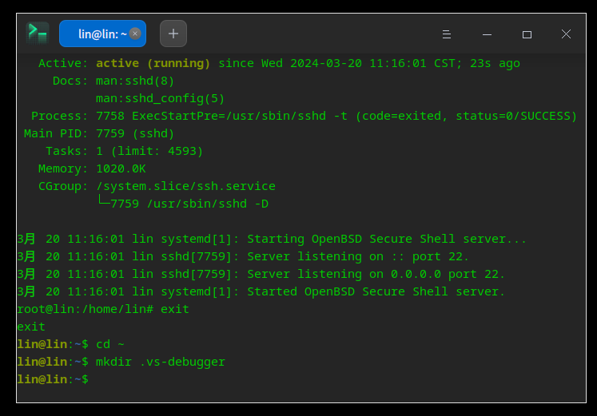 -->


以上的 exit 命令仅仅为了退出 sudo su 状态，如果你是新开的控制台，那请不要带上 exit 命令

完成以上命令之后，再次尝试在 VisualStudio 附加调试

预期能够看到正在启动调试适配器界面

<!-- 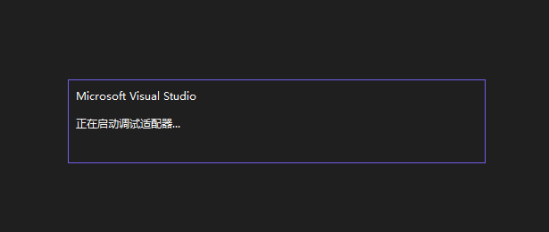 -->


看到此界面表示 VisualStudio 正在帮你部署调试环境，首次部署输入比较慢，大概需要在你的 UOS 下载 200MB 的内容

如果等太久，可以进入 `~/.vs-debugger` 输入 `du -sh` 命令查看大小，就可以知道是否正在下载

<!-- 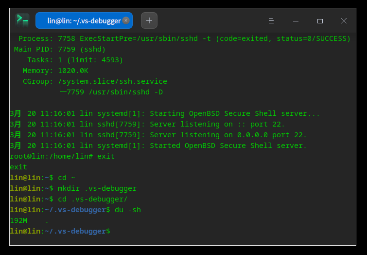 -->


接下来就进入到了咱熟悉的 VisualStudio 调试 .NET 应用的状态了

试试点击 VisualStudio 的暂停按钮，看看线程和堆栈

此调试方式配合 dotnet-campus 开源的 SyncTool 工具使用更好，通过 SyncTool 将 Windows 上的 VisualStudio 构建输出内容同步到 Linux 设备上，然后使用远程调试方式进行调试

详细请参阅 [SyncTool 开源项目](https://github.com/dotnet-campus/dotnetcampus.DotNETBuildSDK)


<a rel="license" href="http://creativecommons.org/licenses/by-nc-sa/4.0/"></a><br />本作品采用<a rel="license" href="http://creativecommons.org/licenses/by-nc-sa/4.0/">知识共享署名-非商业性使用-相同方式共享 4.0 国际许可协议</a>进行许可。欢迎转载、使用、重新发布，但务必保留文章署名[林德熙](http://blog.csdn.net/lindexi_gd)(包含链接:http://blog.csdn.net/lindexi_gd )，不得用于商业目的，基于本文修改后的作品务必以相同的许可发布。如有任何疑问，请与我[联系](mailto:lindexi_gd@163.com)。