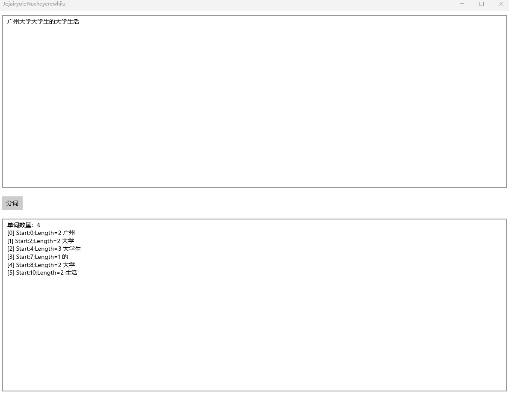

# UWP WinRT 使用系统自带的分词库对字符串文本进行分词

本文将和大家介绍在 UWP 应用，或其他能接入 WinRT 的应用里，使用系统自带的分词库，对中文、英文等等自然语言的字符串文本进行分词

<!--more-->
<!-- CreateTime:2023/4/27 8:44:49 -->

<!-- 发布 -->
<!-- 博客 -->

开始之前需要说明的是，现在不仅仅 UWP 应用，其他的 UI 框架，如 WPF 或 WinForms 或者是 dotnet 控制台都是可以像接入 Win32 一样接入 WinRT 平台。详细请参阅 [我的博客导航](https://blog.lindexi.com/post/%E5%8D%9A%E5%AE%A2%E5%AF%BC%E8%88%AA.html ) 的 WinRT 部分

本文将采用 UWP 作为例子，在 WPF 下调用的 API 也是相同的，许多代码都可以直接拷贝，不需要做更改

先新建一个 UWP 应用，由于本次采用的是 WinRT 提供的方法，直接就是平台自带提供，不需要安装额外的 NuGet 包

先看看分词的效果：

<!--  -->


开始之前，先写一点有趣的界面方便进行测试，界面代码如下，本文所有的代码都可以在本文末尾找到下载方式

```xml
    <Grid>
        <Grid.RowDefinitions>
            <RowDefinition></RowDefinition>
            <RowDefinition Height="Auto"></RowDefinition>
            <RowDefinition></RowDefinition>
        </Grid.RowDefinitions>
        <TextBox x:Name="InputTextBox" Margin="10,10,10,10" IsSpellCheckEnabled="False" AcceptsReturn="True" TextWrapping="Wrap"></TextBox>
        <Button Grid.Row="1" Margin="10,10,10,10" Click="Button_OnClick">分词</Button>
        <TextBox x:Name="TextBox" Grid.Row="2" Margin="10,10,10,10" IsReadOnly="True" AcceptsReturn="True" TextWrapping="Wrap"></TextBox>
    </Grid>
```

在点击分词按钮时，将执行分词逻辑，代码如下

```csharp
        private void Button_OnClick(object sender, RoutedEventArgs e)
        {
            var inputText = InputTextBox.Text;
            if (string.IsNullOrEmpty(inputText))
            {
                return;
            }

            var stringBuilder = new StringBuilder();

            var wordsSegmenter = new WordsSegmenter("zh-CN");

            var wordSegmentList = wordsSegmenter.GetTokens(inputText);
            stringBuilder.AppendLine($"单词数量：{wordSegmentList.Count}");

            for (var i = 0; i < wordSegmentList.Count; i++)
            {
                var wordSegment = wordSegmentList[i];
                stringBuilder.AppendLine($"[{i}] Start:{wordSegment.SourceTextSegment.StartPosition};Length={wordSegment.SourceTextSegment.Length} {wordSegment.Text}");
            }

            TextBox.Text = stringBuilder.ToString();
        }
    }
```

请自行引用以下命名空间

```csharp
using System.Text;
using Windows.Data.Text;
using Windows.UI.Xaml;
using Windows.UI.Xaml.Controls;
```

以上代码就是通过 WinRT 提供的 WordsSegmenter 进行分词。由于世界上的语言文化特别多，而且不同的语言文化的规则可能存在冲突。想要实现比较好的效果，这里就需要传入期望采用哪个语言文化的规则进行分词。可以传入的

可以传入的语言文化字符串请参阅 [BCP-47](https://www.rfc-editor.org/info/bcp47) 标准文档

创建的过程中，由于不同的用户设备可能安装有不同的分词库，可能传入的语言文化对应的分词库是在当前设备上找不到的。判断传入的语言文化是否能找到，可以通过 WordsSegmenter 的 ResolvedLanguage 属性进行判断。此 ResolvedLanguage 属性是表示实际使用的分词库语言

```csharp
            var language = "zh-CN";

            var wordsSegmenter = new WordsSegmenter(language);

            if (wordsSegmenter.ResolvedLanguage == language)
            {
                // 证明本机安装了传入语言的分词库
            }
```

如果传入的语言文化在本机没有找到，那么 ResolvedLanguage 将会是 "und" 字符串的值。这个 und 表示的是 undetermined 的意思。这个时候将采用通用语言文化无关规则进行分词

值得一提的是这里传入的语言文化是采用本机的语言文化库进行分词，传入中文语言文化不代表只能对中文字符串进行分词，而是采用中文语音文化的规则对文本字符串分词，可以支持中文英文和数字等等

创建了 WordsSegmenter 对象，即可通过 GetTokens 方法进行分词，分词时可以看到分出的每个单词和对应的词在字符串里面的偏移量

以上就是 WinRT 使用系统自带的语言文化分词库对文本进行分词的方法

本文以上代码放在[github](https://github.com/lindexi/lindexi_gd/tree/a59524fc6cc35669fbb186f1ea2221891a1546cb/JojairyoleNucheyerewhilu) 和 [gitee](https://gitee.com/lindexi/lindexi_gd/tree/a59524fc6cc35669fbb186f1ea2221891a1546cb/JojairyoleNucheyerewhilu) 欢迎访问

可以通过如下方式获取源代码，先创建一个空文件夹，接着使用命令行 cd 命令进入此空文件夹，在命令行里面输入以下代码，即可获取到代码

```
git init
git remote add origin https://gitee.com/lindexi/lindexi_gd.git
git pull origin a59524fc6cc35669fbb186f1ea2221891a1546cb
```

以上使用的是 gitee 的源，如果 gitee 不能访问，请替换为 github 的源。请在命令行继续输入以下代码

```
git remote remove origin
git remote add origin https://github.com/lindexi/lindexi_gd.git
git pull origin a59524fc6cc35669fbb186f1ea2221891a1546cb
```

获取代码之后，进入 JojairyoleNucheyerewhilu 文件夹

更多博客请参阅 [博客导航](https://blog.lindexi.com/post/%E5%8D%9A%E5%AE%A2%E5%AF%BC%E8%88%AA.html )