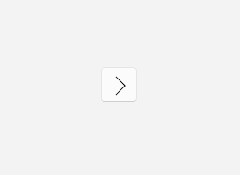

# UWP WinUI 制作一个路径矢量图标按钮样式入门

本文将告诉大家如何在 UWP 或 WinUI3 或 UNO 里，如何制作一个路径按钮。路径按钮就是使用几何路径轮廓表示内容的按钮，常见于各种图标按钮，或 svg 系贴图矢量图按钮

<!--more-->
<!-- CreateTime:2024/07/06 07:07:25 -->

<!-- 发布 -->
<!-- 博客 -->

在网上有非常多矢量图库，其中免费的图库也非常多，比如 <https://www.iconfont.cn/> 等等。在咱的应用程序里面，可以使用这些矢量图作为按钮的图标，从而更好的进行表意，让界面有更好的设计。使用矢量图还自然带有缩放时依然清晰的功能

最为简单的制作方式就是在按钮里面存放一个 Path 作为内容，比如做一个简单的路径矢量图标按钮

```xml
    <Button HorizontalAlignment="Center" VerticalAlignment="Center">
      <Path Stroke="Black" StrokeThickness="1" Data="M5,5L15,15L5,25"></Path>
    </Button>
```

<!--  -->


可以看到简单的几行代码就可以实现一个图标按钮的功能了。不过哩作为有追求的开发者，可不能像在树上的小猫一样，咱还需要多加一些需求。比如我希望鼠标移动到按钮上的时候，按钮可以变色，比如说我感觉上面的重复代码多了，即我有多个图标按钮都有大量相似的代码，能不能做一个样式实现这些功能？当然是可以的啦

先在一个资源里面定义按钮的样式，资源可以放在自己的应用业务代码 xaml 文件里面，也可以单独做一个资源字典。本文为了简单，就放在 MainPage.xaml 里面了。如果大家想要放在资源字典里面，别忘了引用资源字典哦

```xml
    <Style x:Key="Style.Button.PathButtonStyle" TargetType="Button">
       ...
    </Style>
```

如上面代码，就定义了一个名为 `Style.Button.PathButtonStyle` 的代码样式。这样的样式命名方法是我习惯用的，因为如此可以方便一级级点下去，特别在有 ReSharper 的帮助下，会更加好用，在样式特别多的时候，这样写能够和 ReSharper 更好的进行配合

这样的样式，可以应用到按钮代码上，如下面代码

```xml
   <Button Style="{StaticResource Style.Button.PathButtonStyle}"
   	 .../>
```

此样式都是给路径图标按钮制作，可以制作非常明确的按钮样式实现。对于 xaml 的界面样式实现的编码思路有些会和 C# 不一样，即不追求抽象性，有很多界面逻辑都是越具体越好，且允许有一些代码是重复的。核心追求就是让界面代码在看的时候可以更好的和界面效果联系起来，按照界面组织的方式走而不是按照逻辑的组织方式走。且有些界面效果是追求界面像，而不追求逻辑合理，即只要界面像就好更重要，当然，能两者都兼顾那是最好的。放心，本文提供的方法还是两者都兼顾的。那是否只有本文介绍的附加属性的方法才是最佳实践？当然不是啦，只不过这个方法我用的顺手而已

```xml
    <Style x:Key="Style.Button.PathButtonStyle" TargetType="Button">
      <Setter Property="Template">
        <Setter.Value>
          <ControlTemplate TargetType="Button">
            <Grid x:Name="RootGrid" Background="{TemplateBinding Background}">
              <Path x:Name="ButtonContentPath" StrokeThickness="1" Stroke="Black" Data="M5,5L15,15L5,25"></Path>
            </Grid>
          </ControlTemplate>
        </Setter.Value>
      </Setter>
    </Style>
```

如上面代码，即定义了一个图标按钮的样式，也写明了图标按钮的内容，应用此样式的按钮即可显示出也如上图的效果

样式自然是追求一定的通用性的，上面代码只能显示固定的路径图标，自然不符合咱的需求。能否让 ButtonContentPath 的 Data 参与业务定制？自然是可以的，接下来咱使用简单的附加属性来解决此问题

通过附加属性的方式，既可以用在 UWP 等框架上，同样在 WPF 里面也是可以使用的，毕竟都是相同系列的框架

在后台 cs 代码里面定义一个名为 ButtonHelper 的类型，将在这个类型里面定义附加属性，实现代码如下

```csharp
public class ButtonHelper
{
    public static readonly DependencyProperty ButtonPathProperty = DependencyProperty.RegisterAttached(
        "ButtonPath", typeof(string), typeof(ButtonHelper), new PropertyMetadata(default(string)));
    
    public static void SetButtonPath(DependencyObject element, string value)
    {
        element.SetValue(ButtonPathProperty, value);
    }
    
    public static string GetButtonPath(DependencyObject element)
    {
        return (string)element.GetValue(ButtonPathProperty);
    }
    
    ... // 忽略其他代码
}
```

如此即可在样式里面进行绑定 Data 的内容，核心代码如下

```xml
<Path x:Name="ButtonContentPath" StrokeThickness="2" Stroke="#FF666666" Data="{Binding  RelativeSource={RelativeSource TemplatedParent},Path=(local:ButtonHelper.ButtonPath)}"></Path>
```

如果大家看了本文的内容不知道代码写在哪，可以到本文末尾获取所有代码的下载方法，拉取我的代码跑跑看

通过以上代码，可以看到使用 `(local:ButtonHelper.ButtonPath)` 将 Data 绑定到 ButtonHelper 的 ButtonPath 附加属性上，属性源是通过 `RelativeSource={RelativeSource TemplatedParent}` 指定的，在这里就是按钮本身。以上代码的 `local:` 的 local 表示的 xaml 命名空间，这是因为我将 ButtonHelper 放在和 MainPage 相同的命名空间上，于是就刚好就是 local 的值，如果大家放在其他命名空间，还请在 VisualStudio 的帮助下进行命名空间引用 。以上代码的细节在于必须通过 `RelativeSource` 和 TemplatedParent 指定，且使用 Binding 进行绑定，不能通过 TemplateBinding 和 Source 指定绑定

应用以上样式的按钮，需要在按钮上给 ButtonHelper 的 ButtonPath 附加属性进行赋值，如以下代码

```csharp
    <Button Style="{StaticResource Style.Button.PathButtonStyle}"

local:ButtonHelper.ButtonPath="M5,5L15,15L5,25"
     .../>
```

运行代码也可以看到大概如上图的效果，也就是本文以上提供的三个方式都是实现相同的一个按钮效果。可以看到第一个代码最简单，最后一个代码最有通用性，可以将更多的图标按钮使用样式减少重复的代码

那接下来给样式提出更多的要求，如鼠标移动到按钮上方时，修改按钮的图标颜色

对于 Path 元素来说，可以通过 Stroke 和 StrokeThickness 分别修改轮廓颜色画刷和轮廓线条粗细，可以使用 Fill 属性修改填充画刷。在鼠标移动到按钮上方，即 PointerOver 时，通过设置轮廓画刷或填充画刷即可修改按钮的图标颜色

期望在鼠标移动到按钮上方，即 PointerOver 时，设置轮廓画刷或填充画刷，需要配合 VisualStateManager 提供的多个视觉状态，在每个视觉状态下给属性赋值或制作动画

最常用的 VisualStateManager 的 VisualStateGroup 是 CommonStates 组，基础代码组成如下

```xml
              <VisualStateManager.VisualStateGroups>
                <VisualStateGroup x:Name="CommonStates">
                  <VisualState x:Name="Normal">
                    <!-- 正常状态 -->
                  </VisualState>
                  <VisualState x:Name="PointerOver">
                   <!-- 鼠标移动到控件上，即 WPF 的 Hover 效果 -->
                  </VisualState>
                  <VisualState x:Name="Pressed">
                    <!-- 鼠标按下的状态，或叫点击的状态 -->
                  </VisualState>
                </VisualStateGroup>
              </VisualStateManager.VisualStateGroups>
```

这里有一些细节事项：

- 由于 VisualStateManager 必须放在容器里面，因此这里必须需要有一个容器控件住 VisualStateManager 的代码。简单的容器就是如 Grid 等控件，想省一点资源的话，可以用 Border 代替 Grid 做容器
- 一般情况下，第一个状态是 Normal 状态，里面啥都不用做，啥都不用做可以清空其他的 VisualState 的状态。正常状态需要放在第一个

开始编写正式的代码之前，先复习一下 VisualStateManager 的用法，如下面的代码，既可以在 VisualState 里面使用 Setter 修改属性。也可以使用 Storyboard 做动画修改属性。做动画的方式可以比较柔和，有渐变的效果

```xml
  <Page.Resources>
    <Style x:Key="Style.Button.FooButtonStyle" TargetType="Button">
      <Setter Property="Template">
        <Setter.Value>
          <ControlTemplate TargetType="Button">
            <Grid x:Name="RootGrid" Background="{TemplateBinding Background}">
              <!-- 由于 VisualStateManager 必须放在容器里面，因此这里必须需要有一个容器 想省一点的话，可以用 Border 代替 Grid 做容器-->
              <VisualStateManager.VisualStateGroups>
                <VisualStateGroup x:Name="CommonStates">
                  <VisualState x:Name="Normal">
                    <Storyboard>
                      <!--啥都不用做，清空状态即可-->
                      <!-- 正常状态需要放在第一个 -->
                    </Storyboard>
                  </VisualState>
                  <VisualState x:Name="PointerOver">
                    <!-- Hover 效果 -->
                    <VisualState.Setters>
                      <Setter Target="ButtonContentPath.Stroke" Value="Transparent"></Setter>
                      <Setter Target="ButtonContentPath.Fill" Value="Blue"></Setter>
                    </VisualState.Setters>
                  </VisualState>
                  <VisualState x:Name="Pressed">
                    <!-- 按下状态 -->
                    <Storyboard>
                      <!-- 颜色用 ColorAnimation 也可以 -->
                      <!-- <ColorAnimation To=""></ColorAnimation> -->
                      <ObjectAnimationUsingKeyFrames Storyboard.TargetName="ButtonContentPath" Storyboard.TargetProperty="Stroke" >
                        <DiscreteObjectKeyFrame KeyTime="0" Value="Transparent"/>
                      </ObjectAnimationUsingKeyFrames>

                      <ObjectAnimationUsingKeyFrames Storyboard.TargetName="ButtonContentPath" Storyboard.TargetProperty="Fill" >
                        <DiscreteObjectKeyFrame KeyTime="0" Value="#FF666666"/>
                      </ObjectAnimationUsingKeyFrames>
                    </Storyboard>
                  </VisualState>
                  <VisualState x:Name="Disabled">
                    <!-- 不可用的状态 -->
                  </VisualState>
                </VisualStateGroup>
              </VisualStateManager.VisualStateGroups>

              <Path x:Name="ButtonContentPath" StrokeThickness="2" Stroke="#FF666666" Data="M7,15C6.85289858,15.5677816,6.85289858,16.4322348,7,17L22,29C22.7348015,29.3762198,24,28.8227297,24,28L24,4C24,3.1772867,22.7348015,2.62379657,22,3L7,15z"></Path>
            </Grid>
          </ControlTemplate>
        </Setter.Value>
      </Setter>
    </Style>

  </Page.Resources>
  <StackPanel
    HorizontalAlignment="Center"
    VerticalAlignment="Center">
    <Border BorderBrush="Black" BorderThickness="0">
      <Button Style="{StaticResource Style.Button.FooButtonStyle}"
            Background="Transparent" Padding="0">

      </Button>
    </Border>
  </StackPanel>
```

以上代码的细节点在于想要让 VisualStateManager 的 VisualStateGroups 生效，必须放在容器里面，直接写在 ControlTemplate 下面是不行的。第一个 Normal 的 VisualState 需要放在最前面，里面可以不写任何的代码，将会自动清空状态

也如上面代码，设置属性的值时候，既可以使用 Setters 的方式，也可以使用动画的方式。使用 Setters 的代码比较短，如下面代码


```xml
 <VisualState x:Name="PointerOver">
   <!-- Hover 效果 -->
   <VisualState.Setters>
     <Setter Target="ButtonContentPath.Stroke" Value="Transparent"></Setter>
     <Setter Target="ButtonContentPath.Fill" Value="Blue"></Setter>
   </VisualState.Setters>
 </VisualState>
```

使用 Setters 时不需要管 Property 属性，只需要保证 Target 是 `对象.属性` 的写法就好了

使用动画的例子如下

```xml
 <VisualState x:Name="Pressed">
   <!-- 按下状态 -->
   <Storyboard>
     <!-- 颜色用 ColorAnimation 也可以 -->
     <!-- <ColorAnimation To=""></ColorAnimation> -->
     <ObjectAnimationUsingKeyFrames Storyboard.TargetName="ButtonContentPath" Storyboard.TargetProperty="Stroke" >
       <DiscreteObjectKeyFrame KeyTime="0" Value="Transparent"/>
     </ObjectAnimationUsingKeyFrames>

     <ObjectAnimationUsingKeyFrames Storyboard.TargetName="ButtonContentPath" Storyboard.TargetProperty="Fill" >
       <DiscreteObjectKeyFrame KeyTime="0" Value="#FF666666"/>
     </ObjectAnimationUsingKeyFrames>
   </Storyboard>
 </VisualState>
```

动画代码比较多，但是可以实现比较柔和的效果。因为 Setters 是立刻变化的，动画可以实现慢慢变化。对于视觉效果比较大的范围，推荐使用动画

具体一个控件有哪些 VisualState 可以设置，需要查阅文档，详细请看： <https://learn.microsoft.com/en-us/uwp/api/windows.ui.xaml.visualstate>

了解基础用法之后，咱就可以继续在 ButtonHelper 里面定义鼠标移动到按钮上的边框轮廓颜色画刷附加属性，如下面代码

```csharp
public class ButtonHelper
{
    public static readonly DependencyProperty PointerOverStrokeBrushProperty = DependencyProperty.RegisterAttached(
        "PointerOverStrokeBrush", typeof(Brush), typeof(ButtonHelper), new PropertyMetadata(default(Brush)));
    
    public static void SetPointerOverStrokeBrush(DependencyObject element, Brush value)
    {
        element.SetValue(PointerOverStrokeBrushProperty, value);
    }
    
    public static Brush GetPointerOverStrokeBrush(DependencyObject element)
    {
        return (Brush)element.GetValue(PointerOverStrokeBrushProperty);
    }
}
```

定义完成附加属性，尝试在 XAML 里面使用这个属性。正常的使用方法是会在样式里面，给定附加属性初值的。为什么不在附加属性定义的时候，写附加属性默认值？这是因为不同的样式一般都会有样式自身期望的初值，因此作为样式使用的附加属性，比较少会配置默认值。但也不是不能，取决于你的开森

```xml
    <Style x:Key="Style.Button.PathButtonStyle" TargetType="Button">
      <Setter Property="local:ButtonHelper.PointerOverStroke" Value="#FF666666"/>
      ...
    </Style>
```

将此 PointerOverStroke 在 PointerOver 赋值给到按钮的 Path 上，代码如下，以下代码使用 Setter 的方式赋值，代码看起来比较短

```xml
                  <VisualState x:Name="PointerOver">
                    <VisualState.Setters>
                      <Setter Target="ButtonContentPath.Stroke" Value="{Binding RelativeSource={RelativeSource TemplatedParent},Path=(local:ButtonHelper.PointerOverStrokeBrush)}"></Setter>
                    </VisualState.Setters>
                  </VisualState>
```

如此即可完成样式的对鼠标移动到按钮上，按钮使用附加属性配置的颜色的定义

按钮可以通过 PointerOverStrokeBrush 附加属性定义按钮期望鼠标移动到按钮上的颜色画刷，如以下代码

```xml
    <Button Style="{StaticResource Style.Button.PathButtonStyle}"

local:ButtonHelper.ButtonPath="M5,5L15,15L5,25"
            local:ButtonHelper.PointerOverStrokeBrush="Blue">

    </Button>
```

可以看到，在完成样式定义的基础上，只需简单的代码就可以让按钮工作起来了

如果刚好有一组按钮都需要做相同的鼠标移动到按钮上的 Hover 颜色画刷更改，可以再定义一个新的样式，继承 `Style.Button.PathButton` 样式，如以下代码

```xml
    <Style x:Key="Style.Button.SlideButtonStyle" TargetType="Button" BasedOn="{StaticResource Style.Button.PathButton}">
        <Setter Property="Width" Value="50"></Setter>
        <Setter Property="Height" Value="50"></Setter>
        <Setter Property="local:ButtonHelper.PointerOverStrokeBrush" Value="#FF996666"/>
    </Style>
```

如此可以在不影响阅读界面代码的前提下，减少界面代码的重复量，也能让界面代码编写更加方便

本文定义的 `Style.Button.PathButton` 按钮样式的代码如下

```xml
    <Style x:Key="Style.Button.PathButtonStyle" TargetType="Button">
      <Setter Property="Background" Value="Transparent"></Setter>
      <Setter Property="HorizontalAlignment" Value="Center"></Setter>
      <Setter Property="local:ButtonHelper.PointerOverStrokeBrush" Value="#FF666666"/>
      <Setter Property="VerticalAlignment" Value="Center"></Setter>
      <Setter Property="Template">
        <Setter.Value>
          <ControlTemplate TargetType="Button">
            <Grid x:Name="RootGrid" Background="{TemplateBinding Background}">
              <VisualStateManager.VisualStateGroups>
                <VisualStateGroup x:Name="CommonStates">
                  <VisualState x:Name="Normal">

                  </VisualState>
                  <VisualState x:Name="PointerOver">
                    <VisualState.Setters>
                      <Setter Target="ButtonContentPath.Stroke" Value="{Binding RelativeSource={RelativeSource TemplatedParent},Path=(local:ButtonHelper.PointerOverStrokeBrush)}"></Setter>
                    </VisualState.Setters>
                  </VisualState>
                  <VisualState x:Name="Pressed">

                  </VisualState>
                </VisualStateGroup>
              </VisualStateManager.VisualStateGroups>
              <Path x:Name="ButtonContentPath" StrokeThickness="2" Stroke="#FF666666" Data="{Binding RelativeSource={RelativeSource TemplatedParent},Path=(local:ButtonHelper.ButtonPath)}"></Path>
            </Grid>
          </ControlTemplate>
        </Setter.Value>
      </Setter>
    </Style>
```

本文代码放在 [github](https://github.com/lindexi/lindexi_gd/tree/2eb5da7c4a63d65e1a2424ca40e2ae94f5da7549/UnoDemo/PathButtonDemo) 和 [gitee](https://gitee.com/lindexi/lindexi_gd/tree/2eb5da7c4a63d65e1a2424ca40e2ae94f5da7549/UnoDemo/PathButtonDemo) 上，可以使用如下命令行拉取代码

先创建一个空文件夹，接着使用命令行 cd 命令进入此空文件夹，在命令行里面输入以下代码，即可获取到本文的代码

```
git init
git remote add origin https://gitee.com/lindexi/lindexi_gd.git
git pull origin 2eb5da7c4a63d65e1a2424ca40e2ae94f5da7549
```

以上使用的是 gitee 的源，如果 gitee 不能访问，请替换为 github 的源。请在命令行继续输入以下代码，将 gitee 源换成 github 源进行拉取代码

```
git remote remove origin
git remote add origin https://github.com/lindexi/lindexi_gd.git
git pull origin 2eb5da7c4a63d65e1a2424ca40e2ae94f5da7549
```

获取代码之后，进入 UnoDemo/PathButtonDemo 文件夹，即可获取到源代码

更多 UWP 或 WinUI3 或 UNO 开发教程，请参阅 [博客导航](https://blog.lindexi.com/post/%E5%8D%9A%E5%AE%A2%E5%AF%BC%E8%88%AA.html )