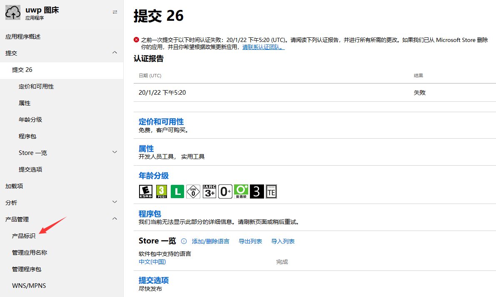
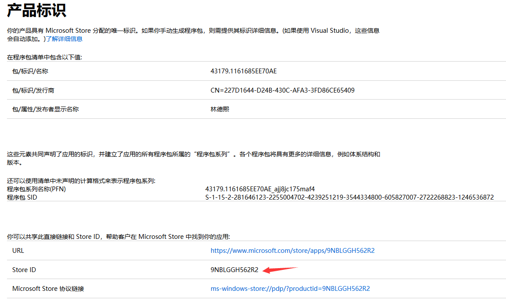

# UWP 上架失败因为没有添加隐私策略

在使用 UWP 上架之前需要经过微软的审核，在美国很看重个人隐私，因此需要在两个地方都填写上隐私策略。第一个是应用商店里面，第二个是应用程序里面

<!--more-->
<!-- CreateTime:2020/2/16 11:07:42 -->

<!-- 发布 -->

如果是个人开发者，我的推荐是在 github 或 gitee 创建一个叫隐私策略的文件，复制这个链接填写在应用商店管理的属性上，请看下图


如何写隐私策略请看 [win10 uwp 隐私声明](https://blog.lindexi.com/post/win10-uwp-%E9%9A%90%E7%A7%81%E5%A3%B0%E6%98%8E.html ) 注意修改软件名

然后打开代码，在代码里面添加一个叫 PrivacyPolicyURL 的静态属性，将隐私策略放在这个属性，然后写一个文本超链接用于打开

```csharp
public static class PrivacyPolicy
{
	public static string PrivacyPolicyURL { get; } = "https://github.com/lindexi/UWP/blob/master/uwp/src/%E9%9A%90%E7%A7%81%E7%AD%96%E7%95%A5/Privacy%20Policy.md";
}
```

在界面添加超链接

```xml
                <TextBlock>
                    <Hyperlink NavigateUri="https://github.com/lindexi/UWP/blob/master/uwp/src/%E9%9A%90%E7%A7%81%E7%AD%96%E7%95%A5/Privacy%20Policy.md">隐私策略</Hyperlink>
                </TextBlock>
```

修改之后请重新上传新的包

如果此时发现无法上传新的包，而在认证里面有附加了联系的邮件地址，如文章最后附加的微软给我的信息，可以看到微软告诉我说联系 `reportapp@microsoft.com` 邮件

可以通过谷歌翻译的方式告诉微软的大佬说我的应用已经更新了，里面填写了隐私声明了。小窍门，即使咱之前已经写过了，也是要给他一点面子，还是说咱改了软件了，感谢你的提示。另外在发邮件的时候记得附加自己应用的 Id 哦，如可以这样写

```
主题: I update my application 9NBLGGH562R2 and please review it

正文:

Hi,
 
My applicaion(App Id: 9NHNXT3Q2X7F) was publish fail and I have changed my app now, and please review it.

Thank you.
```

请将 App id 替换为你的应用 Id 如何找到自己的应用 Id 请看下面

<!--  -->


可以找到应用号

<!--  -->


下面是微软发给我的信息

```
Please take the following action

We reviewed your submission and identified some changes that are needed before we can publish or update the app. Please make these changes and resubmit your app. For more information, contact reportapp@microsoft.com Please include your app ID so we can act quickly.

App Policies: 10.5.1 Personal Information

Notes To Developer

Because the app accesses personal information, a working link to a privacy policy must be provided.
Location where privacy policy was missing: 
Metadata: OK 
In-product: Needs attention
 
For metadata include the privacy policy URL during app submission under the Properties section in the “Privacy Policy URL” field.
 
For in-product include the privacy policy URL under the settings section.
 
For additional assistance with updating the privacy policy URL, please contact Developer Support via Dev Center or here: http://aka.ms/storesupport
 
Personal information the app accesses includes:
Photos (Picture gallery)
Documents (device folders and files)
Please Note

    Your current certification results might differ from earlier submissions because Microsoft Store policy requirements can change over time. When policies change, we might re-test according to the new requirements regardless of the submission type. Please always rely on your most recent certification results.


```

为什么我的图床应用需要写隐私策略，因为我访问了 Photos 文件夹和 Documents 文件夹

<a rel="license" href="http://creativecommons.org/licenses/by-nc-sa/4.0/"></a><br />本作品采用<a rel="license" href="http://creativecommons.org/licenses/by-nc-sa/4.0/">知识共享署名-非商业性使用-相同方式共享 4.0 国际许可协议</a>进行许可。欢迎转载、使用、重新发布，但务必保留文章署名[林德熙](http://blog.csdn.net/lindexi_gd)(包含链接:http://blog.csdn.net/lindexi_gd )，不得用于商业目的，基于本文修改后的作品务必以相同的许可发布。如有任何疑问，请与我[联系](mailto:lindexi_gd@163.com)。
