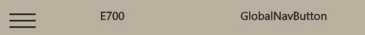

# UWP 开发中，需要知道的1000个问题

本文主要写我开发遇到常（zhi）见（zhang）问题。

<!--more-->
<!-- CreateTime:2018/11/20 9:28:53 -->

<!-- csdn -->


<div id="toc"></div>

真的有那么多问题？其实我就想记 ListViewItem 的问题，我自己都不记得在什么时候写如何设置他不压缩。后面越记录就越多啦

本文记录的内容适用于 UWP 和 WinUI 和 UNO 框架

## 设置 ListView 列表项宽度撑开

默认 ListViewItem 是宽度压缩。想要实现宽度撑开，可在 ListView 里，编写 ItemContainerStyle 样式，核心是设置 HorizontalContentAlignment 为 Stretch 的值，代码如下

```xml
  <ListView.ItemContainerStyle>
     <Style TargetType="ListViewItem">
         <Setter Property="HorizontalContentAlignment" Value="Stretch"/>
     </Style>
  </ListView.ItemContainerStyle>
```

更多关于 ListView 请看 [win10 UWP ListView](./win10-UWP-ListView.html)

如果需要设置 WPF 的 ListView 宽度，可以使用`HorizontalContentAlignment="Stretch"`

## UWP 设置文本使用文字图标

在 UWP 很经常看到如下图这样的图标


<!--  -->

这就是 Segoe MDL2 icons 字体图标，可以使用下面不同的方式在 xaml 使用这些图标

### SymbolIcon

可以使用的 SymbolIcon 直接给名字，相对可读性比较好

```xml
<SymbolIcon Symbol="GlobalNavigationButton"/>
```

### FontIcon

```xml
<FontIcon FontFamily="Segoe MDL2 Assets" Glyph="&#xE700;"/>
```

### TextBlock

使用 TextBlock 和 FontIcon 差不多

```xml
<TextBlock FontFamily="Segoe MDL2 Assets" Text="&#xE700;"/>
```

参见：[Segoe MDL2 icon guidelines - UWP app developer ](https://docs.microsoft.com/en-us/windows/uwp/design/style/segoe-ui-symbol-font )

## 设置 TargetType 样式

编译时 VisualStudio 告诉 `Style object must specify a String value for the TargetType property` 就是存在样式没有设置 TargetType 属性的值，在UWP所有的样式都需要添加 TargetType 才可以使用。

```csharp
      Error WMC0080: Style object must specify a String value for the TargetType property (107, 10)

```

原来的代码

```csharp
        <Style x:Key="KguypnDitzbbi">
            <Setter Property="FontFamily" Value="Segoe MDL2 Assets" />
            <Setter Property="Width" Value="38"></Setter>
        </Style>
```

修改后的代码

```csharp

        <Style x:Key="KguypnDitzbbi" TargetType="TextBlock">
            <Setter Property="FontFamily" Value="Segoe MDL2 Assets" />
            <Setter Property="Width" Value="38"></Setter>
        </Style>
```

<!-- ##  C# AddRange 添加位置

[C# AddRange 添加位置](C# AddRange 添加位置.md)

AddRange 添加的是在列表的最后。一开始我以为是最前。 -->

## 使用 VisualStateManager 编写简单的按钮样式

代码例子如下

```xml
  <Page.Resources>
    <Style x:Key="Style.Button.FooButtonStyle" TargetType="Button">
      <Setter Property="Template">
        <Setter.Value>
          <ControlTemplate TargetType="Button">
            <Grid x:Name="RootGrid" Background="{TemplateBinding Background}">
              <!-- 由于 VisualStateManager 必须放在容器里面，因此这里必须需要有一个容器 想省一点的话，可以用 Border 代替 Grid 做容器-->
              <VisualStateManager.VisualStateGroups>
                <VisualStateGroup x:Name="CommonStates">
                  <VisualState x:Name="Normal">
                    <Storyboard>
                      <!--啥都不用做，清空状态即可-->
                      <!-- 正常状态需要放在第一个 -->
                    </Storyboard>
                  </VisualState>
                  <VisualState x:Name="PointerOver">
                    <!-- Hover 效果 -->
                    <VisualState.Setters>
                      <Setter Target="ButtonContentPath.Stroke" Value="Transparent"></Setter>
                      <Setter Target="ButtonContentPath.Fill" Value="Blue"></Setter>
                    </VisualState.Setters>
                  </VisualState>
                  <VisualState x:Name="Pressed">
                    <!-- 按下状态 -->
                    <Storyboard>
                      <!-- 颜色用 ColorAnimation 也可以 -->
                      <!-- <ColorAnimation To=""></ColorAnimation> -->
                      <ObjectAnimationUsingKeyFrames Storyboard.TargetName="ButtonContentPath" Storyboard.TargetProperty="Stroke" >
                        <DiscreteObjectKeyFrame KeyTime="0" Value="Transparent"/>
                      </ObjectAnimationUsingKeyFrames>

                      <ObjectAnimationUsingKeyFrames Storyboard.TargetName="ButtonContentPath" Storyboard.TargetProperty="Fill" >
                        <DiscreteObjectKeyFrame KeyTime="0" Value="#FF666666"/>
                      </ObjectAnimationUsingKeyFrames>
                    </Storyboard>
                  </VisualState>
                  <VisualState x:Name="Disabled">
                    <!-- 不可用的状态 -->
                  </VisualState>
                </VisualStateGroup>
              </VisualStateManager.VisualStateGroups>

              <Path x:Name="ButtonContentPath" StrokeThickness="2" Stroke="#FF666666" Data="M7,15C6.85289858,15.5677816,6.85289858,16.4322348,7,17L22,29C22.7348015,29.3762198,24,28.8227297,24,28L24,4C24,3.1772867,22.7348015,2.62379657,22,3L7,15z"></Path>
            </Grid>
          </ControlTemplate>
        </Setter.Value>
      </Setter>
    </Style>

  </Page.Resources>
  <StackPanel
    HorizontalAlignment="Center"
    VerticalAlignment="Center">
    <Border BorderBrush="Black" BorderThickness="0">
      <Button Style="{StaticResource Style.Button.FooButtonStyle}"
            Background="Transparent" Padding="0">

      </Button>
    </Border>
  </StackPanel>
```

想要让 VisualStateManager 的 VisualStateGroups 生效，必须放在容器里面，直接写在 ControlTemplate 下面是不行的

第一个 Normal 的 VisualState 需要放在最前面，里面可以不写任何的代码，将会自动清空状态

设置属性的值时候，既可以使用 Setters 的方式，也可以使用动画的方式。使用 Setters 的代码比较短

```xml
 <VisualState x:Name="PointerOver">
   <!-- Hover 效果 -->
   <VisualState.Setters>
     <Setter Target="ButtonContentPath.Stroke" Value="Transparent"></Setter>
     <Setter Target="ButtonContentPath.Fill" Value="Blue"></Setter>
   </VisualState.Setters>
 </VisualState>
```

使用 Setters 时不需要管 Property 属性，只需要保证 Target 是 `对象.属性` 的写法就好了

使用动画的例子如下

```xml
 <VisualState x:Name="Pressed">
   <!-- 按下状态 -->
   <Storyboard>
     <!-- 颜色用 ColorAnimation 也可以 -->
     <!-- <ColorAnimation To=""></ColorAnimation> -->
     <ObjectAnimationUsingKeyFrames Storyboard.TargetName="ButtonContentPath" Storyboard.TargetProperty="Stroke" >
       <DiscreteObjectKeyFrame KeyTime="0" Value="Transparent"/>
     </ObjectAnimationUsingKeyFrames>

     <ObjectAnimationUsingKeyFrames Storyboard.TargetName="ButtonContentPath" Storyboard.TargetProperty="Fill" >
       <DiscreteObjectKeyFrame KeyTime="0" Value="#FF666666"/>
     </ObjectAnimationUsingKeyFrames>
   </Storyboard>
 </VisualState>
```

动画代码比较多，但是可以实现比较柔和的效果。因为 Setters 是立刻变化的，动画可以实现慢慢变化。对于视觉效果比较大的范围，推荐使用动画

具体一个控件有哪些 VisualState 可以设置，需要查阅文档。自己编写 VisualState 也是没问题的

官方文档： <https://learn.microsoft.com/en-us/uwp/api/windows.ui.xaml.visualstate>

以上代码放在[github](https://github.com/lindexi/lindexi_gd/tree/cdad42f92c6aaa25f4a6abfe14166c72defd3b45/UnoDemo/ButtonDemo) 和 [gitee](https://gitee.com/lindexi/lindexi_gd/tree/cdad42f92c6aaa25f4a6abfe14166c72defd3b45/UnoDemo/ButtonDemo) 欢迎访问

可以通过如下方式获取本文的源代码，先创建一个空文件夹，接着使用命令行 cd 命令进入此空文件夹，在命令行里面输入以下代码，即可获取到本文的代码

```
git init
git remote add origin https://gitee.com/lindexi/lindexi_gd.git
git pull origin cdad42f92c6aaa25f4a6abfe14166c72defd3b45
```

以上使用的是 gitee 的源，如果 gitee 不能访问，请替换为 github 的源。请在命令行继续输入以下代码

```
git remote remove origin
git remote add origin https://github.com/lindexi/lindexi_gd.git
git pull origin cdad42f92c6aaa25f4a6abfe14166c72defd3b45
```

获取代码之后，进入 UnoDemo/ButtonDemo 文件夹

### 有些状态设置无效

比如 StrokeThickness 等类似的会导致布局变更的属性，这些属性都是不给设置动画的

当然了，对于 StrokeThickness 还是能够接受 ObjectAnimationUsingKeyFrames 动画的，如以下代码是有效的

```xml
 <ObjectAnimationUsingKeyFrames Storyboard.TargetName="ButtonContentPath"
                                Storyboard.TargetProperty="StrokeThickness">
   <ObjectAnimationUsingKeyFrames.KeyFrames>
     <DiscreteObjectKeyFrame KeyTime="0:0:0" Value="0.0"></DiscreteObjectKeyFrame>
   </ObjectAnimationUsingKeyFrames.KeyFrames>
 </ObjectAnimationUsingKeyFrames>
```

但是如下代码是无效的，这是为了性能考虑的原因

```xml
 <DoubleAnimation Storyboard.TargetName="ButtonContentPath"
                  Storyboard.TargetProperty="StrokeThickness"
                  Duration="0:0:1"
                  To="0" />
```

想要在 DoubleAnimation 里面使用，需要明确设置 EnableDependentAnimation 属性，如以下代码

```xml
 <DoubleAnimation Storyboard.TargetName="ButtonContentPath"
                  Storyboard.TargetProperty="StrokeThickness"
                  EnableDependentAnimation="True"
                  Duration="0:0:1"
                  To="0" />
```

以上例子的全部代码如下

```xml
  <Page.Resources>
    <Style x:Key="Style.Button.EmptyButtonStyle" TargetType="Button">
      <Setter Property="Template">
        <Setter.Value>
          <ControlTemplate TargetType="Button">
            <Grid>
              <VisualStateManager.VisualStateGroups>
                <VisualStateGroup x:Name="CommonStates">
                  <VisualState x:Name="Normal">
                  </VisualState>
                  <VisualState x:Name="PointerOver">
                    <!-- Hover 效果 -->
                    <Storyboard>
                      <DoubleAnimation Storyboard.TargetName="ButtonContentPath"
                                       Storyboard.TargetProperty="StrokeThickness"
                                       EnableDependentAnimation="True"
                                       Duration="0:0:1"
                                       To="0" />

                      <DoubleAnimation Storyboard.TargetName="ButtonContentPath"
                                       Storyboard.TargetProperty="Opacity"
                                       Duration="0:0:3"
                                       To="0.6" />
                   

                    </Storyboard>
                  </VisualState>

                  <VisualState x:Name="Pressed">
                    <Storyboard>

                      <ObjectAnimationUsingKeyFrames Storyboard.TargetName="ButtonContentPath"
                                                     Storyboard.TargetProperty="StrokeThickness">
                        <ObjectAnimationUsingKeyFrames.KeyFrames>
                          <DiscreteObjectKeyFrame KeyTime="0:0:0" Value="0.0"></DiscreteObjectKeyFrame>
                        </ObjectAnimationUsingKeyFrames.KeyFrames>
                      </ObjectAnimationUsingKeyFrames>

                      <ObjectAnimationUsingKeyFrames Storyboard.TargetName="ButtonContentPath"
                                                     Storyboard.TargetProperty="Fill">
                        <ObjectAnimationUsingKeyFrames.KeyFrames>
                          <DiscreteObjectKeyFrame KeyTime="0:0:0" Value="Blue"></DiscreteObjectKeyFrame>
                        </ObjectAnimationUsingKeyFrames.KeyFrames>
                      </ObjectAnimationUsingKeyFrames>

                     
                    </Storyboard>
                  </VisualState>
                </VisualStateGroup>
              </VisualStateManager.VisualStateGroups>

              <Path x:Name="ButtonContentPath" StrokeThickness="5" Stroke="#FF666666"
                    Data="M7,15C6.85289858,15.5677816,6.85289858,16.4322348,7,17L22,29C22.7348015,29.3762198,24,28.8227297,24,28L24,4C24,3.1772867,22.7348015,2.62379657,22,3L7,15z">
              </Path>
            </Grid>
          </ControlTemplate>
        </Setter.Value>
      </Setter>
    </Style>

  </Page.Resources>
  <StackPanel
    HorizontalAlignment="Center"
    VerticalAlignment="Center">
    <Border BorderBrush="Black" BorderThickness="0">
      <Button Style="{StaticResource Style.Button.EmptyButtonStyle}"
              Background="Transparent" Padding="0">

      </Button>
    </Border>
  </StackPanel>
```

以上代码放在[github](https://github.com/lindexi/lindexi_gd/tree/68545b360aa349688f13bdb7734b7ad90e7199c3/UnoDemo/ButtonDemo) 和 [gitee](https://gitee.com/lindexi/lindexi_gd/tree/68545b360aa349688f13bdb7734b7ad90e7199c3/UnoDemo/ButtonDemo) 欢迎访问

可以通过如下方式获取本文的源代码，先创建一个空文件夹，接着使用命令行 cd 命令进入此空文件夹，在命令行里面输入以下代码，即可获取到本文的代码

```
git init
git remote add origin https://gitee.com/lindexi/lindexi_gd.git
git pull origin 68545b360aa349688f13bdb7734b7ad90e7199c3
```

以上使用的是 gitee 的源，如果 gitee 不能访问，请替换为 github 的源。请在命令行继续输入以下代码

```
git remote remove origin
git remote add origin https://github.com/lindexi/lindexi_gd.git
git pull origin 68545b360aa349688f13bdb7734b7ad90e7199c3
```

获取代码之后，进入 UnoDemo/ButtonDemo 文件夹

## List 添加重复项

有时候需要写一个测试，添加1000个相同项，难道使用 For ？

实际有简单方法


```csharp
                List<string> Items = Enumerable.Repeat("lindexi 需要重复文字", n/*多少个*/).ToList();

```

上面不仅是文字，因为使用`List<string>` ，实际使用什么，就添加什么。

## Distinct linq 匿名类去重

[http://www.aneasystone.com/archives/2015/04/distinct-in-csharp-linq.html](http://www.aneasystone.com/archives/2015/04/distinct-in-csharp-linq.html)

## 绑定 DataContext 的所有方法

[win10 uwp DataContext](./win10-uwp-DataContext.html)

如果觉得ms需要做一些功能，或想去说垃圾ms，请到[Welcome to the Windows developer feedback site!](https://wpdev.uservoice.com/)

## UWP中获取Encoding.Default

```csharp
    Encoding.GetEncoding(0);
```

参见：[UWP中获取Encoding.Default - yinyue200 - 博客园](http://www.cnblogs.com/yinyue200/p/6339738.html)

## UWP 使用 GBK 读取文本

核心是因为 .NET Core 下没有带上 GBK 编码，解决方法请参阅

- [dotnet core 使用 GBK 编码](https://blog.lindexi.com/post/dotnet-core-%E4%BD%BF%E7%94%A8-GBK-%E7%BC%96%E7%A0%81.html )
- [win10 uwp 读取文本GBK错误 - CSDN博客](https://blog.csdn.net/lindexi_gd/article/details/52079190 )

## 判断 ctrl 按下

判断 ctrl 按下，可以使用：


```csharp
    (Window.Current.CoreWindow.GetKeyState(VirtualKey.Control) & CoreVirtualKeyStates.Down) != 0
```

判断其它的键，如 shift 键，使用方法也一样。

## UWP 获取软件版本

在 UWP 获取自己软件的版本可以用来和服务器比较，判断当前是否需要升级。可以使用下面的代码获得 UWP 应用的版本

```csharp
Windows.ApplicationModel.Package.Current.Id.Version
```

[UWP 应用获取各类系统、用户信息 (1) - 设备和系统的基本信息、应用包信息、用户数据账户信息和用户账户信息](http://validvoid.net/uwp-system-info-collect-1/)

换成判断程序集版本号也是可以的

## 获取窗口大小

获取主窗口可视大小

```csharp
Windows.UI.ViewManagement.ApplicationView.GetForCurrentView().VisibleBounds
```

当前窗口的大小

```csharp
Window.Current.Bounds
```

获取当前窗口的其他方法

```csharp
Window.Current.CoreWindow.Bounds
```

上面的方法可以获得窗口的 x 和 y 大小

## ContentDialog 透明背景

[张高兴的 UWP 开发笔记：定制 ContentDialog 样式 - 张高兴 - 博客园](http://www.cnblogs.com/zhanggaoxing/p/6617806.html)

## bind 的默认 mode

`{x:Bind}` 的默认 Mode 是 OneTime。`{Binding}` 的默认 mode 是 OneWay.

参见 [Data binding in depth](https://docs.microsoft.com/en-us/windows/uwp/data-binding/data-binding-in-depth)

## 常用转换器

### 布尔转换器

允许自己配置的转换器

```csharp
using Microsoft.UI.Xaml.Data;

public class BoolToVisibilityConverter : IValueConverter
{
    public Visibility TrueFor { set; get; } = Visibility.Visible;
    public Visibility FalseFor { set; get; } = Visibility.Collapsed;
    public Visibility NullFor { set; get; } = Visibility.Collapsed;

    public object Convert(object value, Type targetType, object parameter, string language)
    {
        if (value is true)
        {
            return TrueFor;
        }
        else if (value is false)
        {
            return FalseFor;
        }
        else
        {
            return NullFor;
        }
    }

    public object? ConvertBack(object value, Type targetType, object parameter, string language)
    {
        if (value is Visibility visibility)
        {
            if (visibility == TrueFor)
            {
                return true;
            }
            else if (visibility == FalseFor)
            {
                return false;
            }
            else if (visibility == NullFor)
            {
                return null;
            }
        }
        return null;
    }
}
```

布尔不可见转换器

```csharp
public class BoolTrueToCollapsedConverter : IValueConverter
{
    public object Convert(object value, Type targetType, object parameter, string language)
    {
        if (value is true)
        {
            return Visibility.Collapsed;
        }
        return Visibility.Visible;
    }
    
    public object ConvertBack(object value, Type targetType, object parameter, string language)
    {
        throw new NotSupportedException();
    }
}
```

布尔可见转换器

```csharp
public class BoolTrueToVisibleConverter : IValueConverter
{
    public object Convert(object value, Type targetType, object parameter, string language)
    {
        if (value is true)
        {
            return Visibility.Visible;
        }
        return Visibility.Collapsed;
    }
    
    public object ConvertBack(object value, Type targetType, object parameter, string language)
    {
        throw new NotSupportedException();
    }
}
```

## 使用管道通讯

在非 UWP 的桌面程序或控制台编写管道服务端。在 UWP 使用 CreateFileW 作为客户端。但此方式无法通过 Windows App Certification Kit (WACK) 检测。绕过 WACK 方法请参阅 [三种方式轻松绕过Windows App Certification Kit (WACK)的API检测(UWP, C++) David Huang's Blog](https://blog.hjc.im/3-ways-to-bypass-wack.html )

以下是非 UWP 的控制台的管道服务端代码

```csharp
using (var pipe = NamedPipeServerStreamAcl.Create("FooPipe", PipeDirection.InOut, -1, PipeTransmissionMode.Byte, PipeOptions.None, 0, 0, null, HandleInheritability.None, PipeAccessRights.ChangePermissions))
{
    PipeSecurity ps = pipe.GetAccessControl();
    PipeAccessRule clientRule = new PipeAccessRule(
        new SecurityIdentifier("S-1-15-2-1"), // All application packages
        PipeAccessRights.ReadWrite,
        AccessControlType.Allow);
    PipeAccessRule ownerRule = new PipeAccessRule(
        WindowsIdentity.GetCurrent().Owner!,
        PipeAccessRights.FullControl,
        AccessControlType.Allow);
    ps.AddAccessRule(clientRule);
    ps.AddAccessRule(ownerRule);
    pipe.SetAccessControl(ps);
    pipe.WaitForConnection();
    using (var streamReader = new StreamReader(pipe, Encoding.UTF8))
    {
        for (int i = 0; i < int.MaxValue; i++)
        {
            string? message = streamReader.ReadLine();

            Console.WriteLine($"收到消息： {message}");

            var streamWriter = new StreamWriter(pipe, Encoding.UTF8);
            streamWriter.WriteLine($"[{i}] 服务端已收到消息");
            streamWriter.Flush();
        }
    }
}
```

以下是 UWP 的代码

```csharp
    public sealed partial class MainPage : Page
    {
        public MainPage()
        {
            this.InitializeComponent();

            Loaded += MainPage_Loaded;
        }

        private void MainPage_Loaded(object sender, RoutedEventArgs e)
        {
            const uint readAndWriteAccess = unchecked((uint) (1 << 30 | 1 << 31));
            var handle = CreateFileW(@"\\.\pipe\FooPipe", readAndWriteAccess, 0/*FILE_SHARE_NONE*/, IntPtr.Zero, 4/*OPEN_ALWAYS*/, 0/*SECURITY_ANONYMOUS*/, IntPtr.Zero);
            using (SafeFileHandle safeHandle = new SafeFileHandle(handle, true))
            {
                using (var fileStream = new FileStream(safeHandle, FileAccess.ReadWrite))
                {
                    using (var streamWriter = new StreamWriter(fileStream, Encoding.UTF8))
                    {
                        var streamReader = new StreamReader(fileStream, Encoding.UTF8);

                        while (true)
                        {
                            streamWriter.WriteLine("测试发送信息");
                            streamWriter.Flush();

                            var message = streamReader.ReadLine();
                            Debug.WriteLine(message);
                        }
                    }
                }
            }
        }

        [DllImport("KERNEL32.dll", ExactSpelling = true, SetLastError = true)]
        [DefaultDllImportSearchPaths(DllImportSearchPath.System32)]
        public static extern IntPtr CreateFileW(
           [MarshalAs(UnmanagedType.LPWStr)] string lpFileName,
            uint dwDesiredAccess,
            uint dwShareMode,
            [Optional] IntPtr lpSecurityAttributes,
            uint dwCreationDisposition,
            uint dwFlagsAndAttributes,
            IntPtr hTemplateFile);
    }
```

以上代码放在 [github](https://github.com/lindexi/lindexi_gd/tree/bf97a4c77400f5921b7e1947b160e23ca3fcf202/Workbench/KochufafallwalljoGelriciwu) 和 [gitee](https://gitee.com/lindexi/lindexi_gd/tree/bf97a4c77400f5921b7e1947b160e23ca3fcf202/Workbench/KochufafallwalljoGelriciwu) 上，可以使用如下命令行拉取代码。我整个代码仓库比较庞大，使用以下命令行可以进行部分拉取，拉取速度比较快

先创建一个空文件夹，接着使用命令行 cd 命令进入此空文件夹，在命令行里面输入以下代码，即可获取到本文的代码

```
git init
git remote add origin https://gitee.com/lindexi/lindexi_gd.git
git pull origin bf97a4c77400f5921b7e1947b160e23ca3fcf202
```

以上使用的是国内的 gitee 的源，如果 gitee 不能访问，请替换为 github 的源。请在命令行继续输入以下代码，将 gitee 源换成 github 源进行拉取代码。如果依然拉取不到代码，可以发邮件向我要代码

```
git remote remove origin
git remote add origin https://github.com/lindexi/lindexi_gd.git
git pull origin bf97a4c77400f5921b7e1947b160e23ca3fcf202
```

获取代码之后，进入 Workbench/KochufafallwalljoGelriciwu 文件夹，即可获取到源代码

## 常见构建失败

### 提示 TemplateBindingExtension 错误

错误信息大概如下

```
WMC0615 Type 'TemplateBindingExtension' used after '{' must be a Markup Extension. Error code 0x09c6
```

原因大概就是用了 TemplateBindingExtension 去绑定，如下面代码，而正确的方法应该是使用 TemplateBinding 作为 XAML 绑定

```xml
BorderThickness="{TemplateBindingExtension BorderThickness}"
```

修复代码是换成 TemplateBinding 去做

```xml
BorderThickness="{TemplateBinding BorderThickness}"
```

## 协变 逆变

协变 out ，如：string->object （子类到父类的转换）
逆变 in ，如：object->string （父类到子类的转换）

https://haojima.net/Home/Blog/53

<!-- ## 需要遵守的条约


 -->
<!-- ## [你真的知道C#的TryParse吗？](https://fresky.github.io/2014/12/18/do-you-really-know-c-tryparse/) -->

## 有趣故事

开发中，会遇到一些有趣的故事。

有一天vs告诉我，你写的代码，连标点符号我也不信。

我是世界上少见的不需要写单元测试的程序员，因为我写的代码都是bug。

下面，我来告诉你一些有趣的故事：

[有趣的“烫烫烫烫”和“屯屯屯屯” - imjustice - 博客园](http://www.cnblogs.com/imjustice/archive/2012/03/05/2623915.html)

更多笑话请看：

- [程序员笑话](https://blog.lindexi.com/post/%E7%A8%8B%E5%BA%8F%E5%91%98%E7%AC%91%E8%AF%9D.html )


## 工具

介绍一下好用的工具

[HappyStudio.UwpToolsLibrary.Auxiliarys 1.0.3](https://www.nuget.org/packages/HappyStudio.UwpToolsLibrary.Auxiliarys/) UWP工具库的辅助类库

[HappyStudio.UwpToolsLibrary.Information 1.0.2](https://www.nuget.org/packages/HappyStudio.UwpToolsLibrary.Information/) UWP 工具库的信息类库

[HappyStudio.UwpToolsLibrary.Control 1.1.0](https://www.nuget.org/packages/HappyStudio.UwpToolsLibrary.Control/) UWP 工具类库的控件库

[HappyStudio.UwpToolsLibrary 1.0.4](https://www.nuget.org/packages/HappyStudio.UwpToolsLibrary/) 给UWP工具类库的其他模块使用的依赖类库

[WinRT XAML Toolkit for Windows 10 2.3.0](https://www.nuget.org/packages/WinRTXamlToolkit.UWP/)
