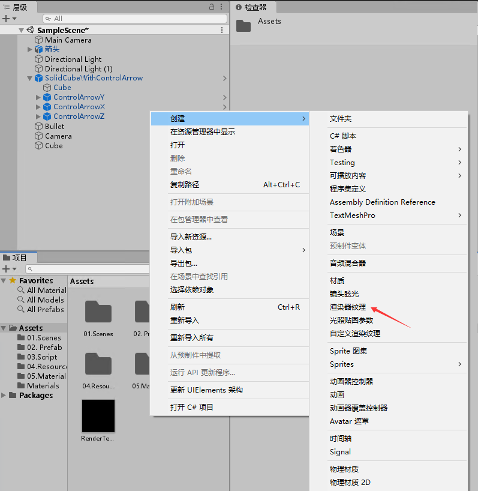
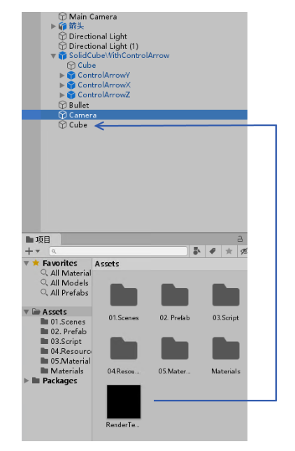
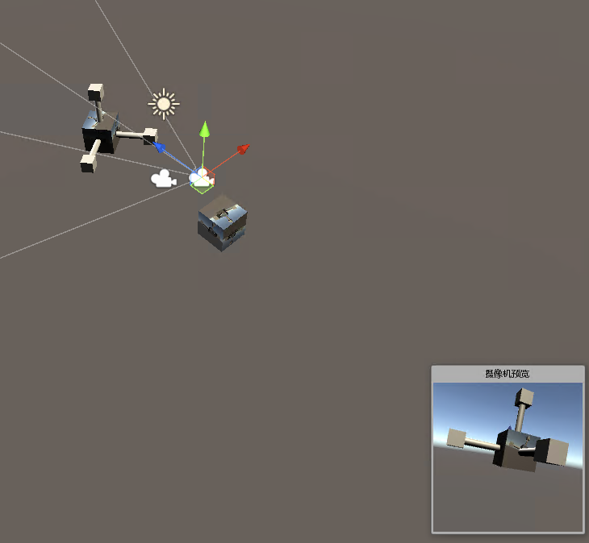

# Unity 2019.3 将 RenderTexture 绑定到相机和物体作出镜子效果

在 Unity 的 RenderTexture 是一个特殊的纹理，这个纹理是渲染器纹理，可以用于关联摄像机画面和物体，做到在物体上附加某个摄像机画面的纹理

<!--more-->
<!-- 发布 -->

这个 RenderTexture 比较特殊，一方面是获取某个相机的画面，另一个方面是作为纹理放在某个物体上

首先右击创建，创建一个渲染器纹理

<!--  -->

接着将这个渲染器纹理改一下名字，如修改为 RenderTexture1 的名字

接着创建一个相机，这个相机的内容将会作为 RenderTexture1 的内容，做法是选择摄像机，拖动 RenderTexture1 放在目标纹理上，请看下图

<!--  -->

然后将这个 RenderTexture1 拖放到物体上，如一个 Cube 上，此时这个 Cube 就会显示相机的内容

<!--  -->

现在可以看到的效果如下图，下图选中的摄像机的画面将会作为纹理贴到立方体上

<!--  -->

更多请看 [RenderTexture](https://docs.unity3d.com/ScriptReference/RenderTexture.html )

[Unity RenderTexture的应用 - 简书](https://www.jianshu.com/p/334770f39127 )

 本作品采用<a rel="license" href="http://creativecommons.org/licenses/by-nc-sa/4.0/">知识共享署名-非商业性使用-相同方式共享 4.0 国际许可协议</a>进行许可。欢迎转载、使用、重新发布，但务必保留文章署名[林德熙](http://blog.csdn.net/lindexi_gd)(包含链接:http://blog.csdn.net/lindexi_gd )，不得用于商业目的，基于本文修改后的作品务必以相同的许可发布。如有任何疑问，请与我[联系](mailto:lindexi_gd@163.com)。
