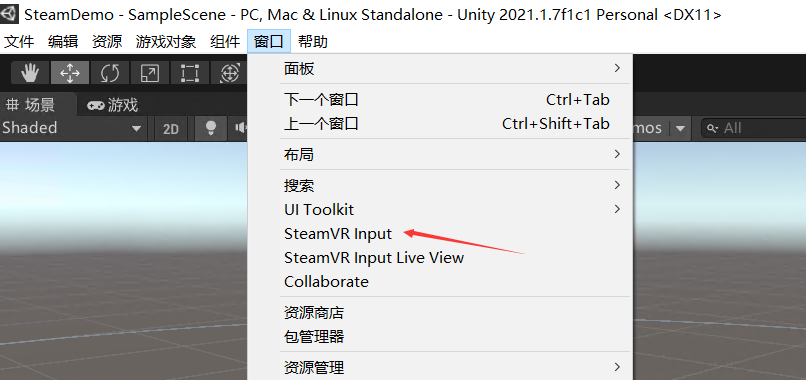
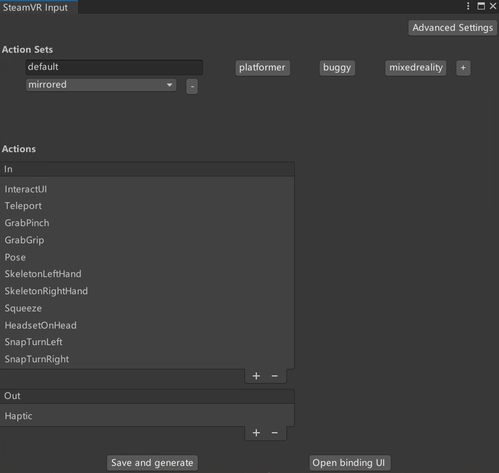

# Unity3D OpenVR SteamVR Input Action 动作

本文来告诉大家在 Unity3D 中的 SteamVR Input 里面的 Action 动作行为

<!--more-->
<!-- 发布 -->

开始之前，请先阅读 [Unity OpenVR 虚拟现实入门一：安装配置 Unity + OpenVR 环境 - walterlv](https://blog.walterlv.com/post/unity-openvr-starting-1.html ) 和 [Unity OpenVR 虚拟现实入门二：一个最简单的虚拟现实游戏/程序 - walterlv](https://blog.walterlv.com/post/unity-openvr-starting-2.html ) 配置完成环境

完成配置环境之后，即可在窗口里面找到 SteamVR Input 按钮，通过点击此按钮即可打开 SteamVR Input 界面

<!--  -->


默认打开的 SteamVR Input 界面会比较小，请将他拖动修改到足够大小，期望能看到如下界面所有按钮

<!--  -->


以上即可看到各个不同的交互类型，每个交互类型可以抽象为以下不同的动作类型

- Boolean 类型动作： 表示只有两个状态的动作，如跳起，只有不跳和跳。对应 `SteamVR_Action_Boolean` 类型
- Single 类型动作： 表示 [0,1] 过程的范围值，如 Trigger 键按下到松开的过程。对应 `SteamVR_Action_Single` 类型
- Vector2 类型动作： 可以表示如 x 和 y 方向的值，如上下左右方向，如 手柄摇杆 的功能。对应 `SteamVR_Action_Vector2` 类型
- Vector3 类型动作： 返回三维的数值，对应 `SteamVR_Action_Vector3` 类型
- Pose 类型动作： 返回三维空间中的位置和旋转，如跟踪 VR 控制器，对应 `SteamVR_Action_Pose` 类型
- Skeleton 类型动作： 对应 `SteamVR_Action_Skeleton` 类型

```csharp
        switch (o)
        {
            case SteamVR_Action_Boolean _: break;
            case SteamVR_Action_Single _: break;
            case SteamVR_Action_Vector2 _: break;
            case SteamVR_Action_Vector3 _: break;
            case SteamVR_Action_Pose _: break;
            case SteamVR_Action_Skeleton _: break;
        }
```

额外还有 `SteamVR_Action_Vibration` 动作，这个大多数是用来作为输出的，如输入到手柄作为反馈

参阅： [SteamVR 2.0 Unity插件使用指南_sovida的博客-CSDN博客](https://blog.csdn.net/sovida/article/details/85085664 )

<a rel="license" href="http://creativecommons.org/licenses/by-nc-sa/4.0/"></a><br />本作品采用<a rel="license" href="http://creativecommons.org/licenses/by-nc-sa/4.0/">知识共享署名-非商业性使用-相同方式共享 4.0 国际许可协议</a>进行许可。欢迎转载、 使用、重新发布，但务必保留文章署名[林德熙](http://blog.csdn.net/lindexi_gd)(包含链接:http://blog.csdn.net/lindexi_gd )，不得用于商业目的，基于本文修改后的作品务必以相同的许可发布。如有任何疑问，请与我[联系](mailto:lindexi_gd@163.com)。  
