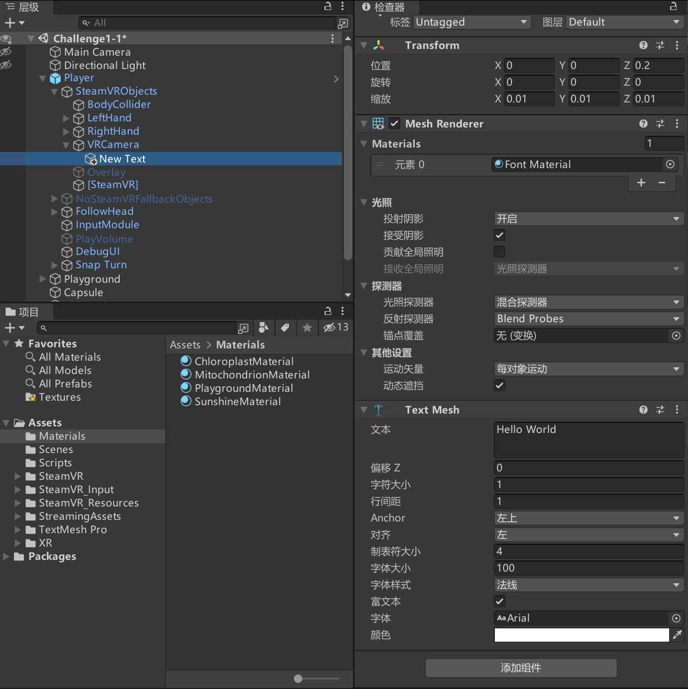

# Unity3D OpenVR SteamVR 在头盔视觉前面常驻文本

我期望在玩家视觉前方常驻一点文本，用于做有趣的交互，实现方法很简单

<!--more-->
<!-- CreateTime:2021/5/31 8:47:48 -->

<!-- 发布 -->

在开始之前，期望大家已阅读过基于 SteamVR 的 Unity3D 相关博客，如果还没了解相关知识，请参阅如下博客

- [Unity OpenVR 虚拟现实入门一：安装配置 Unity + OpenVR 环境](https://blog.walterlv.com/post/unity-openvr-starting-1.html)
- [Unity OpenVR 虚拟现实入门二：一个最简单的虚拟现实游戏/程序](https://blog.walterlv.com/post/unity-openvr-starting-2.html)
- [Unity OpenVR 虚拟现实入门三：最简单的五指交互](https://blog.walterlv.com/post/unity-openvr-starting-3.html)
- [Unity OpenVR 虚拟现实入门四：通过脚本控制手与控制器](https://blog.walterlv.com/post/unity-openvr-starting-4.html)
- [Unity OpenVR 虚拟现实入门五：通过传送控制玩家移动](https://blog.walterlv.com/post/unity-openvr-starting-5.html)
- [Unity OpenVR 虚拟现实入门六：通过摇杆控制玩家移动](https://blog.walterlv.com/post/unity-openvr-starting-6.html)

如系列博客的内容，咱通过加入 SteamVR SDK 然后将 Player 拖入到咱的场景中，如下图

在 Player 的 VRCamera 添加一个文本，设置 z 轴方向为正数，让文本在相机前

<!--  -->

因为文本放在相机对象，因此文本随着相机，文本在相机前面，玩家可以看到文本

这个做法有坑是，如果文本距离玩家不够远，看起来诡异

 本作品采用<a rel="license" href="http://creativecommons.org/licenses/by-nc-sa/4.0/">知识共享署名-非商业性使用-相同方式共享 4.0 国际许可协议</a>进行许可。欢迎转载、 使用、重新发布，但务必保留文章署名[林德熙](http://blog.csdn.net/lindexi_gd)(包含链接:http://blog.csdn.net/lindexi_gd )，不得用于商业目的，基于本文修改后的作品务必以相同的许可发布。如有任何疑问，请与我[联系](mailto:lindexi_gd@163.com)。  
