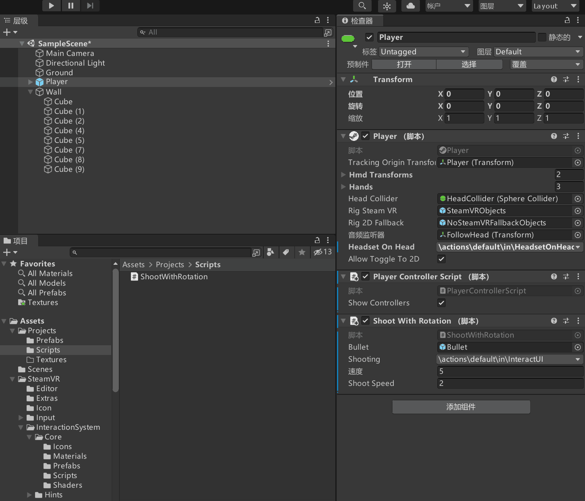
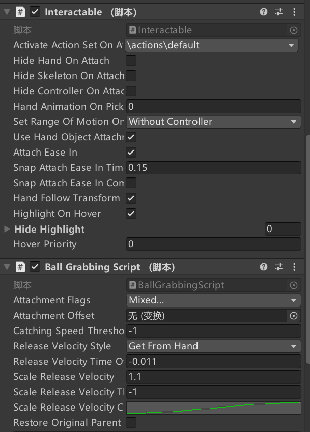

# Unity3D OpenVR 虚拟现实 保龄球打砖块游戏开发

据说水哥买了 Valve Index 设备，既然这个设备这么贵，不开发点有（zhi）趣（zhang）游戏就感觉对不起这个设备。本文将来开始着手开发一个可玩性不大，观赏性极强的保龄球打砖块游戏。这仅仅只是一个入门级的游戏，代码量和制作步骤都超级少，适合入门

<!--more-->
<!-- 发布 -->
<!-- 标签：Unity3D，OpenVR -->

在开始之前，请参阅水哥提供的环境搭建以及部分必备知识博客

- [Unity OpenVR 虚拟现实入门一：安装配置 Unity + OpenVR 环境](https://blog.walterlv.com/post/unity-openvr-starting-1.html)
- [Unity OpenVR 虚拟现实入门二：一个最简单的虚拟现实游戏/程序](https://blog.walterlv.com/post/unity-openvr-starting-2.html)

在阅读本文之前，我期望你有部分 Unity3D 开发的知识，本文不会提及多少 Unity3D 入门的知识，如果有看不懂的地方，还请自行翻 Unity3D 入门知识

此游戏的玩法就是用双手拿起保龄球，将一堵墙砸掉，将砖块推下地板。效果视频如下

<!--  -->

[](https://r302.cc/erJknAA)

写代码就和搬砖一样，一开始咱先使用 [Unity OpenVR 虚拟现实入门二：一个最简单的虚拟现实游戏/程序](https://blog.walterlv.com/post/unity-openvr-starting-2.html) 的方法搭建出来一个放在 SteamVR SDK 里面的 Sample 的内容，开始进行砌墙

<!--  -->


以上墙里面的各个砖块记得加上刚体（Rigidbody）同时设置质量为 0.2 不然咱可打不掉砖块

<!--  -->


接下来咱来创建保龄球子弹，按照约定创建 Prefabs 文件夹，在里面创建一个叫 Bullet 的圆球

<!--  -->


如上图，同样给此子弹加上刚体，设置比较大的质量。如上图给了质量是 10 这样才好将砖块打到地板下。请不要将地板加上刚体哦，默认的刚体是加上重力的，刚进入调试发现地板掉了，这可不是在做恐怖游戏哈

下面咱来写一点代码，用来在扣扳机的时候，创建保龄球子弹

如何在 SteamVR 游戏中，获取当前扳机的状态？其实按照 [Unity3D OpenVR SteamVR Input Action 动作](https://blog.lindexi.com/post/Unity3D-OpenVR-SteamVR-Input-Action-%E5%8A%A8%E4%BD%9C.html ) 博客的建议，咱是不开发获取当前扳机状态的代码。咱需要开发的是定义某个动作，如 InteracetUI 这个动作，获取此动作的值来决定逻辑。这样做的好处是方便用户进行配置，以及支持其他不同的交互设备。如某个设备没有扳机，但是此设备有另一个按钮，这个按钮也可以实现此效果，那么就可以让用户绑定新的按键

咱现在还在 VR 应用或游戏开发的蛮荒时代，很多交互都在摸索阶段，为了更好适配未来的新硬件和交互，通过定义动作名而不是绑定具体的硬件设备上的做法的适配性更强

咱来创建一个叫 ShootWithRotation 的 C# 脚本文件，按照国际惯例，放在 Scripts 文件夹里面

```csharp
using System.Collections;
using System.Collections.Generic;
using UnityEngine;
using Valve.VR;
using Valve.VR.InteractionSystem;

public class PlayerDemoScript : MonoBehaviour
{
    // Start is called before the first frame update
    void Start()
    {

    }

    // Update is called once per frame
    void Update()
    {
        
    }
}
```

咱添加一个字段，按照 [Unity3D OpenVR SteamVR Input Action 动作](https://blog.lindexi.com/post/Unity3D-OpenVR-SteamVR-Input-Action-%E5%8A%A8%E4%BD%9C.html ) 博客的内容，咱需要一个 bool 值获取当前的扳机是否按下。在 SteamVR 里面，布尔使用 `SteamVR_Action_Boolean` 类型表示，通过 state 属性获取值，代码如下

```csharp
public SteamVR_Action_Boolean Shooting;
```

获取扳机是否按下的代码如下

```csharp
            if (Shooting.state)
            {
                Shoot();
            }
```

通过 state 即可获取当前的扳机是否按下，以上代码的 Shoot 方法就是实际的射击代码，这部分代码咱在下文才写。回到 Shooting 字段的定义。因为我主业是 WPF 开发，按照我的编码习惯，字段是不会公开的，而且使用下划线开头，但这和 Unity3D 这边的编码规范冲突，于是我就将字段当成属性好了，第一个字符大写

咱上面代码定义的 Shooting 字段，想要获取交互的本身就需要在 Unity3D 里面进行绑定交互，此绑定交互的方法可参阅 [Unity OpenVR 虚拟现实入门六：通过摇杆控制玩家移动](https://blog.walterlv.com/post/unity-openvr-starting-6.html) 这一篇的内容。大概的做法就是先将脚本附加到某个游戏对象里面。如咱将这个脚本附加到 Player 对象上面，接下来点击 Shooting 的下拉，选择交互

<!--  -->


咱选择 InteracetUI 这个动作，默认在 SteamVR 里面就是扣扳机这个交互，当然，用户也可以自己设置到其他按键里面

<!--  -->


此时我推荐大家如果之前没有做过 SteamVR 的交互，那请尝试在 VisualStudio 里面附加 Unity3D 调试，在 Update 方法里面获取 Shooting 字段的值了解这部分的交互

<!--  -->


如上图，此时咱将 Shooting 字段和 InteracetUI 这个动作绑定

上图里面的 Bullet 字段以及 Shoot Speed 字段等，咱将进行定义，代码如下

```csharp
    public GameObject Bullet;
    public SteamVR_Action_Boolean Shooting;

    public float Speed = 5;

    public float ShootSpeed = 2;
```

以上代码的 Bullet 就是保龄球子弹的模版，用来创建保龄球子弹，而 ShootSpeed 是射击频率。在 VR 应用中，如果在 Update 里面不通过判断频率，就进行创建子弹，那么将会因为超级高的刷新而让子弹创建速度超级快。本文这里的代码判断频率只是用了直观快速的方法

通过下面代码可以用来限制发送子弹的速度

```csharp
    public GameObject Bullet;
    public SteamVR_Action_Boolean Shooting;

    public float Speed = 5;

    public float ShootSpeed = 2;

    private float _shootTime = 0;
    private float _shootTimerInterval = 0;

    void Start()
    {
        _shootTimerInterval = 1 / ShootSpeed;
    }

    void Update()
    {
        _shootTime += Time.deltaTime;
        if(_shootTime> _shootTimerInterval)
        {
            _shootTime -= _shootTimerInterval;
            if (Shooting.state)
            {
                Shoot();
            }
        }
    }
```

下面就是 Shoot 代码的编写了，我编写了几个版本，经过了水哥的测试，也就是本文如下没有注释掉代码的版本的交互是最好的（虽然可玩性也特别渣）因此咱下面将来写这个版本的逻辑

通过 GameObject.Instantiate 方法创建子弹，接着将子弹放在旁边即可

```csharp
    private void Shoot()
    {
        var sphere = GameObject.Instantiate(Bullet);

        sphere.transform.Translate(new Vector3(0, 0.25f, 0.1f));
    }
```

因为咱的 Player 和地板没有添加传送的功能，因此在设置 Player 在原点时，刚好将子弹放在 (0,0.25,0.1) 的地方即可。为什么 y 是 0.25 是因为刚好球大小就是 0.5 而坐标中点是球心，通过球的一半即可刚好放在地板上。而 z 方向设置 0.1 是可以让球刚好在前面

此时在 Unity 绑定 Bullet 字段到咱上文设置的 Prefbabs 里面的 Bullet 即可，跑起来，通过刚体的逻辑，可以使用双手拿起球，开始玩起来

接下来是一个被干掉的交互方式，此交互方式是扣扳机进行射击，射击方向就是前方

实现方式是在创建子弹时，将子弹的旋转设置和当前 HMD （头戴式显示器 Head-mounted display）的方向相同，然后设置速度方向为物体前方，代码如下

```csharp
    private void Shoot()
    {
        var sphere = GameObject.Instantiate(Bullet);

        sphere.transform.Translate(new Vector3(0, 0.25f, 0.1f));

        // 向着用户看到方向
        sphere.transform.rotation = Player.instance.hmdTransform.transform.rotation;

        var rigidbody = sphere.GetComponent<Rigidbody>();

        rigidbody.velocity = sphere.transform.forward * Speed;
    }
```

以下是 ShootWithRotation 的全部代码

```csharp
using System;
using System.Collections;
using System.Collections.Generic;

using UnityEngine;

using Valve.VR;
using Valve.VR.InteractionSystem;

public class ShootWithRotation : MonoBehaviour
{
    public GameObject Bullet;
    public SteamVR_Action_Boolean Shooting;

    public float Speed = 5;

    public float ShootSpeed = 2;

    private float _shootTime = 0;
    private float _shootTimerInterval = 0;

    // Start is called before the first frame update
    void Start()
    {
        _shootTimerInterval = 1 / ShootSpeed;
    }

    // Update is called once per frame
    void Update()
    {
        _shootTime += Time.deltaTime;
        if(_shootTime> _shootTimerInterval)
        {
            _shootTime -= _shootTimerInterval;
            if (Shooting.state)
            {
                Shoot();
            }
        }
    }

    private void Shoot()
    {
        var sphere = GameObject.Instantiate(Bullet);

        //sphere.transform.Translate(Player.instance.hmdTransform.position);
        sphere.transform.Translate(new Vector3(0, 0.25f, 0.1f));

        // 向着用户看到方向
        sphere.transform.rotation = Player.instance.hmdTransform.transform.rotation;

        var rigidbody = sphere.GetComponent<Rigidbody>();

        //rigidbody.velocity = sphere.transform.forward * Speed;

        //// 旋转发射
        //var rotation = Player.transform.eulerAngles.y;
        //var vx = 1 * Mathf.Cos(rotation);
        //var vy = -1 * Mathf.Sin(rotation);
        //rigidbody.velocity = new Vector3(vx, 0, vy) * Speed;
        //Destroy(sphere, 5);
    }
}
```

当前后续水哥还开发出通过抓握的交互方式，这个交互方式看起来更好玩。实现方法是给子弹加上一个叫 Interactable 的脚本，这个脚本是带在 SteamVR SDK 里面的。添加这个脚本时需要给定他的 activateActionSetOnAttach 字段 `\actions\default` 交互

<!--  -->


再给子弹添加一个 Throwable 脚本，让这个球可以被扔掉

当前的游戏就可以抓起来球然后扔出去

这个游戏开发难度不高，只是有很多知识需要了解，而且有点费德熙。我在调试了几个小时，看着屏幕上工具人水哥测试的画面，特别想吐

系列博客请看

- [Unity OpenVR 虚拟现实入门一：安装配置 Unity + OpenVR 环境](https://blog.walterlv.com/post/unity-openvr-starting-1.html)
- [Unity OpenVR 虚拟现实入门二：一个最简单的虚拟现实游戏/程序](https://blog.walterlv.com/post/unity-openvr-starting-2.html)
- [Unity OpenVR 虚拟现实入门三：最简单的五指交互](https://blog.walterlv.com/post/unity-openvr-starting-3.html)
- [Unity OpenVR 虚拟现实入门四：通过脚本控制手与控制器](https://blog.walterlv.com/post/unity-openvr-starting-4.html)
- [Unity OpenVR 虚拟现实入门五：通过传送控制玩家移动](https://blog.walterlv.com/post/unity-openvr-starting-5.html)
- [Unity OpenVR 虚拟现实入门六：通过摇杆控制玩家移动](https://blog.walterlv.com/post/unity-openvr-starting-6.html)

<a rel="license" href="http://creativecommons.org/licenses/by-nc-sa/4.0/"></a><br />本作品采用<a rel="license" href="http://creativecommons.org/licenses/by-nc-sa/4.0/">知识共享署名-非商业性使用-相同方式共享 4.0 国际许可协议</a>进行许可。欢迎转载、 使用、重新发布，但务必保留文章署名[林德熙](http://blog.csdn.net/lindexi_gd)(包含链接:http://blog.csdn.net/lindexi_gd )，不得用于商业目的，基于本文修改后的作品务必以相同的许可发布。如有任何疑问，请与我[联系](mailto:lindexi_gd@163.com)。  
