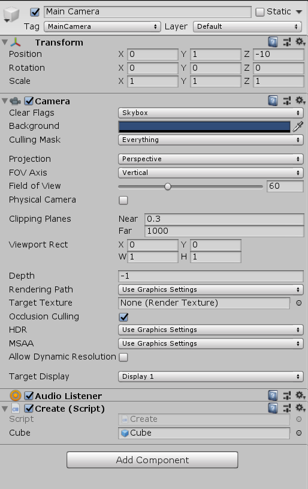
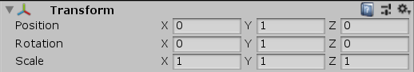

# Unity3D 用对象创建对象

在 Unity3d 中会用到从一个游戏对象复制出一个新的游戏物体的方式，如制作射击游戏的子弹等。在 Unity3d 中可以使用 GameObject.Instantiate 的方式从一个 GameObject 里面创建一个和这个 GameObject 一样的对象

<!--more-->
<!-- 发布 -->

一般此时游戏对象都是使用模板对象，在 Unity3d 里面制作一个模板是十分简单的，只需要在 Hierarchy 里面的物体拖动放到 Assets 文件夹里面就可以了

拖放进去的模板对象推荐给他一个命名，这样才方便查找

先点击 Hierarchy 然后点击菜单的 GameObject 的创建，创建一个立方体。接下来将这个立方体拖动放到 Assets 文件夹，删除 Hierarchy 里面的立方体。等等，是不是有更加简洁的步骤？没错，在 Assets 文件夹里面右击也是可以创建的，只是在 Hierarchy 创建的时候可以方便看到对象在游戏中显示的好看还是不好看

新建一个 C# 代码，可以命名为 Create 在这个代码里面将会判断如果用户点击了按键，将会创建一个 Cube 立方体

在 Unity3d 中判断用户按键的方式请看 [Unity3d 连续按键处理和单次按键处理](https://blog.lindexi.com/post/Unity3d-%E8%BF%9E%E7%BB%AD%E6%8C%89%E9%94%AE%E5%A4%84%E7%90%86%E5%92%8C%E5%8D%95%E6%AC%A1%E6%8C%89%E9%94%AE%E5%A4%84%E7%90%86.html)

从 VisualStudio 打开代码，或者右击刚才创建出来的代码文件点击 Open 都可以

在 C# 代码里面添加一个公开的字段，这个字段叫 Cube 用来在 Unity3d 界面给他赋值

```csharp
    public GameObject Cube;
```

创建出来的代码还需要放在某个 GameObject 里面才能运行，本文将这个代码放在相机里面，放在相机可以通过拖动代码文件，放在相机对象上面，此时可以在相机里面看到如下图

<!--  -->


可以在相机的 Component 看到有脚本代码，所以反过来点击 Add Component 添加代码也是可以的

在这个代码里面可以看到刚才定义的字段 Cube 在界面显示，将刚才放在 Assets 的 Cube 对象拖动放在这个字段上去，这样就在 Unity 上绑定了游戏对象了

也就是在脚本执行的时候，这个 Cube 字段就会被框架赋值，给的值就是在 Unity 界面拖动过去的对象

接下来就是编辑 Update 的方法了，在判断到用户点击了鼠标，就根据字段创建一个新的游戏对象，这里创建的游戏对象默认都会自动添加到游戏画面中

```csharp
    void Update()
    {
        if (Input.GetButtonDown("Fire1"))
        {
            // 鼠标左键
            var cube = GameObject.Instantiate(Cube);
        }
    }
```

此时就完成了创建，保存代码，在 Unity3d 里面点击开始游戏，然后点击一下鼠标。此时可能还看不到这个 cube 对象，可能的原因就是这个 Cube 不在相机范围内。可以通过点击一下暂停按钮看看是不是 Cube 放在了相机范围外

如果想要设置这个 Cube 在相机可见范围里面，简单做法是放在相机前面，我的相机是面向 z 轴的，如下图我的相机设置如下，那么如何设置创建出来的物体的坐标在我的相机前面

<!--  -->


可以通过物体的 transform 属性进行移动物体，可以先移动到相机所在的地方，然后再次移动到相机前面

```csharp
        if (Input.GetButtonDown("Fire1"))
        {
            // 鼠标左键
            var cube = GameObject.Instantiate(Cube);
            cube.transform.Translate(transform.position);
            cube.transform.Translate(0, 0, 10);
        }
```

这样就完成了代码啦

本文代码放在[github](https://github.com/lindexi/lindexi_gd/tree/eac5d4aa2b48dc9322d97e6f676937af1017f205/unity/BeanairnalkeDayhojafayhe)欢迎小伙伴访问

<a rel="license" href="http://creativecommons.org/licenses/by-nc-sa/4.0/"></a><br />本作品采用<a rel="license" href="http://creativecommons.org/licenses/by-nc-sa/4.0/">知识共享署名-非商业性使用-相同方式共享 4.0 国际许可协议</a>进行许可。欢迎转载、使用、重新发布，但务必保留文章署名[林德熙](http://blog.csdn.net/lindexi_gd)(包含链接:http://blog.csdn.net/lindexi_gd )，不得用于商业目的，基于本文修改后的作品务必以相同的许可发布。如有任何疑问，请与我[联系](mailto:lindexi_gd@163.com)。
