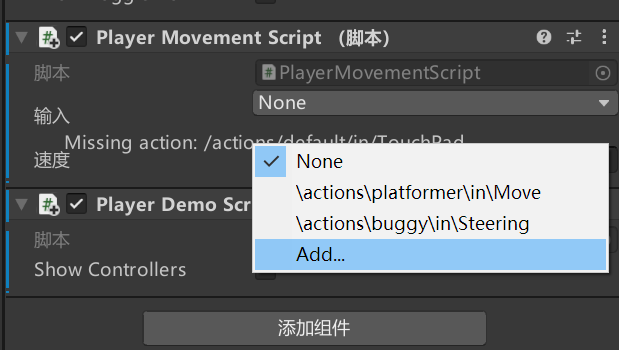
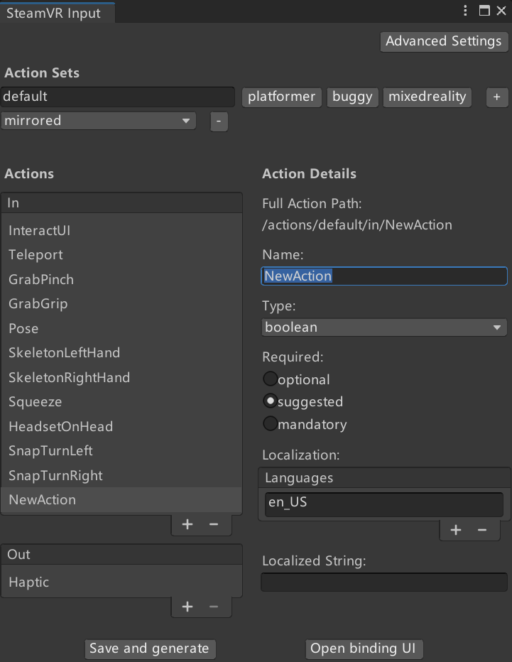
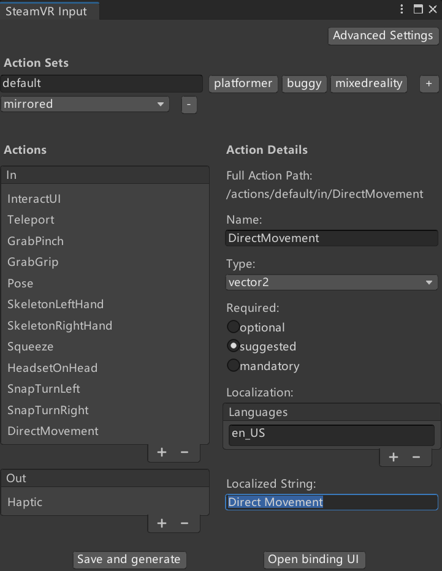
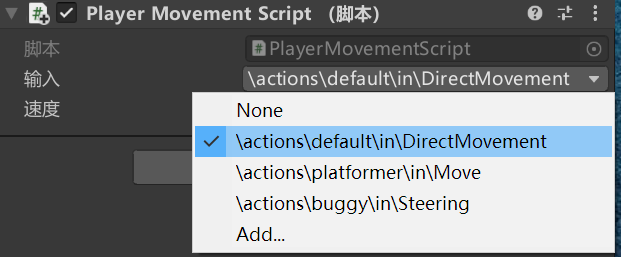
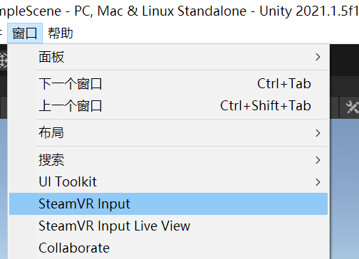
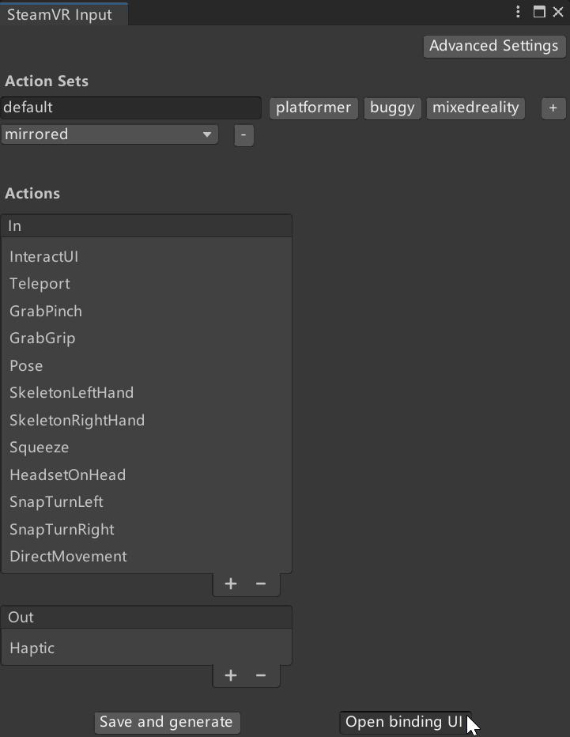
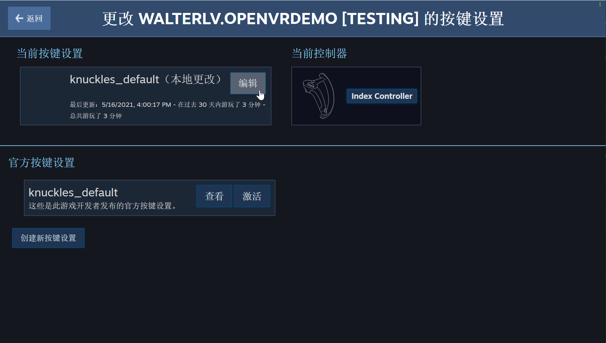
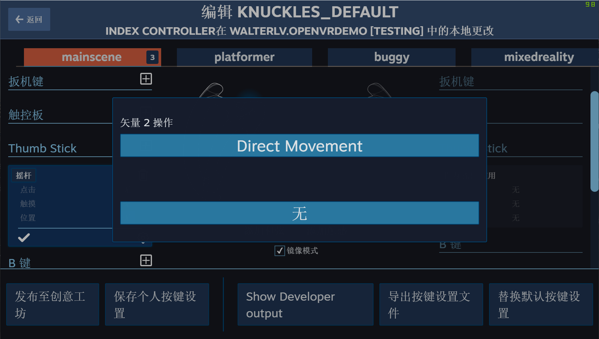
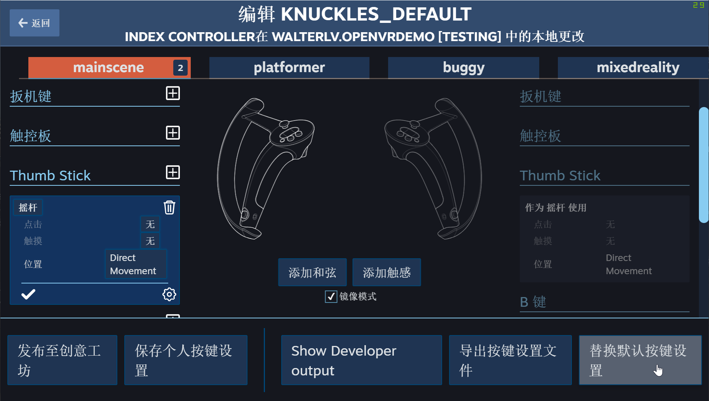

# Unity3D OpenVR SteamVR 获取输入动作按键 交互设备数据方法

在开发 OpenVR 游戏或应用时，由于 VR 设备的交互形式和传统的形式不相同，因此获取输入交互设备数据如按键等的方式也有所不同。在 Steam VR SDK 里面给出了推荐的做法是只定义交互名称，而不获取具体的硬件设备信息，也就是说咱在应用或游戏里面采用的交互都是抽象的交互，至于这个抽象的交互是采用哪个硬件产生的，就交给跟上一层进行定义，于是就能很好的将编写代码的获取输入和各个不同类型的 VR 控制器隔离开来，避免 VR 应用绑死某个控制器上，也能很好的支持未来的交互设备

<!--more-->


<!-- 发布 -->

基于 SteamVR SDK 开发的应用，获取输入的交互动作的步骤如下

- 定义交互数据类型字段
- 绑定交互数据与 VR 抽象输入动作
- 关联 VR 输入动作与实体控制器

定义交互数据类型字段的做法是在代码里面定义字段， 将这个字段的返回值定义为自己需要输入的数值类型，可以选择的输入类型请参阅 [Unity3D OpenVR SteamVR Input Action 动作](https://blog.lindexi.com/post/Unity3D-OpenVR-SteamVR-Input-Action-%E5%8A%A8%E4%BD%9C.html ) 博客，大概如下

- Boolean 类型动作： 表示只有两个状态的动作，如跳起，只有不跳和跳。对应 `SteamVR_Action_Boolean` 类型
- Single 类型动作： 表示 [0,1] 过程的范围值，如 Trigger 键按下到松开的过程。对应 `SteamVR_Action_Single` 类型
- Vector2 类型动作： 可以表示如 x 和 y 方向的值，如上下左右方向，如 手柄摇杆 的功能。对应 `SteamVR_Action_Vector2` 类型
- Vector3 类型动作： 返回三维的数值，对应 `SteamVR_Action_Vector3` 类型
- Pose 类型动作： 返回三维空间中的位置和旋转，如跟踪 VR 控制器，对应 `SteamVR_Action_Pose` 类型
- Skeleton 类型动作： 对应 `SteamVR_Action_Skeleton` 类型

例如咱期望获取摇杆的动作，咱本质逻辑需要的是一个表示上下左右移动方向的值，可以对应到 Vector2 类型动作。如上文可以了解到对应的是 `SteamVR_Action_Vector2` 类型，此时的代码编写如下

```csharp
 public SteamVR_Action_Vector2 input;
```

将代码脚本附加到某个游戏对象上，下一步就是需要绑定交互数据与 VR 抽象输入动作。告诉 Unity3D 咱刚才定义的 input 字段应该由什么进行输入。默认可以选择下拉菜单选择某个已经定义好的抽象交互动作

<!--  -->


如果以上没有任何抽象交互符合预期，请点击 Add 按钮添加新的自定义交互动作，点击 Add 按钮之后可以看到如下界面，咱添加一个新的交互动作

<!--  -->


自定义交互需要关注的点是交互的命名，默认的命名是 NewAction 默认的输入类型是 `SteamVR_Action_Boolean` 类型。咱进行一些定制化，如为了支持 input 属性的类型是 `SteamVR_Action_Vector2` 类型，将类型设置为 Vector2 顺便修改一下命名为 `DirectMovement` 动作，和加上本地化的字符串

<!--  -->


以上默认加入到 `default` 的动作组里面，推荐不要删除 `default` 动作组，原因是在 SteamVR 组件里面有很多组件都用到了 default 动作组里的动作，删除会导致无法看见手和手柄

添加完成之后，点击 `SteamVR Input` 窗口的 `Save and generate` 按钮，等待编译完成后，关闭这个窗口。再次回到游戏对象的脚本里面，此时可以选择咱刚才创建的动作

<!--  -->


此时就完成了 定义交互数据类型字段 和 绑定交互数据与 VR 抽象输入动作，接下来是将此抽象的动作绑定到具体的交互设备上

重新打开 `SteamVR Input` 窗口，此窗口可以在 Unity3D 的菜单栏里面的 窗口->`SteamVR Input` 打开

<!--  -->


在 `SteamVR Input` 窗口里面，点击 `Open binding UI` 按钮，打开 SteamVR 的 控制器按键设置 界面

<!--  -->


进入到 SteamVR 的 控制器按键设置 界面，点击当前按键设置的编辑按钮即可进入编辑。如果后续此应用或游戏发布后，玩家自定义按键也是通过此界面

<!--  -->


接下来配置上文定义 DirectMovement 动作，做法是点击 Thumb Stick 的加号，作为摇杆使用，点击位置，选择 DirectMovement 动作

<!--  -->


完成配置之后，点击 `替换默认按键设置` 按钮

<!--  -->


此时将会更改 Unity3D 里面的按键配置记录文件，同时关闭此窗口

通过上文步骤即可完成获取用户的动作，关联交互设备。在脚本代码里面，用户通过摇杆的动作将可以在 `input` 字段里面获取对应的值

本文其实是将 [Unity OpenVR 虚拟现实入门六：通过摇杆控制玩家移动](https://blog.walterlv.com/post/unity-openvr-starting-6.html) 这篇博客重新再写一次，系列博客请看

- [Unity OpenVR 虚拟现实入门一：安装配置 Unity + OpenVR 环境](https://blog.walterlv.com/post/unity-openvr-starting-1.html)
- [Unity OpenVR 虚拟现实入门二：一个最简单的虚拟现实游戏/程序](https://blog.walterlv.com/post/unity-openvr-starting-2.html)
- [Unity OpenVR 虚拟现实入门三：最简单的五指交互](https://blog.walterlv.com/post/unity-openvr-starting-3.html)
- [Unity OpenVR 虚拟现实入门四：通过脚本控制手与控制器](https://blog.walterlv.com/post/unity-openvr-starting-4.html)
- [Unity OpenVR 虚拟现实入门五：通过传送控制玩家移动](https://blog.walterlv.com/post/unity-openvr-starting-5.html)
- [Unity OpenVR 虚拟现实入门六：通过摇杆控制玩家移动](https://blog.walterlv.com/post/unity-openvr-starting-6.html)


<a rel="license" href="http://creativecommons.org/licenses/by-nc-sa/4.0/"></a><br />本作品采用<a rel="license" href="http://creativecommons.org/licenses/by-nc-sa/4.0/">知识共享署名-非商业性使用-相同方式共享 4.0 国际许可协议</a>进行许可。欢迎转载、使用、重新发布，但务必保留文章署名[林德熙](http://blog.csdn.net/lindexi_gd)(包含链接:http://blog.csdn.net/lindexi_gd )，不得用于商业目的，基于本文修改后的作品务必以相同的许可发布。如有任何疑问，请与我[联系](mailto:lindexi_gd@163.com)。