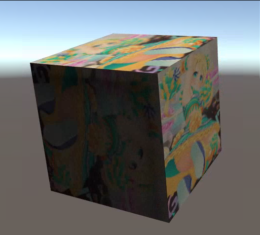
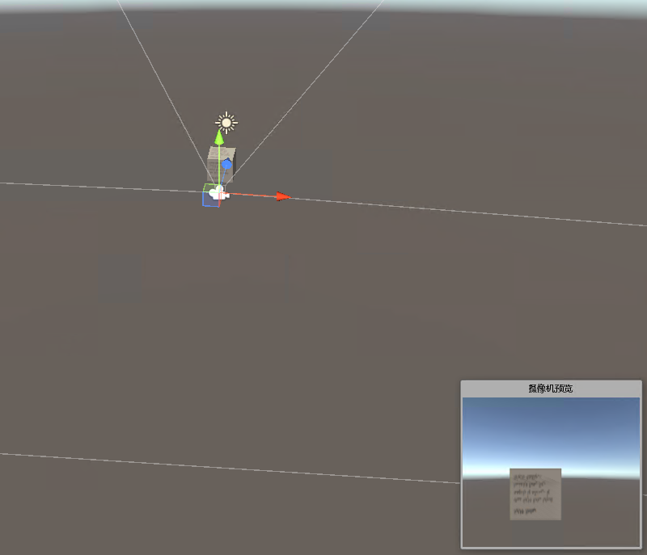
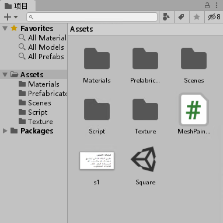
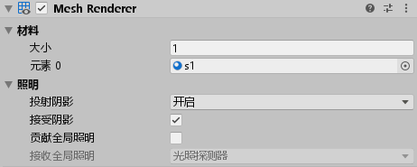

# Unity3d 制作一个立体旋转相册

大概效果就是在空间放一个立方体，然后给他贴图，点击鼠标的时候切换贴图内容。按下方向键旋转立方体

<!--more-->
<!-- csdn -->

效果请看下图

<!--  -->


本来是打算做个 Gif 动态图给大家看效果的，但是图片太大了 25M 我就不敢放出来了

这个效果很简单，做法可以分为三个部分，第一个部分是模型部分，或者说 Scane 里面的内容。第二个部分就是读取本地图片作为贴图部分。第三个部分就是立体旋转部分

## 模型

只需要右击新建一个立方体放在相机可以看到的部分就可以

<!--  -->


将磁盘的随意一张图片拖到资源里面，如我这里放的 s1 这张图片

<!--  -->


接着选择 Cube 将图片 s1 拖放到 Cube 上，大概的效果就是在 Cube 的 Mesh Renderer 的材料的元素0显示了拖进去 s1 元素，同时可以看到 Cube 被 S1 贴图

<!--  -->


## 切换贴图内容

新建一个 C# 脚本，命名是 MeshPainter 将在这里读取本地的图片，按照文件夹的图片，一张张播放

在 C# 中获取一个文件夹里面的所有文件的方法很简单，只需要使用  Directory.GetFiles 方法。在脚本的 Start 方法里面尝试获取图片，获取之后存放在本地的字段

```csharp
    void Start()
    {
        var imageList = Directory.GetFiles(@"D:\lindexi\image");
        foreach (var temp in imageList)
        {
            Debug.Log(temp);
        }

        _imageList = imageList;
    }

    private string[] _imageList;
```

在 Update 方法判断用户是否有输入，通过判断鼠标的方法，在上一篇博客 [Unity3d 连续按键处理和单次按键处理](https://blog.lindexi.com/post/Unity3d-%E8%BF%9E%E7%BB%AD%E6%8C%89%E9%94%AE%E5%A4%84%E7%90%86%E5%92%8C%E5%8D%95%E6%AC%A1%E6%8C%89%E9%94%AE%E5%A4%84%E7%90%86.html ) 告诉小伙伴可以通过 Fire1 判断鼠标左键

```csharp
    void Update()
    {
        // 鼠标左键
        if (Input.GetButtonDown("Fire1"))
        {
           
        }
    }
```

新建一个字段用来存放当前是第几次点击，对应文件夹的文件

```csharp
    void Update()
    {
        // 鼠标左键
        if (Input.GetButtonDown("Fire1"))
        {
            var path = _imageList[_count];
            _count++;

            if (_count == _imageList.Length)
            {
                _count = 0;
            }
        }
    }

    private int _count;
```

此时就可以拿到本地文件 `path` 了，接下来就是通过创建 Texture2D 的方式进行贴图

创建 Texture2D 需要给定大小，这个大小建议是根据模型来，也就是需要贴到那个模型上

```csharp
Texture2D texture = new Texture2D(1920, 1080);
```

通过 LoadImage 方法可以加载图片，参数是一个 byte 数组，在 C# 里面读取文件作为 byte 数组的方法可以使用 `System.IO.File.ReadAllBytes` 方法

```csharp
 texture.LoadImage(File.ReadAllBytes(path));
```

创建了 Texture2D 可以将他贴到 mainTexture 作为贴图

```csharp
            var meshRender = gameObject.GetComponent<MeshRenderer>();

            Texture2D texture = new Texture2D(1920, 1080);
            texture.LoadImage(File.ReadAllBytes(path));
            
            meshRender.material.mainTexture = texture;
```

贴图的代码请看下面

```csharp
    void Update()
    {
        // 鼠标左键
        if (Input.GetButtonDown("Fire1"))
        {
            var meshRender = gameObject.GetComponent<MeshRenderer>();
            var path = _imageList[_count];
            _count++;

            if (_count == _imageList.Length)
            {
                _count = 0;
            }

            Texture2D texture = new Texture2D(1920, 1080);
            texture.LoadImage(File.ReadAllBytes(path));
            
            meshRender.material.mainTexture = texture;
        }
    }

    private int _count;
```

## 旋转

新建一个脚本 Move.cs 用来做旋转

通过下面代码可以了解用户的按键，将这个值作为旋转

```csharp
        var horizontalAsixName = "Horizontal";
        var horizontal = Input.GetAxis(horizontalAsixName);

        var verticalAsixName = "Vertical";
        var vertical = Input.GetAxis(verticalAsixName);
```

旋转的方法请看下面

```csharp
        transform.Rotate(new Vector3(horizontal, vertical) * Time.deltaTime * Speed, Space.World);
```

所有代码请看

```csharp
    void Update()
    {
        var horizontalAsixName = "Horizontal";
        var horizontal = Input.GetAxis(horizontalAsixName);

        var verticalAsixName = "Vertical";
        var vertical = Input.GetAxis(verticalAsixName);

        transform.Rotate(new Vector3(horizontal, vertical) * Time.deltaTime * Speed, Space.World);
    }
```

将刚才创建的两个脚本拖放到 Cube 上，然后尝试运行就可以

本文代码放在 [github](https://github.com/lindexi/lindexi_gd/tree/2ed787585407f0af2e1ce34efeb1e4bc061e961a/unity/Square) 欢迎小伙伴访问

<a rel="license" href="http://creativecommons.org/licenses/by-nc-sa/4.0/"></a><br />本作品采用<a rel="license" href="http://creativecommons.org/licenses/by-nc-sa/4.0/">知识共享署名-非商业性使用-相同方式共享 4.0 国际许可协议</a>进行许可。欢迎转载、使用、重新发布，但务必保留文章署名[林德熙](http://blog.csdn.net/lindexi_gd)(包含链接:http://blog.csdn.net/lindexi_gd )，不得用于商业目的，基于本文修改后的作品务必以相同的许可发布。如有任何疑问，请与我[联系](mailto:lindexi_gd@163.com)。
