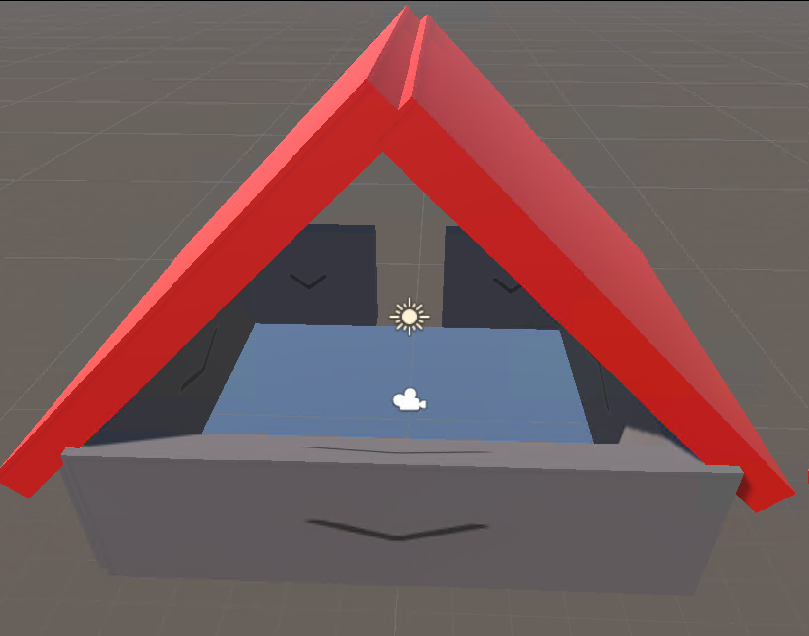
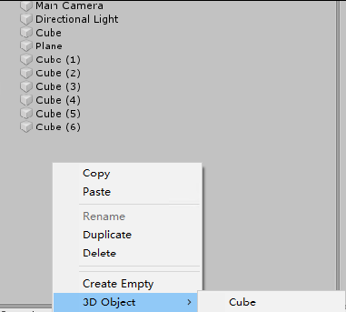
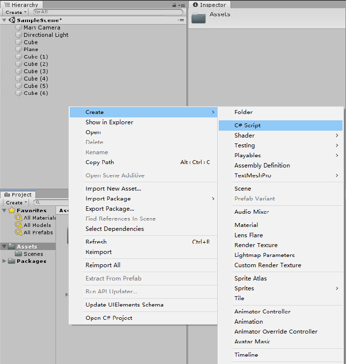
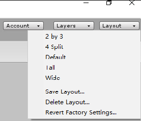

# Unity3d 连续按键处理和单次按键处理

某个按键按下不放叫连续按键，而仅在按下的首次处理叫单次按键处理。用途是在游戏中控制移动，例子是可以将用户点击鼠标左键时向前走一步，而点击鼠标右键时，只要按住不放就连续后退

<!--more-->
<!-- CreateTime:2020/1/31 18:16:28 -->

<!-- 发布 -->

在 unity3d 中，通过 Input 静态类可以拿到用户的输入，而按键的输入统一可以作为某个功能的输入，如鼠标的左键对应的是 "Fire1" 而鼠标的右键对应的是 "Fire2" 而鼠标的滚轮 用的是 Fire3 使用方法如下

```csharp
        if (Input.GetButtonDown("Fire1"))
        {
            // 鼠标左键
        }
        else if (Input.GetButton("Fire2"))
        {
            // 鼠标右键
        }
```


另一个方法是使用 `Input.GetMouseButtonDown` 传入数值的方法，如传入 0 就是鼠标左键，传入 1 就是鼠标右键

```csharp
        if (Input.GetMouseButtonDown(0))
        {
            // 鼠标左键
        }
        else if(Input.GetMouseButton(1))
        {
            // 鼠标右键
        }
```

我推荐使用 Fire 的方法获取

从上面的代码小伙伴可以看到我获取鼠标左键和获取右键用的方法不相同，在 Unity3d 里面通过了以下方法

- GetButton 如果传入的虚拟按钮被按下，那么返回 true 值
- GetButtonDown 在虚拟按钮被按下的一帧，返回 true 值

不同就在于 GetButtonDown 只有在虚拟按钮被按下的一帧，返回 true 值，而之后就没有返回 true 值了，也就是获取到是按下一次。而 GetButton 只要按钮被按下就返回 true 可以用来做连续点击

在脚本的 Update 方法里面方式使用 GetButtonDown 作为相机向前移动，而 GetButton 作为相机向后移动，此时可以做到鼠标左键点击向前走一步，安装鼠标左键没有反应，而点击鼠标右键时，只要按住不放就连续后退

创建一个简单的游戏用来说明一下连续按键控制和单次按键控制的不同，接下来的部分是给入门的小伙伴准备的

首先创建简单的界面，如我随意搭的界面

<!--  -->


搭建界面的方法就是右击创建 3d object 如下面图片

<!--  -->


接着看界面你也就知道如何搭界面出来了，当然如果想要做游戏开发，很多时候都需要美工或在网上找一些素材，很少有自己画的

接下来右击创建一个 C# 脚本

<!--  -->


我这个布局是 Tall 布局，我比较喜欢这个布局，在 Unity3d 的右上角点击 Layout 然后选择 Tall 就可以

<!--  -->


右击创建的 C# 脚本，用 VisualStudio 编辑，也就是点击 Open C# project 按钮

在 VisualStudio 添加下面代码

```csharp
    // Start is called before the first frame update
    void Start()
    {

    }

    // Update is called once per frame
    void Update()
    {
        var z = 0f;

        if (Input.GetButtonDown("Fire1"))
        {
            z = 1f;
        }
        else if (Input.GetButton("Fire2"))
        {
            z = -0.1f;
        }

        transform.Translate(new Vector3(0, 0, z) * 0.5f);
    }
```

在 Unity3d 控制物体或相机移动的方法是创建一个 C# 脚本在这个 C# 脚本里面通过 transform 字段的方法移动。在 Unity3d 里面相机也是普通的物体，移动相机和移动普通物体方法相同。如上面代码就定义了鼠标点击移动物体，现在的脚本还没有绑定到某个物体上，也就是这个脚本的作用就是用来移动绑定的物体

现在将这个脚本拖放到相机上面，或者点击相机，点击 Inspector 的 Add Component 按钮，搜寻刚才创建的脚本名。这样就完成了脚本和物体的绑定，尝试点击运行游戏，此时可以做到点击鼠标左键时向前走一步，而点击鼠标右键时，只要按住不放就连续后退

本文代码放在[github](https://github.com/lindexi/lindexi_gd/tree/699e6c7dc8ccadd55a92181a18e6901df4ade9db/unity/Ax)欢迎小伙伴访问

[Unity输入系统 - 知乎](https://zhuanlan.zhihu.com/p/37662637 )

[unity中Input.GetAxis()用法_天行九歌-CSDN博客](https://blog.csdn.net/Fenglele_Fans/article/details/82261507 )

<a rel="license" href="http://creativecommons.org/licenses/by-nc-sa/4.0/"></a><br />本作品采用<a rel="license" href="http://creativecommons.org/licenses/by-nc-sa/4.0/">知识共享署名-非商业性使用-相同方式共享 4.0 国际许可协议</a>进行许可。欢迎转载、使用、重新发布，但务必保留文章署名[林德熙](http://blog.csdn.net/lindexi_gd)(包含链接:http://blog.csdn.net/lindexi_gd )，不得用于商业目的，基于本文修改后的作品务必以相同的许可发布。如有任何疑问，请与我[联系](mailto:lindexi_gd@163.com)。
