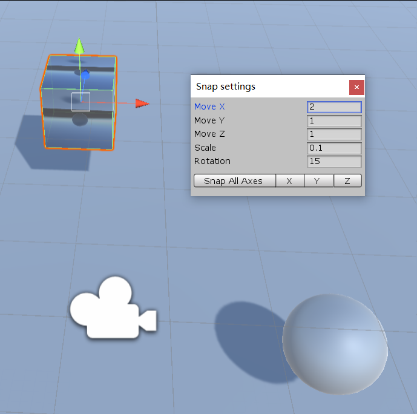

# Unity3d 2019.3 通过 Ctrl 键让移动是固定步距

默认在 Unity3d 通过 w 的移动的时候，是根据鼠标的移动距离移动物体，此时做对齐就不好玩了。通过按下 ctrl 键盘，然后再拖动物体移动，此时就可以设置移动是固定的步频

<!--more-->

<!-- CreateTime:6/9/2020 8:18:13 AM -->

而如何修改默认的步频？可以通过点击 edit 的 Snap Settings 打开设置面板，此时从面板里面设置各个方向的步距

<!--  -->

此时设置的值就是按下 ctrl 的时候移动的最小距离，也是移动的固定距离

除了移动之外，还可以设置缩放的每次固定大小，和旋转的固定大小

<!-- 不知道怎么做的话，试试看一下 B 站的视频 https://www.bilibili.com/video/BV1xt4y1y7uk/

<iframe src="//player.bilibili.com/player.html?bvid=BV1xt4y1y7uk&page=1" scrolling="no" border="0" frameborder="no" framespacing="0" allowfullscreen="true"> </iframe> -->

 本作品采用<a rel="license" href="http://creativecommons.org/licenses/by-nc-sa/4.0/">知识共享署名-非商业性使用-相同方式共享 4.0 国际许可协议</a>进行许可。欢迎转载、使用、重新发布，但务必保留文章署名[林德熙](http://blog.csdn.net/lindexi_gd)(包含链接:http://blog.csdn.net/lindexi_gd )，不得用于商业目的，基于本文修改后的作品务必以相同的许可发布。如有任何疑问，请与我[联系](mailto:lindexi_gd@163.com)。