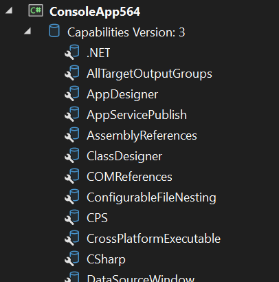

# Visual Studio 查看项目的能力

在 Visual Studio 里面，可以在项目里面通过配置 DiagnoseCapabilities 查看项目的能力。什么是项目的能力？项目的能力就是对当前项目来说，可以具备 VS 支持的功能，项目功能是确定项目类型、平台和特性的推荐方法

<!--more-->


<!-- CreateTime:2024/09/12 07:27:31 -->

<!-- 发布 -->
<!-- 博客 -->

查看项目的能力的功能只适合于框架开发者使用，用于了解当前的项目所具备的能力。也用于测试自己编写的项目能力是否可以在当前项目加载上。正常开发者是不会关注也不会用到这个功能的

开启的方法如下

在 csproj 项目文件里面添加如下代码开启

```xml
  <ItemGroup>
    <ProjectCapability Include="DiagnoseCapabilities" />
  </ItemGroup>
```

修改之后的 csproj 项目文件的内容大概如下

```xml
<Project Sdk="Microsoft.NET.Sdk">

  <PropertyGroup>
    <OutputType>Exe</OutputType>
    <TargetFramework>net9.0</TargetFramework>
    <ImplicitUsings>enable</ImplicitUsings>
    <Nullable>enable</Nullable>
  </PropertyGroup>

  <ItemGroup>
    <ProjectCapability Include="DiagnoseCapabilities" />
  </ItemGroup>
</Project>
```

开启之后的 Visual Studio 界面大概如下

<!--  -->


这里面的一项项就是项目的能力，如 AppDesigner 就是 指示项目使用应用程序设计器管理项目属性 的意思

微软官方有整理一些官方提供的项目能力，详细请参阅 [官方文档](https://github.com/microsoft/VSProjectSystem/blob/ceb5f28aef793a7f576609b41b04243d14944bc7/doc/overview/project_capabilities.md)

本文代码放在 [github](https://github.com/lindexi/lindexi_gd/tree/b0341f898bdcbc0a5dd1b267208eb4de9f0ccbfb/Workbench/QaihijukallBerchegaryuqa) 和 [gitee](https://gitee.com/lindexi/lindexi_gd/tree/b0341f898bdcbc0a5dd1b267208eb4de9f0ccbfb/Workbench/QaihijukallBerchegaryuqa) 上，可以使用如下命令行拉取代码。我整个代码仓库比较庞大，使用以下命令行可以进行部分拉取，拉取速度比较快

先创建一个空文件夹，接着使用命令行 cd 命令进入此空文件夹，在命令行里面输入以下代码，即可获取到本文的代码

```
git init
git remote add origin https://gitee.com/lindexi/lindexi_gd.git
git pull origin b0341f898bdcbc0a5dd1b267208eb4de9f0ccbfb
```

以上使用的是国内的 gitee 的源，如果 gitee 不能访问，请替换为 github 的源。请在命令行继续输入以下代码，将 gitee 源换成 github 源进行拉取代码。如果依然拉取不到代码，可以发邮件向我要代码

```
git remote remove origin
git remote add origin https://github.com/lindexi/lindexi_gd.git
git pull origin b0341f898bdcbc0a5dd1b267208eb4de9f0ccbfb
```

获取代码之后，进入 Workbench/QaihijukallBerchegaryuqa 文件夹，即可获取到源代码

更多技术博客，请参阅 [博客导航](https://blog.lindexi.com/post/%E5%8D%9A%E5%AE%A2%E5%AF%BC%E8%88%AA.html )

参考文档： <https://github.com/microsoft/VSProjectSystem/blob/ceb5f28aef793a7f576609b41b04243d14944bc7/doc/overview/about_project_capabilities.md>


<a rel="license" href="http://creativecommons.org/licenses/by-nc-sa/4.0/"></a><br />本作品采用<a rel="license" href="http://creativecommons.org/licenses/by-nc-sa/4.0/">知识共享署名-非商业性使用-相同方式共享 4.0 国际许可协议</a>进行许可。欢迎转载、使用、重新发布，但务必保留文章署名[林德熙](http://blog.csdn.net/lindexi_gd)(包含链接:http://blog.csdn.net/lindexi_gd )，不得用于商业目的，基于本文修改后的作品务必以相同的许可发布。如有任何疑问，请与我[联系](mailto:lindexi_gd@163.com)。