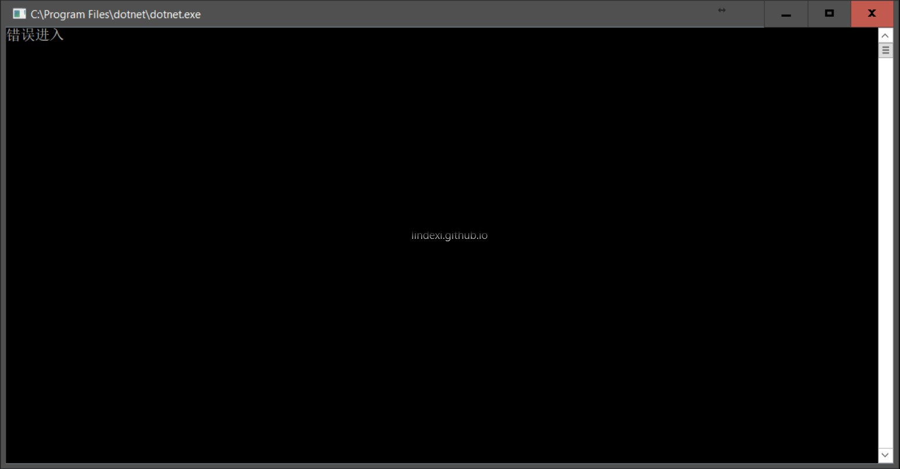

# VisualStudio 打断点调试和不打断点调试有什么区别

最近小伙伴告诉我，他的代码在打断点的时候，运行到断点，之后就可以运行。如果没有断点，他的代码就无法运行，经过了一段时间的研究才发现，原来打断点和不打断点是有一些区别。

本文来告诉大家，如果在自己的软件发现打断点之后程序和不打有区别，如在打断点之后程序可以运行，不打就不能运行，那么可以从下面的方法开始查看是否程序的问题。

<!--more-->
<!-- CreateTime:2018/8/10 19:16:52 -->

<!-- csdn -->
<div id="toc"></div>

<!-- 标签：VisualStudio，调试 -->

## 线程问题

实际上进入断点之后的运行有一个很大的不同在于时间。对于线程调度等，因为时间的不同，进行调度的顺序可能被修改。例如有两个线程，使用相同属性，请看代码。

```csharp

int n = 0;

//线程1
if(n == 0)
{
	n ++;
}

//线程2
if(n == 1)
{
	//代码
}

```

这时如果同时运行 线程1 和 线程2 ，可能线程2的代码就不会运行，因为他判断的 n 还是 0 不是 1。在线程2的判断打断点，这时会发现，经常可以运行代码。

所以遇到打断点问题，那么请看一下使用的判断是否使用很多线程，所以遇到断点让程序可以运行或者不能的时候，先看一下是不是线程的问题。有没有属性没有加锁。

## 随机数

最近在测试框架也看到随机数的问题。

下面是一个简单的类，在构造创建一个随机数，判断相同使用的是判断随机数属性是否相同。实际上小伙伴的问题是有随机数。默认的随机数的构造方法使用的是时间，所以如果创建两个随机数，可能拿到的值是相同，请看下面的代码

```csharp
    class DhtwSwyotml : IEquatable<DhtwSwyotml>
    {
        /// <inheritdoc />
        public DhtwSwyotml()
        {
            var ran = new Random();
            HvkemkKevavvqur = ran.Next();
        }

        public int HvkemkKevavvqur { get; set; }

        /// <inheritdoc />
        public bool Equals(DhtwSwyotml other)
        {
            if (ReferenceEquals(null, other)) return false;
            if (ReferenceEquals(this, other)) return true;
            return HvkemkKevavvqur == other.HvkemkKevavvqur;
        }

        /// <inheritdoc />
        public override bool Equals(object obj)
        {
            if (ReferenceEquals(null, obj)) return false;
            if (ReferenceEquals(this, obj)) return true;
            if (obj.GetType() != this.GetType()) return false;
            return Equals((DhtwSwyotml) obj);
        }

        /// <inheritdoc />
        public override int GetHashCode()
        {
            return HvkemkKevavvqur;
        }

        public static bool operator ==(DhtwSwyotml left, DhtwSwyotml right)
        {
            return Equals(left, right);
        }

        public static bool operator !=(DhtwSwyotml left, DhtwSwyotml right)
        {
            return !Equals(left, right);
        }
    }

```

如果使用的是两个不同的对象，那么一般判断相等都是 false ，但是下面的代码在不打断点可能进入错误的代码

```csharp
        static void Main(string[] args)
        {
            var sutpSgeg = new DhtwSwyotml();
            var kzduDglirxr = new DhtwSwyotml();
            if (sutpSgeg.Equals(kzduDglirxr))
            { 
                //xx 这时不应该进入
                  Console.WriteLine("错误进入");
            }

            Console.WriteLine(sutpSgeg.HvkemkKevavvqur);
            Console.WriteLine(kzduDglirxr.HvkemkKevavvqur);

        }
```

<!--  -->


在 kzduDglirxr 打断点和不在他这里打断点，得到不相同的结果。来两个不同的对象希望返回 false ，结果写为 true ，而且在 kzduDglirxr 断点可以看到不会进入错误的代码。打的时候不会进入判断相等的代码，但是不打的时候可能可以进入判断相等。因为Random的构造函数默认给他是当前的时间，两个对象的创建使用的时间很短，所以创建的随机数可能就相同。但是不是所有的运行都能进入判断。我把上面代码给我小伙伴，结果他一直运行都是不会进入错误的代码。

参见：[Make GenericParameterHelper's behavior same between running and debugging by walterlv · Pull Request #362 · Microsoft/testfx](https://github.com/Microsoft/testfx/pull/362 )

## 等待时间

有一些逻辑是获取了当前的时间，然后对比执行一段逻辑之后的时间，如果两个时间差满足一定的条件，那就执行不同的行为逻辑。用人话来说例如就是以下的情景，在实现一个叫双击的功能，实现的方法是通过鼠标按下的时候，记录按下的时间，在第二次按下之后，记录第二次按下的时间，判断两次按下的时间差，如果足够小，那就是双击。这样的逻辑，即使是自己快速双击进入，但如果进入了断点，那现实物理时间依然在跑，应用程序里面的时间却是停止的。尽管现实里面自己是快速按下两次鼠标，进行双击，然而如果是在第二次鼠标按下的时候，进入断点，然后自己就去跑个厕所回来，接着断点继续往下走，那就会发现，第二次按下获取到的时间是代码运行到的时间，导致了判断双击失败。对应的伪代码如下

```
当前鼠标按下时间 = 获取鼠标按下时间（）；

如果 （鼠标按下时间 距离 当前鼠标按下时间 小于1秒钟）
则 执行双击逻辑；

鼠标按下时间 = 当前鼠标按下时间；
```

由于应用程序里面，获取时间大部分时候获取的都是现实的物理时间，也就是在获取时间的逻辑执行到的时候，才获取到时间。断点影响了获取时间逻辑的时机，导致了加上断点之后，获取时间的逻辑和没有加上断点的逻辑的执行时机不相同

另一个方面和多线程也有一点点关系的是通过 Thread.Sleep 或 Task.Delay 方法时，这两个都是用来做延迟的，下了断点之后，这两个方法的延迟时间是根据物理时间来的，也就是延迟的逻辑的时间依然在走。根据“相对论”来说，进入断点调试的应用的时间是停止的，但是现实世界的时间依然是在走的，这就会让应用内的逻辑感觉到原本的延迟的时间变短了，自然有一些依赖此延迟的逻辑执行也就变更了行为

如以下的伪代码例子

```
var doTask = Task.Delay(5秒);

执行逻辑逻辑（）；// 在这里被下断点，且被调试5秒

await doTask; // 结果会发现等待 doTask 一闪而过，因为这个延迟 5 秒已经过了
```

## 变量监视影响属性获取方法

在 VisualStudio 里提供了局部变量窗口、自动窗口、监视n窗口等变量监视工具，可以方便看到应用程序的各个状态。而在 VisualStudio 获取状态时，一定会影响应用程序的执行代码逻辑，且如果应用程序在如属性的 get 获取方法编写了影响内存的逻辑，那调试时将会导致内存存放的数据被修改，从而有调试和没调试的结果是相同的

看看以下的代码例子

```csharp
public class Program
{
    public int Count
    {
        get => _count++;
    }
    private int _count;

    public static void Main(string[] args)
    {
        var program = new Program(); // 试试在这里打上断点，通过局部变量窗口看 Program 的 Count 属性
        Console.WriteLine(program.Count);
    }
}
```

以上代码的 Count 方法里面，将会在每次获取时，修改字段的内容。这将导致在调试的时候，如果通过局部变量窗口等看 Program 的 Count 属性，将会直接影响到输出结果

根据上文描述，在发现断点和没有之间出现不同的行为时，请看一下是不是有线程问题或者随机数问题和所有时间有关的问题

