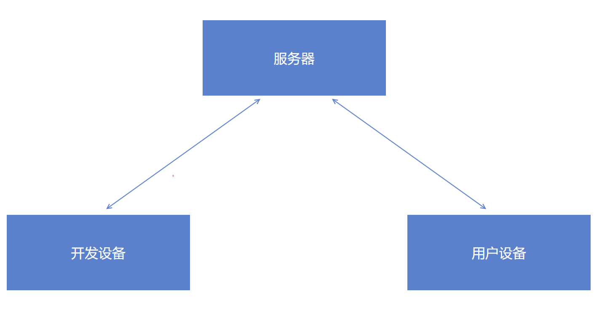
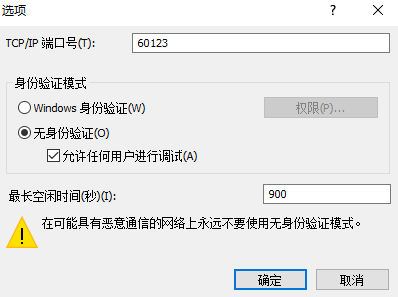
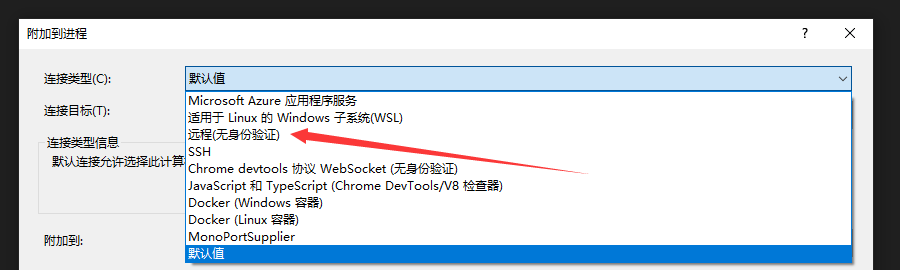
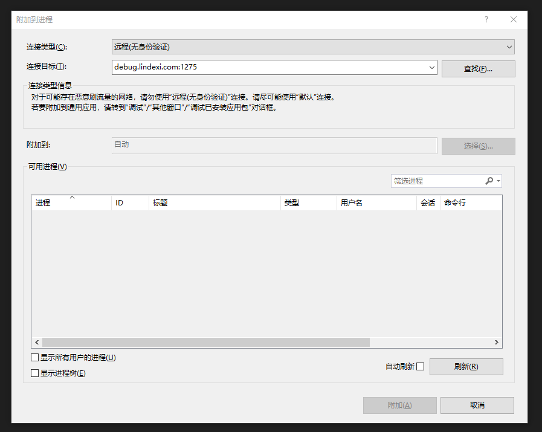
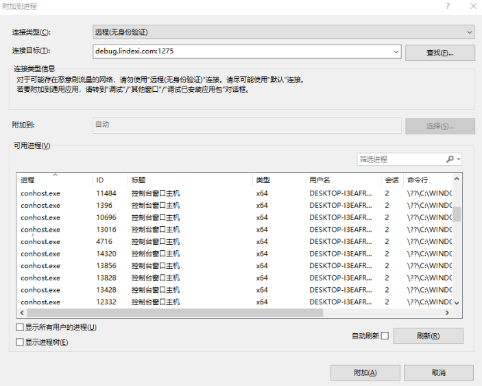

# VisualStudio 使用 FastTunnel 辅助搭建远程调试环境

有时候需要远程调试一些用户问题，期望能使用本机的 Visual Studio 开发环境，调试远程的用户的设备上的应用。这时会遇到的一个问题是如何让本机的 Visual Studio 可以连接上远程的用户的设备，从而进行调试。本文将告诉大家如何采用 FastTunnel 工具，让本机的 Visual Studio 和远程的用户的设备建立调试联系，搭建远程调试环境，从而支持远程调试

<!--more-->
<!-- CreateTime:2022/10/22 15:36:07 -->


<!-- 发布 -->

开始之前需要先介绍一下 FastTunnel 工具，这是一款高性能跨平台内网穿透工具，使用它可以实现将内网服务暴露到公网供自己或任何人访问。对比市面上的其他内网穿透工具最大优势在于基于 dotnet 编写，提供二次开发扩展能力。本文将来告诉大家，在不做任何编程的情况下，通过 FastTunnel 工具，搭建远程调试环境

开始之前需要要求开发者有一台可公网访问的服务器，用来作为中继。现在的开发者，谁还没有几台公网服务器，是在不行，那就掏钱上腾讯云（腾讯，打钱）吧

本文的演示需要三台计算机设备，其中一台是服务器，服务器拥有公网 ip 地址。如腾讯云的服务器。不挑服务器的系统，基于 dotnet 的 FastTunnel 轻松做到了在各个系统平台上运行

另外两台分别是开发设备，和用户设备

咱期望做的就是在开发设备上可以让开发设备的 Visual Studio 开发环境可以连接上用户设备进行调试

<!--  -->


开始之前，先从 [https://github.com/FastTunnel/FastTunnel/releases](https://github.com/FastTunnel/FastTunnel/releases) 下载最新的版本。需要下载一个客户端版本和一个服务端版本，其中服务端版本将放在服务器上运行，客户端版本放在用户设备上运行，开发设备上啥都不需要

当前是 2022.10 最新版本是 2.1.1 版本

先进行服务端的部署

部署服务端的方法是先将下载下来的 FastTunnel.Server 进行解压缩，下载的时候自己注意一下对应的系统版本，如 Windows 的就应该下载 Windows 的，是 Linux 的服务器就应该下载 Linux 的。但愿我的读者不会这么傻

接着打开 config 文件夹，编辑里面的 `appsettings.json` 文件。这个文件里面写满了注释，相信大家看着注释就知道是怎么回事。核心关注的就是开发的连接端口。不清楚的话，自己去加 FastTunnel 群问

<!--  -->


完成配置之后，运行 FastTunnel.Server 应用

接下来即可进行客户端的配置

推荐先在本地写好配置，再将整个 FastTunnel.Client 压缩给到用户设备。因为用户设备上大部分没啥好用的编辑工具。另外考虑到现在还有很多用户都使用 x86 系统，推荐先使用 x86 版本的 FastTunnel.Client 客户端应用

编辑 FastTunnel.Client 的 `appsettings.json` 文件，填写注释里写了必选的 ServerAddr 和 ServerPort 属性，这两个属性需要和服务端配置已知。接着可选填写 Token 信息，如果你的服务端有更改的话，那这里需要同步更改。接着在端口转发这里进行编辑，这就是本文的重点，也是进行远程调试的重点

在 Forwards 属性里面，填写本机的远程调试开放端口，这个开放端口现在还不能完全确定，可以在客户端开启远程调试的时候，动态更改。这里先在 LocalPort 写入我喜欢的 60123 端口当成远程调试开放端口。接着编辑 RemotePort 属性，设置在服务器上开放哪个端口进行对应，我这里选用 1275 作为端口。也就是说访问服务器的 1275 端口，将转发到客户端的 60123 端口上

这里有一点需要注意的是，开放的服务器端口，需要服务器的端口可以被开放。例如上文写了将本地的 60123 端口，映射到服务器的 1275 端口上，这就要求服务器的 1275 端口是防火墙允许的端口，不能被防火墙拦截

我的配置的内容代码如下

```json
{
  "Logging": 
  {
    "LogLevel": 
    {
      // Trace Debug Information Warning Error
      "Default": "Information",
      "Microsoft": "Warning",
      "Microsoft.Hosting.Lifetime": "Information"
    }
  },
  // 是否启用文件日志输出
  "EnableFileLog": true,
  "ClientSettings": 
  {
    "Server": 
    {
      // [必选] 服务端ip/域名（来自服务端配置文件的urls参数） 以下是我的服务器，还请换成你自己的
      "ServerAddr": "debug.lindexi.com",
      // [必选] 服务端监听的通信端口（来自服务端配置文件的urls参数）
      "ServerPort": 1270
    },

    /**
     * [可选] 端口转发 通过专用端口代理，不需要有自己的域名
     * 可穿透所有TCP上层协议
     * 远程linux示例：#ssh -oPort=12701 {root}@{ServerAddr} ServerAddr 填入服务端ip，root对应内网用户名
     * 通过服务端返回的访问方式进行访问即可
     */
    "Forwards": [
      {
        // [必选] 内网服务所在主机ip
        "LocalIp": "127.0.0.1",
        // [必选] 内网服务监听端口 这就是我的远程调试端口
        "LocalPort": 60123,
        // [必选] 服务端端口 访问 服务端ip:1274 即可转发到远程调试
        "RemotePort": 1275,
        // [可选] 通讯协议，可选值TCP,UDP,默认值TCP 。远程调试必须选用 TCP 方式
        "Protocol": "TCP"
      }
    ]
  }
}
```

完成了配置文件编写之后，将整个 FastTunnel.Client 拷贝到用户端，运行 FastTunnel.Client 应用

预期是能看到大概如下的控制台界面输出内容

```
[15:34:49 INF] ===== FastTunnel Client Start =====
[15:34:49 INF] 正在连接服务端 172.20.114.51:1270
[15:34:49 INF] Application started. Press Ctrl+C to shut down.
[15:34:49 INF] Hosting environment: Production
[15:34:49 INF] Content root path: D:\lindexi\FastTunnel.Client.win-x86
[15:35:05 INF] 穿透协议 | 映射关系（公网=>内网）
[15:35:05 INF]   TCP    | test.cc:1275 => 127.0.0.1:60123
```

接着拷贝 Visual Studio 远程调试工具到用户设备上，可以将本机的 Visual Studio 远程调试工具文件夹拷贝过去。对于 Visual Studio 2022 来说，本机的远程调试工具文件夹默认放在 `C:\Program Files\Microsoft Visual Studio\2022\Community\Common7\IDE\Remote Debugger\` 文件夹里面。其他版本的，请参阅 [Remote debugging - Visual Studio (Windows) 官方文档](https://learn.microsoft.com/en-us/visualstudio/debugger/remote-debugging?view=vs-2022 ) 了解存放的文件夹

将 Remote Debugger 文件夹拷贝到用户设备上。然后根据所要调试的应用的是 x86 的还是 x64 的等，运行对应文件夹下的 msvsmon.exe 文件。当然，如果明确只需要调试 x86 应用程序，那也只需要拷贝 Remote Debugger 文件夹里面的 x86 文件夹即可

打开 msvsmon.exe 文件，打开之后进行一些配置，对于用户的设备上来说，快速的调试可以选用不安全的方式，也就是没有带用户权限的方式进行调试，这样的调试就不需要登录用户设备的用户账户，比较方便

点击工具选项，进行选项设置。先修改远程调试开放端口号，如上文，上文使用的是 60123 端口，于是这里需要修改为 60123 端口。接着选择不安全的 `无身份验证` 和勾选允许任何用户进行调试选项，如下图

<!--  -->


这个勾选 `无身份验证` 是比较危险的，记得调试完成要帮用户关闭 msvsmon.exe 应用。因为这就意味着任何能访问到用户设备远程调试端口的人都可以挂上调试，而挂上了调试了，还有啥不能做的。这也是我为什么不使用默认的远程调试端口的原因

完成配置之后，点击确认，可以看到 msvsmon 输出了启动成功

回到自己的开发设备上，开始打开 VisualStudio 进行远程调试

点击 调试->附加到进程

先选择连接类型为 远程 的方式。由于采用的是非内网的调试，不要选择默认的方式，默认的方式基本上是找不到的

<!--  -->


在连接目标里面输入服务器的地址和映射远程调试的端口，例如我的配置是 `debug.lindexi.com:1275` 的，界面如下

<!--  -->


输入完成之后，按下回车。如果成功的话，就可以看到列出用户设备上所有能被调试的进程

<!--  -->


选择感兴趣的进程，即可开始调试

更多请看 [FastTunnel-开源内网穿透框架 - gui.h - 博客园](https://www.cnblogs.com/springhgui/p/15005329.html )
