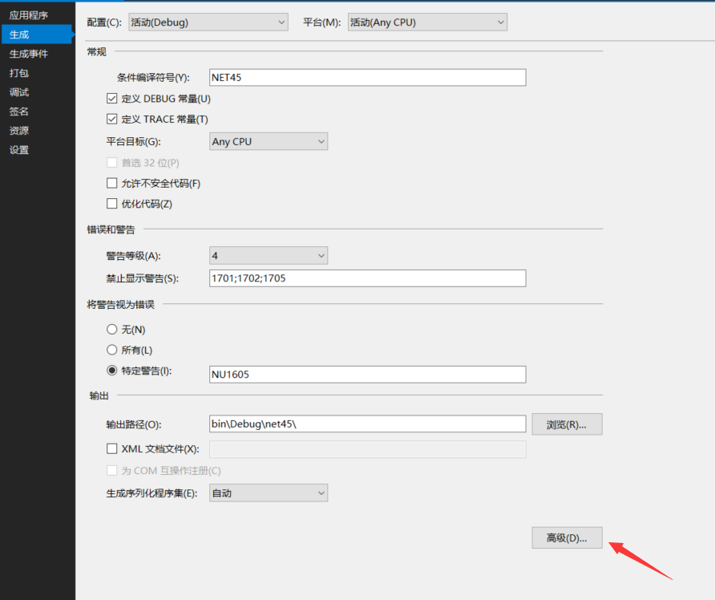
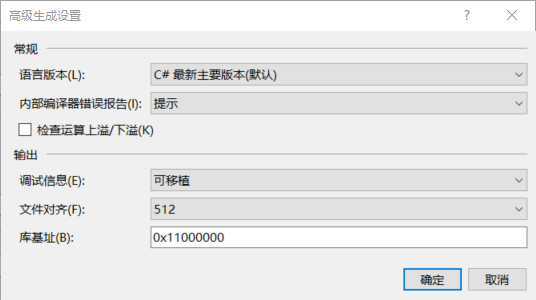

# VisualStudio 使用三个方法启动最新 C# 功能

本文告诉大家如何在 VisualStudio 打开最新的 C#，现在的微软更新 C# 很快，那么如何让 VisualStudio 在项目使用最新的

<!--more-->
<!-- CreateTime:2019/11/29 8:58:50 -->

<!-- csdn -->
<!-- 标签：VisualStudio -->

本文会告诉大家三个不同的方法，最后的方法是最推荐的

## 第一个方法

第一个方法是最简单的方法，右击项目属性，选择生成，可以看到下面界面

<!--  -->


然后点击高级，选择最新语言版本，建议选择最新次要版本而不是直接选择是哪个版本

<!--  -->


现在就可以使用最新的 C# 做出奇诡的业务，但是不告诉你除了在 Debug 需要设计还需要切换 Release 也设置，不然在 Debug 下可以使用，但是在 Release 就无法用最新的 C# 代码

## 第二个方法

如果升级了自己的 VisualStudio 项目为 VisualStudio 2017 项目格式，那么就很建议使用下面的方法，如何升级请看 [从以前的项目格式迁移到 VS2017 新项目格式](https://blog.lindexi.com/post/%E4%BB%8E%E4%BB%A5%E5%89%8D%E7%9A%84%E9%A1%B9%E7%9B%AE%E6%A0%BC%E5%BC%8F%E8%BF%81%E7%A7%BB%E5%88%B0-VS2017-%E6%96%B0%E9%A1%B9%E7%9B%AE%E6%A0%BC%E5%BC%8F.html )

打开项目的 csproj 文件，在一个`PropertyGroup`随便一个地方添加下面代码

```
<LangVersion>latest</LangVersion>
```

看起来的代码就是

```
 <PropertyGroup>
    <TargetFrameworks>netcoreapp2.0;net47</TargetFrameworks>
    <LangVersion>latest</LangVersion>
    <PackageId>lindexi.wpf.Mvvm</PackageId>
    <RootNamespace>lindexi.wpf.Mvvm</RootNamespace>
    <GeneratePackageOnBuild>true</GeneratePackageOnBuild>
    <Authors>lindexi</Authors>
    <RepositoryUrl>https://github.com/lindexi/UWP</RepositoryUrl>
    <Description>
      欢迎来我博客 lindexi.gitee.io
    </Description>
  </PropertyGroup>
```

## 第三个方法

在上面一个方法，可以看到在一个新的项目都需要添加一句代码，这个方法是在新项目添加一个文件。

在项目文件所在的文件夹创建一个文件`Directory.Build.props`，需要注意这个文件的名字是特殊，不能随便改

在这里文件添加下面代码

```csharp
<Project>
  <PropertyGroup>
    <LangVersion>latest</LangVersion>
  </PropertyGroup>
</Project>
```

因为 VisualStudio 会寻找文件夹存在的 `Directory.Build.props` 把这里的内容作为选项

<a rel="license" href="http://creativecommons.org/licenses/by-nc-sa/4.0/"></a><br />本作品采用<a rel="license" href="http://creativecommons.org/licenses/by-nc-sa/4.0/">知识共享署名-非商业性使用-相同方式共享 4.0 国际许可协议</a>进行许可。欢迎转载、使用、重新发布，但务必保留文章署名[林德熙](http://blog.csdn.net/lindexi_gd)(包含链接:http://blog.csdn.net/lindexi_gd )，不得用于商业目的，基于本文修改后的作品务必以相同的许可发布。如有任何疑问，请与我[联系](mailto:lindexi_gd@163.com)。  
