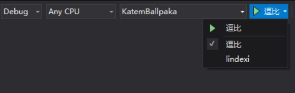
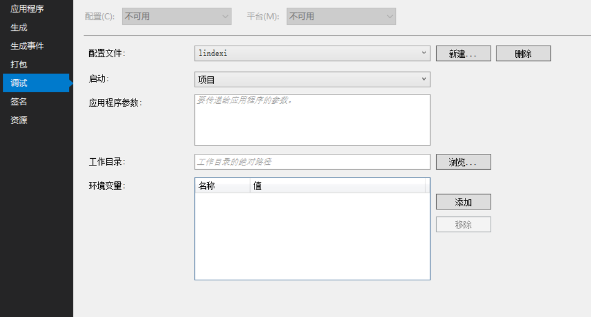
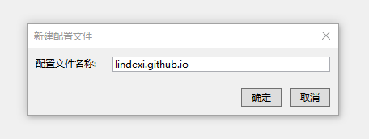
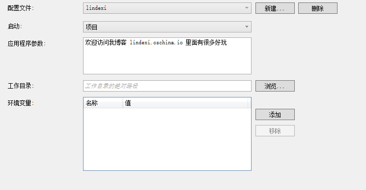
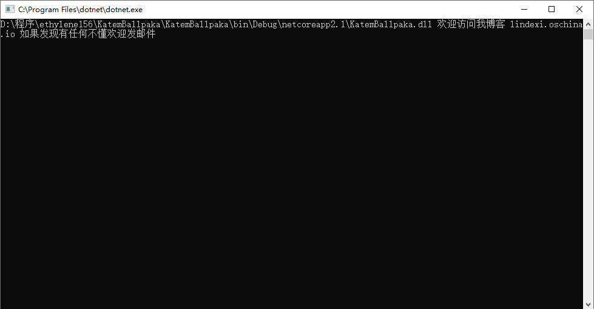
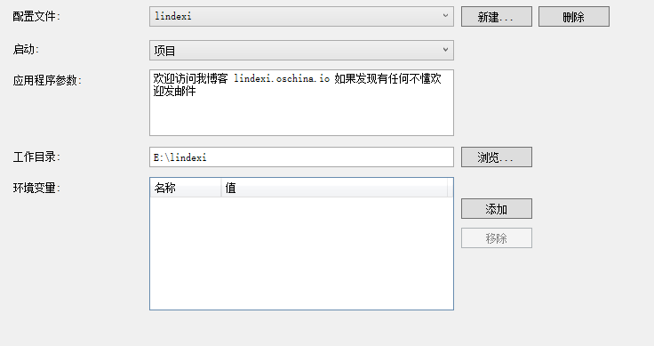
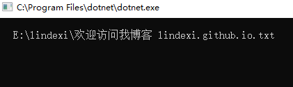
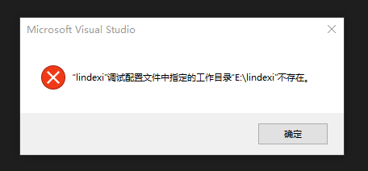
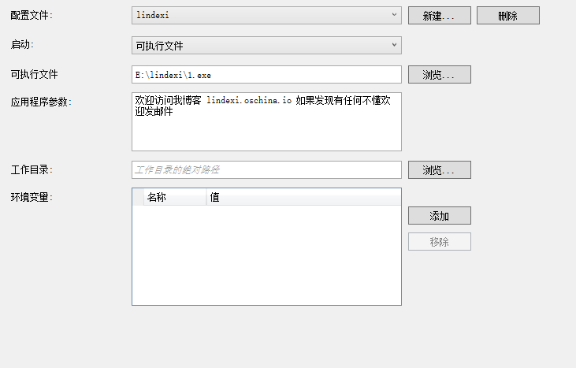
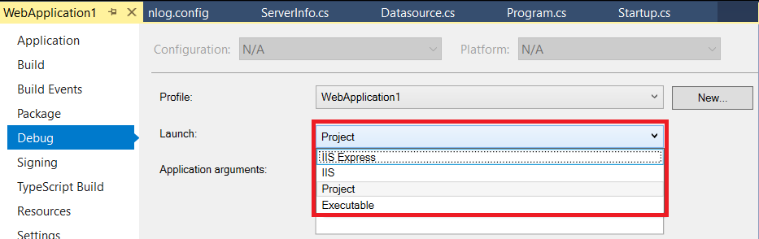

# VisualStudio 使用多个环境进行调试

在 VisualStudio 2017 支持使用 launchSettings.json 文件定义多个不同的环境进行调试

<!--more-->
<!-- CreateTime:2019/11/29 8:58:49 -->

<!-- 标签：VisualStudio，调试 -->

<div id="toc"></div>

先给大家一张图看一下效果

<!--  -->


可以看到原来的是启动的按钮，现在被我修改为 lindexi 和 逗比，那么我是如何做到的？这个有什么用呢？

实际上这个是通过 `launchSettings.json` 设置的，可以在 VisualStudio 里设置也可以在文件直接修改。

## 在调试添加

先创建一个 dotnet core 的程序，为什么需要创建这样的一个程序？因为在 dotnet core 项目创建出来就是新的 VisualStudio 2017 的项目格式。

如果创建的是WPF 程序就需要 [从以前的项目格式迁移到 VS2017 新项目格式](https://blog.lindexi.com/post/%E4%BB%8E%E4%BB%A5%E5%89%8D%E7%9A%84%E9%A1%B9%E7%9B%AE%E6%A0%BC%E5%BC%8F%E8%BF%81%E7%A7%BB%E5%88%B0-VS2017-%E6%96%B0%E9%A1%B9%E7%9B%AE%E6%A0%BC%E5%BC%8F.html )

创建完成请右击项目属性，可以看到下面界面

<!--  -->


点击调试可以看到配置文件，默认的配置文件就是和项目相同，这时只需要点击新建按钮然后输入新的名字，就可以创建新的配置

<!--  -->


在不同的配置可以选择使用启动的是什么，如项目。选择项目就是启动这个项目进行调试，可以在调试的时候输入应用程序参数和设置工作文件夹。

这里的应用程序参数就是在运行控制台的时候传入的参数。如果运行的是 WPF 程序也可以使用 `Environment.CommandLine` 拿到传入的参数。下面我随意添加一个字符，然后在主函数输出

<!--  -->


我在主函数输出可以看到下面代码

<!--  -->


那么工作文件夹又是做什么的呢？

我将工作文件夹修改为 `E:\lindexi` 现在尝试在主函数运行下面的代码

<!--  -->


在主函数添加下面代码然后运行

```csharp
            var file = new FileInfo("欢迎访问我博客 lindexi.github.io.txt");

            Console.WriteLine(file.FullName);
```

可以看到路径相对的文件夹就修改了，所以设置工作文件夹会修改软件的找 dll 和文件的文件夹。

<!--  -->


需要注意，添加的工作文件夹需要是存在的，不然会出现下面提示


<!--  -->


启动除了使用项目还可以使用外面的程序，可以选择启动可执行文件，然后写入可执行文件的路径

<!--  -->


这时的 VisualStudio 执行的就是这个传入的软件，这个就和使用调试附加到进程一样。

这个问题是在堆栈网的以为大神问的，他问启动的几个选项有什么不同，于是我就这样回答

<!--  -->


The first is IIS Express that will use IIS Express to host this project and the second is `Project` that will run this project and debugging it.

If your project include `Main` that you can select `Project` to Launch and VisualStudio will debugging it.

The last one is `Executable` that will use the other application to run this project like `dotnet run xx.dll` and you should set the running application path when you select `Executable` and set some arguments. The VisualStudio will debugging the running application like use attached process.

See:[Working with Environments and Launch Settings in ASP.NET Core](https://exceptionnotfound.net/working-with-environments-and-launch-settings-in-asp-net-core/ )

[Use multiple environments in ASP.NET Core](https://docs.microsoft.com/en-us/aspnet/core/fundamentals/environments?view=aspnetcore-2.1 )

链接：https://stackoverflow.com/q/48221913/6116637

## 修改文件

如果不想使用 VisualStudio 可以直接打开 `Properties\launchSettings.json` 如果这个文件还不存在可以自己创建。

文件的格式是


```json
{
  "profiles": 
  {
    "配置文件1": 
    {
      "commandName": "Project",
      "commandLineArgs": " 欢迎访问我博客 lindexi.github.io 如果发现有任何不懂欢迎发邮件 ",
      "workingDirectory": "E:\\lindexi"
    },
    "配置文件2":
    {
      "commandName": "Executable",
      "executablePath": "D:\\程序\\baozitongregex.exe",
      "commandLineArgs": "欢迎访问我博客 lindexi.oschina.io 如果发现有任何不懂欢迎发邮件"
    }
  }
}
```

必须指定配置文件的 `commandName` ，其他的如 `commandLineArgs` 这些都是可以不写的

可以添加的值是

 - executablePath 只有 commandName 设置为 Executable 时才可以使用，用于设置启动的软件

 - commandLineArgs 传入的命令行

 - workingDirectory 工作文件夹

 - environmentVariables 环境变量

环境变量的格式是

```csharp
      "environmentVariables": 
      {
        "环境变量1": "值"
      }
```

参见：[Use multiple environments in ASP.NET Core ](https://docs.microsoft.com/en-us/aspnet/core/fundamentals/environments?view=aspnetcore-2.1 )

[Working with Environments and Launch Settings in ASP.NET Core](https://exceptionnotfound.net/working-with-environments-and-launch-settings-in-asp-net-core/ )

<a rel="license" href="http://creativecommons.org/licenses/by-nc-sa/4.0/"></a><br />本作品采用<a rel="license" href="http://creativecommons.org/licenses/by-nc-sa/4.0/">知识共享署名-非商业性使用-相同方式共享 4.0 国际许可协议</a>进行许可。欢迎转载、使用、重新发布，但务必保留文章署名[林德熙](http://blog.csdn.net/lindexi_gd)(包含链接:http://blog.csdn.net/lindexi_gd )，不得用于商业目的，基于本文修改后的作品务必以相同的许可发布。如有任何疑问，请与我[联系](mailto:lindexi_gd@163.com)。