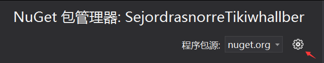

# VisualStudio 使用新项目格式快速打出 Nuget 包

本文告诉大家如何通过 VisualStudio 的新项目格式快速打出 Nuget 包

<!--more-->
<!-- CreateTime:2019/11/29 10:15:25 -->

<!-- csdn -->

在对比之前使用 nuspc 文件创建 Nuget 包的方法，就会发现本文提供的使用  VisualStudio 新项目格式打出 Nuget 包的效率是很高的。从零开始打包 Nuget 只需要不到 3 分钟，其中有 2.9 分钟都是在等待 VisualStduio 卡

先来回顾一下之前是如何制作一个 Nuget 包的，首先通过 `Nuget` 创建一个空白的 nuspec 文件

```csharp
nuget.exe spec
```

然后打开这个 nuspec 文件，添加自己需要的内容，需要包括 Nuget 的 id 和 作者、描述这些，请看代码

```xml
<?xml version="1.0"?>
<package >
  <metadata>
    <id>包的 id 保证上传到的服务器只有一个 id 是自己创建的</id>
    <version>版本号</version>
    <authors>作者</authors>
    <owners>这个包是谁写的，也就是和作者一样</owners>

    <description>描述</description>
  </metadata>
</package>
```

还需要自己添加需要打包的文件，或者通过 nuget 的命令自动编译打包，看起来很麻烦

下面就是我写出来的制作一个 lindexi 的包

```xml
<?xml version="1.0" encoding="utf-8"?>
<package xmlns="http://schemas.microsoft.com/packaging/2013/05/nuspec.xsd">
  <metadata>
    <id>lindexi</id>
    <version>1.0.0</version>
    <authors>lindexi</authors>
    <owners>lindexi</owners>
    <requireLicenseAcceptance>false</requireLicenseAcceptance>
    <description>欢迎访问我博客 https://lindexi.gitee.io/ 里面有很多 UWP WPF 博客</description>
    <dependencies>
      <group targetFramework=".NETCoreApp2.1">
        <dependency id="Microsoft.NETCore.App" version="2.1.0" exclude="Build,Analyzers" />
      </group>
    </dependencies>
  </metadata>
</package>
```

另外我还需要添加一些文件

<!--  -->


具体打包请看 [win10 uwp 如何打包Nuget给其他人](https://blog.lindexi.com/post/win10-uwp-%E5%A6%82%E4%BD%95%E6%89%93%E5%8C%85Nuget%E7%BB%99%E5%85%B6%E4%BB%96%E4%BA%BA.html )

而使用 VisualStudio 新项目格式打出 Nuget 包的方法很简单，首先是创建一个 dotnet core 项目，使用这个项目演示

<!--  -->


右击解决方案，打包，然后打开项目的`bin\Debug`文件夹，就可以看到打出来 nuget 包

<!--  -->


<!--  -->


当然这个粗糙的包还可以做一些修改，例如修改这个包的 id 在 新的项目格式会使用 AssemblyName 作为默认的包的 id 来尝试修改这个值看打出来的包是什么

我修改为 lindexi 请看代码

```xml
  <PropertyGroup>
    <OutputType>Exe</OutputType>
    <TargetFramework>netcoreapp2.1</TargetFramework>
    <AssemblyName>lindexi</AssemblyName>
  </PropertyGroup>
```

<!--  -->


这时右击项目打包就会在 `bin\Debug` 文件夹找到 lindexi.1.0.0.nupkg 文件

<!--  -->


如果想要自己定义一个 nuget 包的 id 和 AssemblyName 不相同，可以通过修改 PackageId 的方式，具体请看[项目文件中的已知 NuGet 属性（使用这些属性，创建 NuGet 包就可以不需要 nuspec 文件啦） - walterlv](https://walterlv.com/post/known-nuget-properties-in-csproj.html )

这时还可以右击项目属性，通过 VisualStudio 修改属性，如我修改了描述

<!--  -->


<!--  -->


那么如何验证打出来的包是可以使用的？做法很简单，就是使用 Nuget 安装本地的包的方式

右击项目管理 Nuget 包

<!--  -->


点击设置

<!--  -->


点击添加一个本地的包，修改输出包的文件夹

<!--  -->


切换本地包

<!--  -->


点击浏览

<!--  -->


点击刚才创建的包

<!--  -->


这时就可以看到刚才快速创建的包

[项目文件中的已知 NuGet 属性（使用这些属性，创建 NuGet 包就可以不需要 nuspec 文件啦） - walterlv](https://walterlv.com/post/known-nuget-properties-in-csproj.html )

课件 

[](https://r302.cc/xejeg0)

[Create and publish a .NET Standard package using Visual Studio on Windows](https://docs.microsoft.com/en-us/nuget/quickstart/create-and-publish-a-package-using-visual-studio )

<a rel="license" href="http://creativecommons.org/licenses/by-nc-sa/4.0/"></a><br />本作品采用<a rel="license" href="http://creativecommons.org/licenses/by-nc-sa/4.0/">知识共享署名-非商业性使用-相同方式共享 4.0 国际许可协议</a>进行许可。欢迎转载、使用、重新发布，但务必保留文章署名[林德熙](http://blog.csdn.net/lindexi_gd)(包含链接:http://blog.csdn.net/lindexi_gd )，不得用于商业目的，基于本文修改后的作品务必以相同的许可发布。如有任何疑问，请与我[联系](mailto:lindexi_gd@163.com)。
