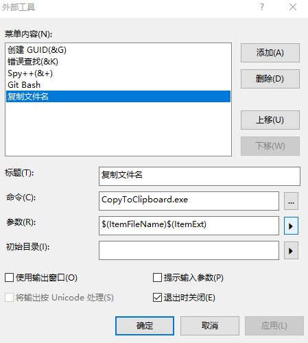
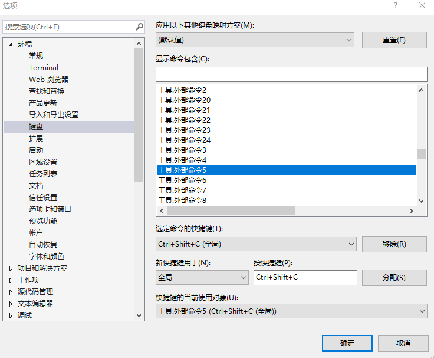

# VisualStudio 外部工具配合 dotnet tool 制作复制文件名工具

我在 VisualStudio 中，为了方便沟通，我需要复制当前文件的文件名，不包含本地的路径，但是我没有找到一个好的复制方式，每次都是复制完全的路径，然后再删除部分的功能。为了提高效率，于是我就自己使用 .NET Core 制作了一个 dotnet 工具，让 VisualStudio 的自定义外部工具配合 dotnet tool 加上传入参数实现通过按下快捷键即可复制当前标签页对应的文件名。实现在 VisualStudio 中按下某个快捷键即可复制当前打开的文件的文件名到剪贴板的功能

<!--more-->
<!-- CreateTime:2021/3/27 14:50:05 -->

<!-- 发布 -->

在 VisualStudio 中有一个很好用的功能是外部命令，外部命令可以使用命令行的方式调用其他的进程，而且传入参数可以有很多预设置的选项，通过预设置选项配合其他进程就可以实现很多复杂的功能。本文提供的工具使用非常方便，因为这是一个 dotnet 工具，因此第一步就是老套的安装方法了，请在命令行输入以下代码进行安装

```
dotnet tool install -g Lindexi.Tool.CopyToClipboard
```

请确定你本机已经安装了 .NET Core 3.1 或以上的 SDK 了

接下来进入 VisualStudio 的外部命令编辑里面，点击工具，外部工具，就可以进入设置外部命令了。更多关于外部命令设置请看 [VisualStudio 自定义外部命令](https://blog.lindexi.com/post/VisualStudio-%E8%87%AA%E5%AE%9A%E4%B9%89%E5%A4%96%E9%83%A8%E5%91%BD%E4%BB%A4.html )

输入标题和命令和参数分别如下

- 标题： 复制文件名
- 命令： CopyToClipboard.exe
- 参数： `$(ItemFileName)$(ItemExt)`

参数的含义可以通过旁边的三角形看到意思，上面参数就是文件名和扩展名，而 CopyToClipboard 工具就是咱刚才安装的 Lindexi.Tool.CopyToClipboard 工具，这个工具的用途就是将传入命令行的内容自动复制到剪贴板。这个工具是在 GitHub 上完全开源的，请看 [https://github.com/lindexi/UWP/](https://github.com/lindexi/UWP/)

<!--  -->


接下来一步就是配置快捷键关联了，在 VisualStudio 加入外部命令，如果需要将某个快捷键关联到这个外部命令，需要在 VisualStudio 工具选项键盘里面进行设置

进入 选项环境键盘 里面，找到外部工具对应的项，如上面图片，我设置的是第5项，因此找到外部命令5给定快捷键

<!--  -->


此时就可以在某个文件标签通过快捷键按下 `ctrl+shift+c` 复制文件名，当然，大家也可以自己设置自己想要的快捷键

使用 dotnet tool 工具的优势在于方便分发和更新，配合 VisualStudio 的外部命令，可以提升很多效率

本文的 dotnet tool 工具代码十分简单

```csharp
    class Program
    {
        [STAThread]
        static void Main(string[] args)
        {
            var commandLine = string.Join(" ", args);
            if (string.IsNullOrEmpty(commandLine))
            {
                Console.WriteLine("啥都没有");
            }
            else
            {
                Clipboard.SetText(commandLine);
                Console.WriteLine($"已复制{commandLine}到剪贴板");
            }
        }
    }
```

接着将这个工具打包作为 dotnet tool 方法是在 csproj 上添加如下代码

```xml
<Project Sdk="Microsoft.NET.Sdk.WindowsDesktop">

    <PropertyGroup>
        <OutputType>WinExe</OutputType>
        <TargetFramework>netcoreapp3.1</TargetFramework>
        <!-- 引用WPF为了剪贴板 -->
        <UseWPF>true</UseWPF>
        <PackAsTool>true</PackAsTool>
        <ToolCommandName>CopyToClipboard</ToolCommandName>
        <AssemblyName>Lindexi.Tool.CopyToClipboard</AssemblyName>
        <RootNamespace>$(AssemblyName)</RootNamespace>
        <Description>命令行传入的内容都会被复制到剪贴板</Description>
    </PropertyGroup>

</Project>
```

这里我使用了 WindowsDesktop 是为了使用 UseWPF 这个属性，使用这个属性的原因是我期望用上剪贴板

在有 WPF 框架的辅助下，才可以使用 Clipboard 类，而其实这个应用没有真的成为一个 WPF 应用，因为只是将 WPF 作为某个库来使用

在输出设置 WinExe 可以让这个控制台在启动的时候，不会显示控制台

接下来就是 GitHub 的 Action 自动打包这个工具，发布到 NuGet 上

这个工具完全开源，放在 [https://github.com/lindexi/UWP/](https://github.com/lindexi/UWP/)

更多关于外部工具请看 [Visual Studio 自定义外部命令 (External Tools) - J.晒太阳的猫 - 博客园](https://www.cnblogs.com/jasongrass/p/14682527.html )

<a rel="license" href="http://creativecommons.org/licenses/by-nc-sa/4.0/"></a><br />本作品采用<a rel="license" href="http://creativecommons.org/licenses/by-nc-sa/4.0/">知识共享署名-非商业性使用-相同方式共享 4.0 国际许可协议</a>进行许可。欢迎转载、使用、重新发布，但务必保留文章署名[林德熙](http://blog.csdn.net/lindexi_gd)(包含链接:http://blog.csdn.net/lindexi_gd )，不得用于商业目的，基于本文修改后的作品务必以相同的许可发布。如有任何疑问，请与我[联系](mailto:lindexi_gd@163.com)。
