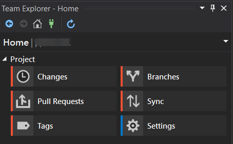
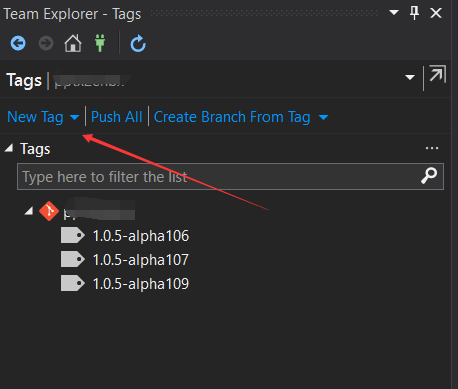
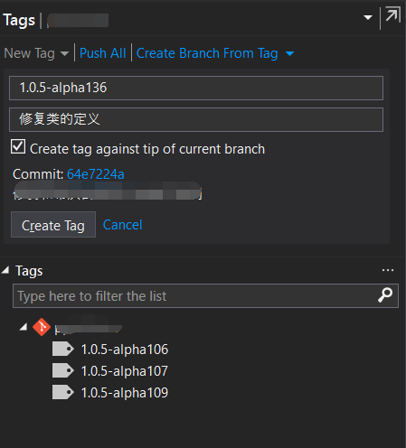
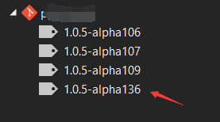
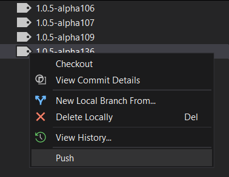

# VisualStudio 如何快速添加一个 Git Tag 推送

在 VisualStudio 的团队管理功能，提供了方便的添加 Tag 的方法，可以新建一个 Tag 添加 Tag 信息，同时推送某个特定的 Tag 到服务器。配合推 Tag 打包 NuGet 的方法，将可以让整套工具用起来特别爽，完全本地化打 Tag 推送就完成了 NuGet 服务器打包推送

<!--more-->
<!-- CreateTime:4/17/2020 11:33:12 AM -->

<!-- 发布 -->

进入团队管理界面，我用的英文版的，但是按钮在中文版也没有变化。我的 VisualStudio 是 2019 的

<!--  -->

点击 Tags 进入标记界面

<!--  -->

此时可以通过点击 新建Tag按钮 新建一个 Tag 给他版本号和信息，请看下图

<!--  -->

点击创建按钮就可以完成了创建，上面代码只有 Tag 号是必须的，而信息是不必须的。当然有信息可以协助小伙伴更好了解这个 Tag 对应的功能

<!--  -->

此时就可以看到刚才新建的 Tag 了，右击这个新建的 Tag 号就可以找到推送按钮，点击推送按钮就可以将 Tag 推送到服务器了

<!--  -->

熟悉这个方法可以快速给代码添加一个 Tag 号

配合 [dotnet 配合 Gitlab 做自动推 Tag 时打包 NuGet 包](https://blog.lindexi.com/post/dotnet-%E9%85%8D%E5%90%88-Gitlab-%E5%81%9A%E8%87%AA%E5%8A%A8%E6%8E%A8-Tag-%E6%97%B6%E6%89%93%E5%8C%85-NuGet-%E5%8C%85.html ) 可以特别方便打 Tag 打包推送

为什么需要推送 Tag 才能打包？原因是为了解决回退到某个版本发现有一个坑，这个坑是因为某个依赖库的版本问题，此时我期望最小改动，我虽然能拿到这个库的代码，但是我很难知道我这个版本安装的 NuGet 库对应依赖库的哪个 commit 的代码

我之前每次需要追踪某个 NuGet 包对应的依赖库的源代码的版本的时候，都需要进入打包服务器，查看打包日志，在这样很坑玩了很久，公司的配置管理员干掉了服务器，删除了日志。而我接到一个很古老的项目需要修复某个坑，此时这个项目引用了一个底层库的古老版本，此时我不能升级底层库，应该底层库的改动量太大了。但是我又很难定位我现在项目引用的 NuGet 库对应的底层库的哪个 commit 代码。后面只能通过二分的方法，用了几天的开发才完成

所以看到了我上面的坑，小伙伴大概也就能知道为什么我期望将 Tag 和 NuGet 包关联了

在我现在团队的约定里面，只要添加了 alpha 也就是预览版，就可以随意推送测试的 Tag 让服务器帮你打包 NuGet 包，然后在其他的项目安装。为什么会鼓励这样做？原因是有小伙伴说我的某个项目的开发依赖某个库，但是假设这个库一定是合并到主分支之后才能打出 Tag 打包，也就是小伙伴在某个项目的代码将一直不能推送。同时小伙伴也不能在 csproj 里面引用某个私有的版本，因为私有的版本只有小伙伴自己能构建通过，其他小伙伴可构建不通过

假设小 A 需要开发项目 F 而这个项目以来库 L 的更改  
而库 L 的更改如果没有合并到 master 分支，就不允许推送 Tag 打包  
此时小 A 如果推送了代码，这个代码引用了还没有被发布的 L 库的代码，那么其他小伙伴将无法构建通过  
此时小 A 如果推送了代码，这个代码引用了小 A 本地生成的 NuGet 库，那么其他小伙伴将找不到这个 NuGet 库，无法构建通过  
如果小 A 不推送代码，只是写了一个 commit 但是这个 commit 包含了 L 库的代码，但是没有在 csproj 里面升级 L 库版本，那么在回滚代码的时候，进入到这个 commit 将构建失败  
如果小 A 在 commit 里面升级到他本地生成的 NuGet 库，那么回滚代码的时候，因为公共服务器不存在小 A 的本地的 NuGet 库，依然会构建失败

此时有一个叫头像的小伙伴出了一个馊主意，小 A 虽然 L 库代码没有被合并，但是可以知道这个 L 库被合并之后分配的版本号，此时就在 csproj 里面更新到这个版本，然后通过本地打包的方法引用和推送。但是这个方法存在以下问题

- 小伙伴本地打包第一次，发现翻车了，想要第二次打包，但是此时的版本号就重叠了，需要经过黑科技删除 NuGet 缓存重新构建，此时的效率特别低
- 小伙伴在这次 commit 写的代码是他认为发布的时候将会添加的公开方法，但是实际上最后发布的时候更改了公开方法，此时回滚到这个 commit 虽然能下载到 NuGet 库，但是发现 L 库的公开方法不匹配，构建失败

这就是为什么选用推送 Tag 打包的原因，允许小伙伴自己选择预览版的版本推送，自动打包，这样就可以在项目中使用此Tag 打出的预览版的代码。此时的 commit 其他小伙伴也能构建，回滚代码的时候也可以在公共服务器找到 NuGet 包或切换到对应版本的源代码

 本作品采用<a rel="license" href="http://creativecommons.org/licenses/by-nc-sa/4.0/">知识共享署名-非商业性使用-相同方式共享 4.0 国际许可协议</a>进行许可。欢迎转载、使用、重新发布，但务必保留文章署名[林德熙](http://blog.csdn.net/lindexi_gd)(包含链接:http://blog.csdn.net/lindexi_gd )，不得用于商业目的，基于本文修改后的作品务必以相同的许可发布。如有任何疑问，请与我[联系](mailto:lindexi_gd@163.com)。
