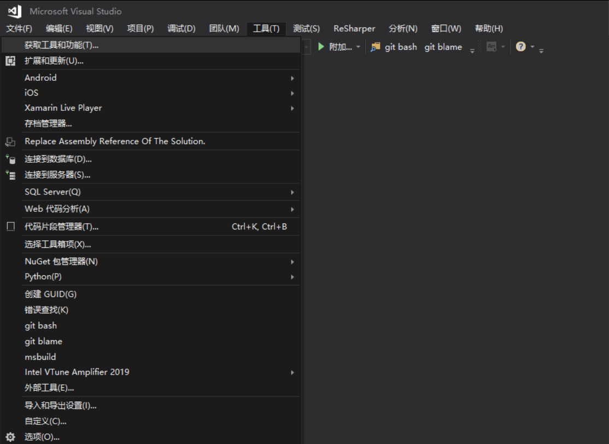
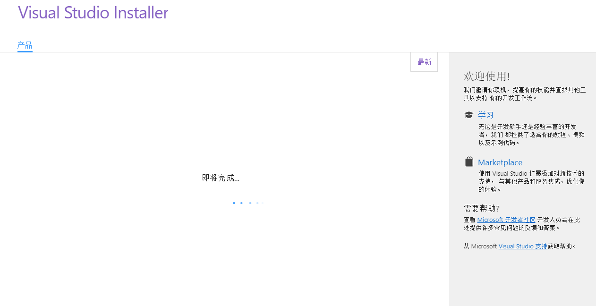
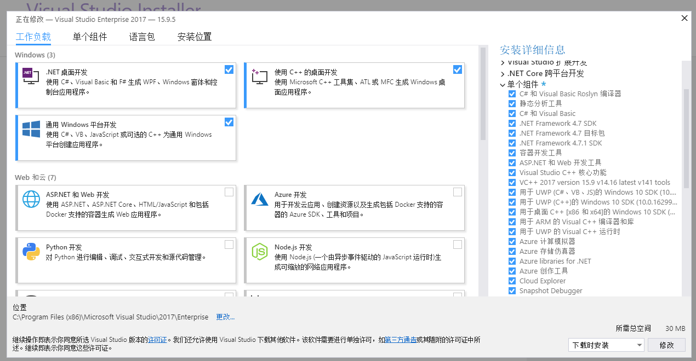
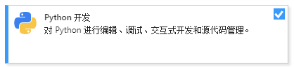
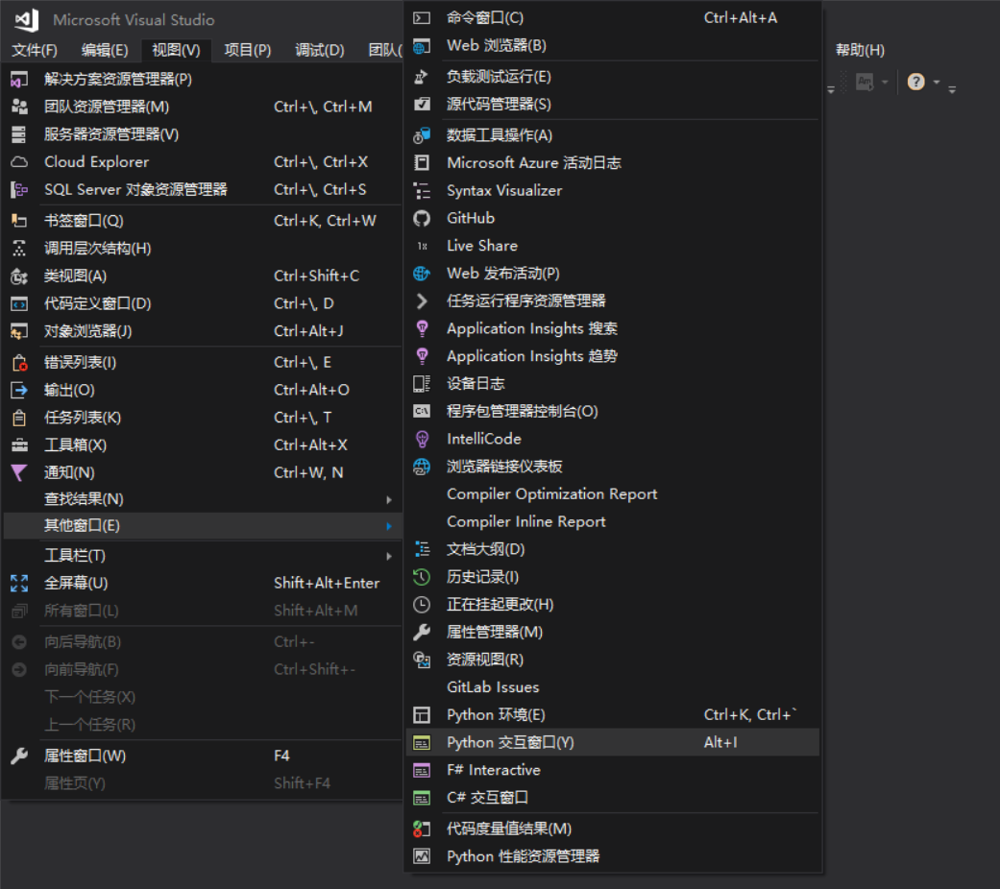

# VisualStudio 安装 Python 开发

本文告诉大家如何在 VisualStudio 使用 Python 开发

<!--more-->
<!-- CreateTime:2019/1/20 10:51:15 -->

<!-- csdn -->

在当前的编程中 Python 是非常强大，可以用 Python 在高性能的计算和工具等

在太阳系内最好用的 VisualStudio 对 Python 的支持是很好的，但是需要先安装一下 Python 才能使用

打开一个空白的 VisualStudio 2017 现在最新的是 VisualStudio 2019 了，但是需要过一些时间才能发布

点击 工具 获取工具和更新 请看下图

<!--  -->


这时可能会让用户点击确定，请点击一下

然后就可以看到下面的界面

<!--  -->


出去和小伙伴聊聊天，然后回来可能看到下面的界面，如果没有看到，那么就请你的小伙伴去吃个饭，如果还是还没有看到，请看看你的设备联网了没

<!--  -->


在这个界面点击 Python 开发，然后点击修改

<!--  -->


如果是英文版的系统请点击下面的图片的按钮


这时会提示你关闭 VisualStudio 点击继续就会帮你关掉 VisualStudio 同时不会保存你还没保存的内容

然后继续和小伙伴聊天，等待安装完成

安装完成之后，尝试从 视图 其他窗口 Python 交互窗口 打开，输入 1+2 回车，如果显示 3 那么就安装成功了

<!--  -->


那么如何创建一个 Python 项目？

点击文件新建项目，然后选择 Python 输入创建的路径


现在就安装完成了

找到创建的一个 py 的文件，输入下面的代码

```csharp
print("林德熙")

```

然后按下 ctrl+F5 运行

[Python in Visual Studio tutorial step 0, installation](https://docs.microsoft.com/en-us/visualstudio/python/tutorial-working-with-python-in-visual-studio-step-00-installation?wt.mc_id=MVP )

<a rel="license" href="http://creativecommons.org/licenses/by-nc-sa/4.0/"></a><br />本作品采用<a rel="license" href="http://creativecommons.org/licenses/by-nc-sa/4.0/">知识共享署名-非商业性使用-相同方式共享 4.0 国际许可协议</a>进行许可。欢迎转载、使用、重新发布，但务必保留文章署名[林德熙](http://blog.csdn.net/lindexi_gd)(包含链接:http://blog.csdn.net/lindexi_gd )，不得用于商业目的，基于本文修改后的作品务必以相同的许可发布。如有任何疑问，请与我[联系](mailto:lindexi_gd@163.com)。
