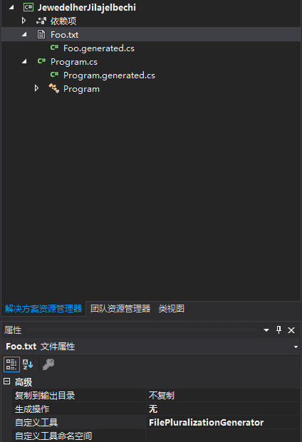

# VisualStudio 开发文件自定义工具单文件生成工具

在 VisualStudio 右击任意的文件夹，点击属性，可以看到属性里面有一个选项是自定义工具。如果创建的是 WPF 项目，可以看到页面或用户控件的自定义工具是 XamlIntelliSenseFileGenerator 可以用来在设计时转换文件，将转换的输出放在另一个文件中。通过这个方法可以自己定义一些内容，在修改内容文件的时候自动生成代码

<!--more-->
<!-- CreateTime:2019/4/26 10:49:32 -->

<!-- csdn -->
<!-- 标签：VisualStudio -->

我最近在做优化，我想将一个自定义的 yml 文件编译为一个类，这样我可以提高软件的运行速度。我想做到和编译 xaml 一样，在 xaml 修改的时候就自动将 yml 编译为一个类，于是我就找到了自定义工具

本文的方法将是在 VisualStudio 2019 使用的方法，在 VisualStudio 2019 的[特性](https://blog.lindexi.com/post/VisualStudio-2019-%E6%96%B0%E7%89%B9%E6%80%A7.html) 就提供了新的插件 Nuget 包使用方法十分简单

在安装 Visual Studio 2019 的时候，可以选择插件开发，这时可以在新的欢迎界面快速创建插件

现在创建的插件默认给的是 AsyncPackage 而不是之前的 Package 这个类不需要修改内容

创建一个新的类，这个类继承 IVsSingleFileGenerator 接口，这样就可以用来创建文件了。在继承这个接口之后，可以发现需要重写两个方法，第一个方法是 DefaultExtension 方法，这个方法需要返回转换创建的文件的后缀名，同时返回后缀名的字符长度

```csharp
        public int DefaultExtension(out string defaultExtension)
        {
            defaultExtension = ".generated.cs";
            return defaultExtension.Length;
        }
```

在自定义工具可以自动创建一个和设置自定义工具的文件的相同命名的文件，只是这个文件的后缀名修改为这个方法返回的后缀名。因为这个方法可能是会被一些不清真的代码使用，所以需要返回当前的字符串的长度

第二个方法是 Generate 这是一个核心的方法，在设置使用自定义工具的文件被更改的时候，将会自动调用这个方法。在这个方法的输出里面相对有一些坑，我想要输出林德熙是逗比这个字符串到文件，我需要使用下面代码

```csharp
        public int Generate(string wszInputFilePath, string bstrInputFileContents, string wszDefaultNamespace, IntPtr[] rgbOutputFileContents, out uint pcbOutput, IVsGeneratorProgress pGenerateProgress)
        {
            var bytes = Encoding.UTF8.GetBytes("林德熙是逗比");
            var length = bytes.Length;

            rgbOutputFileContents[0] = Marshal.AllocCoTaskMem(length);
            Marshal.Copy(bytes, 0, rgbOutputFileContents[0], length);
            pcbOutput = (uint) length;

            return VSConstants.S_OK;
        }
```

这个方法的参数含义

- wszInputFilePath 文件的绝对路径
- bstrInputFileContents 文件的内容，可能出现编码问题
- wszDefaultNamespace 建议的命名空间
- rgbOutputFileContents 输出的内容
- pcbOutput 输出的长度

需要将输出的字符串先转 byte 数组，然后赋值给输出的内容返回输出内容的长度。还需要在赋值之前先申请一段内存

当然为了让 VisualStudio 能发现这个类，需要添加一些特性

```csharp
    [ComVisible(true)]
    [Guid(FilePluralizationGeneratorId)]
    [CodeGeneratorRegistrationAttribute(typeof(FilePluralizationGenerator), nameof(FilePluralizationGenerator), VSConstants.UICONTEXT.CSharpProject_string, GeneratesDesignTimeSource = true)]
    [ProvideObject(typeof(FilePluralizationGenerator))]
    public sealed class FilePluralizationGenerator : IVsSingleFileGenerator
```

这里的 ProvideObject 是做注入使用的，添加这个特性将会注入到 VisualStudio 插件，但是如果有看过之前的博客，就会发现默认需要自己修改注册表的方法才能做到使用自定义工具，现在可以创建 CodeGeneratorRegistrationAttribute 这个类，继承 RegistrationAttribute 做到修改注册表，请看代码

```csharp
    [AttributeUsage(AttributeTargets.Class, AllowMultiple = true)]
    public sealed class CodeGeneratorRegistrationAttribute : RegistrationAttribute
    {
        public CodeGeneratorRegistrationAttribute(Type generatorType, string generatorName, string contextGuid)
        {
           
        }

        
        /// <summary> 
        ///     Called to register this attribute with the given context.  The context 
        ///     contains the location where the registration information should be placed. 
        ///     It also contains other information such as the type being registered and path information. 
        /// </summary> 
        public override void Register(RegistrationContext context)
        {
            // 写注册表
        }

        /// <summary> 
        /// Unregister this file extension. 
        /// </summary> 
        /// <param name="context"></param> 
        public override void Unregister(RegistrationContext context)
        {

        }
    }
```

此时在 FilePluralizationGenerator 上进行断点，然后运行插件，在调试的 VisualStudio 创建一个项目，添加一个 Foo.txt 文本，右击属性，修改自定义工具

<!--  -->


此时就可以看到代码运行，输出的林德熙是逗比将会写入到 Foo.txt 下面的 Foo.generated.cs 文件里面

修改 Foo.txt 文件，点击保存会继续进入函数，在自定义工具可以在文件修改的时候自动调用

所有代码放在[github](https://github.com/lindexi/lindexi_gd/tree/ebcd65c41d21c8e4379e8924a7235f22025cbbb7/HiaiemhiuBobmnawa )

更多插件开发请看

- [VisualStudio 插件开发 获得输出窗口内容](https://blog.lindexi.com/post/visualstudio-%E6%89%A9%E5%B1%95%E5%BC%80%E5%8F%91-%E8%8E%B7%E5%BE%97%E8%BE%93%E5%87%BA%E7%AA%97%E5%8F%A3%E5%86%85%E5%AE%B9 )
- [VisualStudio 插件开发 添加输出窗口](https://blog.lindexi.com/post/visualstudio-%E6%89%A9%E5%B1%95%E5%BC%80%E5%8F%91-%E6%B7%BB%E5%8A%A0%E8%BE%93%E5%87%BA%E7%AA%97%E5%8F%A3 )
- [VisualStudio 插件开发 添加菜单](https://blog.lindexi.com/post/visualstudio-%E6%89%A9%E5%B1%95%E5%BC%80%E5%8F%91-%E6%B7%BB%E5%8A%A0%E8%8F%9C%E5%8D%95 )
- [VisualStudio 插件开发](https://blog.lindexi.com/post/visualstudio-%E6%89%A9%E5%B1%95%E5%BC%80%E5%8F%91 )

[Developing Custom Tool (aka Single File Generators) for Visual Studio 2012](https://mnaoumov.wordpress.com/2012/09/26/developing-custom-tool-aka-single-file-generators-for-visual-studio-2012/ )

[IVsSingleFileGenerator Interface (Microsoft.VisualStudio.Shell.Interop) ](https://docs.microsoft.com/en-us/dotnet/api/microsoft.visualstudio.shell.interop.ivssinglefilegenerator?wt.mc_id=MVP )

[RegistrationAttribute Class (Microsoft.VisualStudio.Shell) ](https://docs.microsoft.com/en-us/dotnet/api/microsoft.visualstudio.shell.registrationattribute?wt.mc_id=MVP )

<a rel="license" href="http://creativecommons.org/licenses/by-nc-sa/4.0/"></a><br />本作品采用<a rel="license" href="http://creativecommons.org/licenses/by-nc-sa/4.0/">知识共享署名-非商业性使用-相同方式共享 4.0 国际许可协议</a>进行许可。欢迎转载、使用、重新发布，但务必保留文章署名[林德熙](http://blog.csdn.net/lindexi_gd)(包含链接:http://blog.csdn.net/lindexi_gd )，不得用于商业目的，基于本文修改后的作品务必以相同的许可发布。如有任何疑问，请与我[联系](mailto:lindexi_gd@163.com)。

