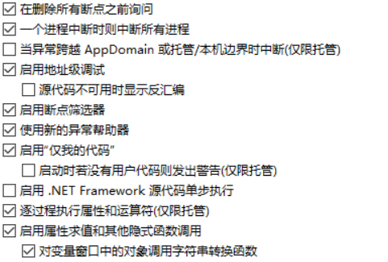

# VisualStudio 开启仅我代码调试

在 VisualStudio 开始调试的时候经常需要加载很多符号，加载符号的速度很慢，很多时候我只是调试我的代码，因为框架提供的代码都是很稳定的，只有我这么逗比才会写出诡异的方法。可以在设置开启仅我代码进行调试，开启之后只有自己的用户代码才会进行调试，也只有自己的代码才会加载符号文件，这样可以调试的速度

<!--more-->
<!-- CreateTime:2019/6/5 19:29:44 -->

<!-- csdn -->

在 VisualStudio 可以使用开启仅我代码提高调试速度

点击工具-选项 找到调试里面的开启仅我代码就可以在调试的时候只加载用户代码的符号

<!--  -->


此时会自动跳过库里面的代码调试，同时也会跳过使用[DebuggerNonUserCodeAttribute](https://docs.microsoft.com/en-us/dotnet/api/system.diagnostics.debuggernonusercodeattribute?wt.mc_id=MVP )标记的代码

如我添加了函数 Foo 在这个函数上面添加[DebuggerNonUserCodeAttribute](https://docs.microsoft.com/en-us/dotnet/api/system.diagnostics.debuggernonusercodeattribute?wt.mc_id=MVP )那么在调试的时候无法在这个函数添加断点也无法单步进入这个函数

```csharp
        [DebuggerNonUserCode]
        private static void Foo()
        {
        }
```

[Debug user code with Just My Code - Visual Studio](https://docs.microsoft.com/en-us/visualstudio/debugger/just-my-code?wt.mc_id=MVP )

<a rel="license" href="http://creativecommons.org/licenses/by-nc-sa/4.0/"></a><br />本作品采用<a rel="license" href="http://creativecommons.org/licenses/by-nc-sa/4.0/">知识共享署名-非商业性使用-相同方式共享 4.0 国际许可协议</a>进行许可。欢迎转载、使用、重新发布，但务必保留文章署名[林德熙](http://blog.csdn.net/lindexi_gd)(包含链接:http://blog.csdn.net/lindexi_gd )，不得用于商业目的，基于本文修改后的作品务必以相同的许可发布。如有任何疑问，请与我[联系](mailto:lindexi_gd@163.com)。
