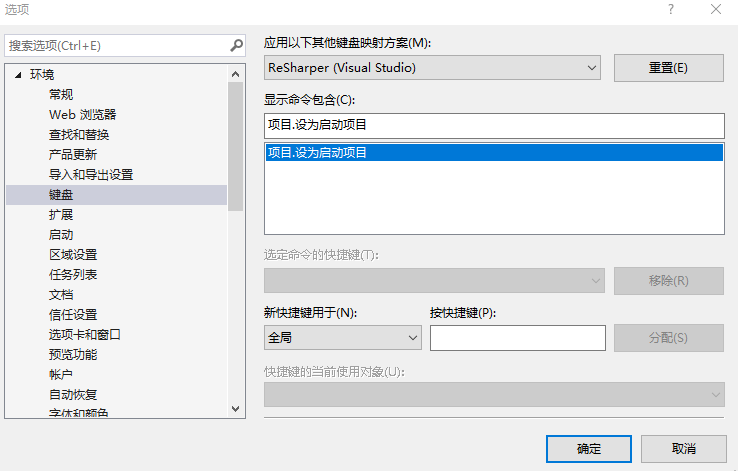

# VisualStudio 快速设置启动项目

我现在的软件需要有 100 个项目，同时我需要切换不同的项目作为启动项目，但是右击项目设置为启动需要在很长的右击中找到设置为启动项很慢。本文告诉大家如何在 VisualStudio 设置快捷键，可以让选择的项目作为启动项目

<!--more-->
<!-- CreateTime:2019/7/1 14:37:38 -->

<!-- csdn -->

在我开发 UWP 项目的时候，我需要引用很多个项目，因为我需要给多个不同的设备定制，我需要切换多个项目作为启动项目。同时我有一些项目会添加呆魔程序，因为对于很多小的控件，我是不想在主项目调试开发

例如我有一个绘制公式的功能，我会给这个功能添加一个项目和一个呆魔用于快速开发，每次调试公式的时候我是先设置呆魔为启动项目，进行开发和调试。做完之后我再设置主项目为启动项目调试我的公式是否在主项目可以使用。但是切换启动项目需要先选择项目，然后右击设置启动项目，我需要一个效率比较高的方法用来切换，例如使用快捷键

在 VisualStudio 的默认快捷键里面，先选择某个项目，按下`Shift + F10`可以做出和右击项目一样的效果，此时设置为启动项目是按键`a`通过这个方式可以做到快捷键

但是我默认是有输入法的，于是我很难再次按下`a`键，同时弹出右击菜单的速度太慢，我需要一个比较快的方法

点击 VisualStudio 工具选项

进入环境里面的键盘，在显示命令包含里面可以输入下面代码按下回车找到设置项目为启动项目

```csharp
//中文版输入
项目.设为启动项目
//英文版输入
Project.SetasStartUpProject
```

按下回车可以看到下图

<!--  -->


然后分配一个快捷键给他就可以

我推荐的快捷键是设置为在解决方案资源管理器里面的 `ctrl+alt+t` 这个快捷键只有在 xaml 下打开单元测试冲突

<a rel="license" href="http://creativecommons.org/licenses/by-nc-sa/4.0/"></a><br />本作品采用<a rel="license" href="http://creativecommons.org/licenses/by-nc-sa/4.0/">知识共享署名-非商业性使用-相同方式共享 4.0 国际许可协议</a>进行许可。欢迎转载、使用、重新发布，但务必保留文章署名[林德熙](http://blog.csdn.net/lindexi_gd)(包含链接:http://blog.csdn.net/lindexi_gd )，不得用于商业目的，基于本文修改后的作品务必以相同的许可发布。如有任何疑问，请与我[联系](mailto:lindexi_gd@163.com)。
