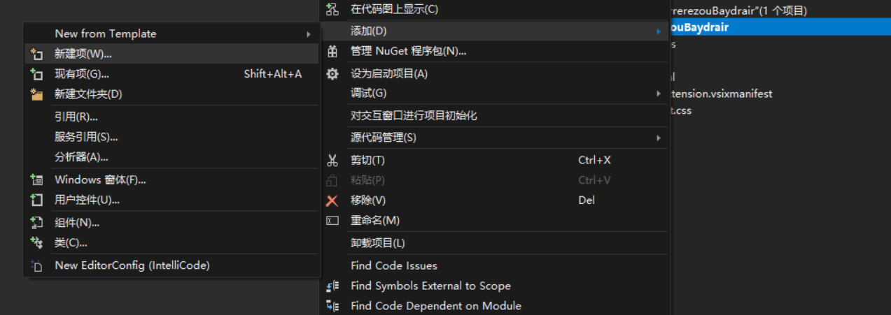

# VisualStudio 扩展开发 添加菜单

本文告诉大家如何快速在开发 VisualStudio 的工具里面添加菜单，点击菜单运行自己的代码

<!--more-->
<!-- CreateTime:2019/2/2 15:35:18 -->

<!-- csdn -->

<!-- 标签： VisualStudio -->

在 VisualStudio 开发插件需要安装插件的开发，在 VisualStudio 2017 可以点击更新，添加插件开发

<!--  -->


在之前我写过 [VisualStudio 扩展开发](https://lindexi.gitee.io/post/VisualStudio-%E6%89%A9%E5%B1%95%E5%BC%80%E5%8F%91.html) 使用的是 VisualStudio 2015 开发，在开发 VisualStudio 2017 的插件和开发之前的版本几乎一样

新建一个插件的程序

<!--  -->


右击新建一个自定义命令，这里的命令的文件名可以随意写，如我就写了 NowkuPurqicowFourocafem 然后就可以去和小伙伴聊天，等待自动写的代码

<!--  -->


<!--  -->


现在只需要做很小的更改，就可以看到效果

双击打开 NowkuPurqicowFourocafemPackage.vsct 文件可以看到下面代码

```csharp
    <Buttons>
      <!--To define a menu group you have to specify its ID, the parent menu and its display priority.
          The command is visible and enabled by default. If you need to change the visibility, status, etc, you can use
          the CommandFlag node.
          You can add more than one CommandFlag node e.g.:
              <CommandFlag>DefaultInvisible</CommandFlag>
              <CommandFlag>DynamicVisibility</CommandFlag>
          If you do not want an image next to your command, remove the Icon node /> -->
      <Button guid="guidNowkuPurqicowFourocafemPackageCmdSet" id="NowkuPurqicowFourocafemId" priority="0x0100" type="Button">
        <Parent guid="guidNowkuPurqicowFourocafemPackageCmdSet" id="MyMenuGroup" />
        <Icon guid="guidImages" id="bmpPic1" />
        <Strings>
          <ButtonText>这里就是菜单</ButtonText>
        </Strings>
      </Button>
    </Buttons>
```

这里的 ButtonText 就是显示的内容，先在这里做一点修改

```csharp
          <ButtonText>欢迎访问我博客 http://lindexi.gitee.io 里面有大量 UWP WPF 博客</ButtonText>

```

按钮的图标是通过 Icon 设置，相对复杂，就先不告诉大家如何修改

打开 NowkuPurqicowFourocafem 类在 Execute 方法添加一些代码，这个函数就是用户点击按钮使用的方法

```csharp
        private void Execute(object sender, EventArgs e)
        {
        }
```

如在用户点击的时候访问我的博客

```csharp
        private void Execute(object sender, EventArgs e)
        {
            Process.Start("http://lindexi.gitee.io");
        }
```

现在点击调试 VisualStudio 可以看到 VisualStudio 实在厉害，听说 VS 是使用 VS 写的，同时 VS 可以使用 VS 调试

但是可以发现输出有很多诡异的代码，难道微软的小伙伴不关注 VisualStudio 的启动性能？

<!--  -->


再和小伙伴聊天，现在可以和他说，我在开发 VS 然后告诉他知道为什么 VS 启动那么慢

点击工具，可以看到一个按钮

<!--  -->


点击按钮就可以看到我博客

[Creating an Extension with a Menu Command](https://docs.microsoft.com/en-us/visualstudio/extensibility/creating-an-extension-with-a-menu-command?view=vs-2017 )

<a rel="license" href="http://creativecommons.org/licenses/by-nc-sa/4.0/"></a><br />本作品采用<a rel="license" href="http://creativecommons.org/licenses/by-nc-sa/4.0/">知识共享署名-非商业性使用-相同方式共享 4.0 国际许可协议</a>进行许可。欢迎转载、使用、重新发布，但务必保留文章署名[林德熙](http://blog.csdn.net/lindexi_gd)(包含链接:http://blog.csdn.net/lindexi_gd )，不得用于商业目的，基于本文修改后的作品务必以相同的许可发布。如有任何疑问，请与我[联系](mailto:lindexi_gd@163.com)。
