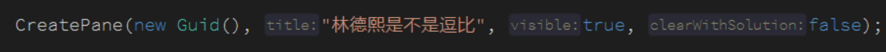
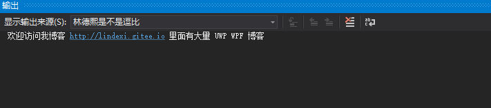
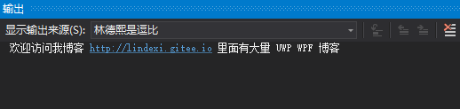

# VisualStudio 扩展开发 添加输出窗口

小伙伴都用过 VisualStudio 都在输出窗口看到不同的子窗口，如 gitlab 的输出窗口，调试的输出窗口，本文告诉大家如何写插件在输出窗口里面添加一个窗口

<!--more-->
<!-- CreateTime:2019/2/3 11:41:40 -->

<!-- csdn -->
<!-- 标签： VisualStudio -->

在[添加菜单](https://lindexi.oschina.io/lindexi/post/VisualStudio-%E6%89%A9%E5%B1%95%E5%BC%80%E5%8F%91-%E6%B7%BB%E5%8A%A0%E8%8F%9C%E5%8D%95.html ) 告诉大家如何简单在 VisualStudio 的工具添加一个按钮，通过用户点击按钮才能使用插件

于是请先看一下如何添加按钮的博客，这样本文就可以直接开始告诉大家在[这篇博客](https://lindexi.oschina.io/lindexi/post/VisualStudio-%E6%89%A9%E5%B1%95%E5%BC%80%E5%8F%91-%E6%B7%BB%E5%8A%A0%E8%8F%9C%E5%8D%95.html ) 用到方法里面快速添加一个自定义的输出窗口

在输出窗口里面的窗口在 VisualStudio 官方的命名是 Pane 也就是本文是告诉大家如何在 VisualStudio 的 OutputWindow 添加一个 Pane 在这个 Pane 里面输出

在 VisualStudio 的 OutputWindow 包含了一组可读可写的文本 默认的 VisualStudio 会带很多的 Pane 如 Build 这是一个项目关于编译的输出，还有 General 这是 VisualStudio 这个工具的一些信息。通过 [IVsBuildableProjectCfg](https://docs.microsoft.com/en-us/dotnet/api/microsoft.visualstudio.shell.interop.ivsbuildableprojectcfg?redirectedfrom=MSDN&view=visualstudiosdk-2017 ) 接口可以自动绑定输出到 Build 如调用编译。通过 [SVsGeneralOutputWindowPane](https://docs.microsoft.com/en-us/dotnet/api/microsoft.visualstudio.shell.interop.svsgeneraloutputwindowpane?redirectedfrom=MSDN&view=visualstudiosdk-2017 ) 服务可以直接访问 General 获取里面的输出。

开发者可以通过 VisualStudio SDK 创建管理自己的自定义窗口。

通过 [IVsOutputWindow](https://docs.microsoft.com/en-us/dotnet/api/microsoft.visualstudio.shell.interop.ivsoutputwindow?redirectedfrom=MSDN&view=visualstudiosdk-2017 ) 和 [IVsOutputWindowPane](https://docs.microsoft.com/en-us/dotnet/api/microsoft.visualstudio.shell.interop.ivsoutputwindowpane?redirectedfrom=MSDN&view=visualstudiosdk-2017 ) 接口可以控制输出窗口。通过 [SVsOutputWindow](https://docs.microsoft.com/en-us/dotnet/api/microsoft.visualstudio.shell.interop.svsoutputwindow?redirectedfrom=MSDN&view=visualstudiosdk-2017 ) 服务可以拿到 [IVsOutputWindow](https://docs.microsoft.com/en-us/dotnet/api/microsoft.visualstudio.shell.interop.ivsoutputwindow?redirectedfrom=MSDN&view=visualstudiosdk-2017 ) 接口。通过 [IVsOutputWindow](https://docs.microsoft.com/en-us/dotnet/api/microsoft.visualstudio.shell.interop.ivsoutputwindow?redirectedfrom=MSDN&view=visualstudiosdk-2017 ) 可以获取到 [IVsOutputWindowPane](https://docs.microsoft.com/en-us/dotnet/api/microsoft.visualstudio.shell.interop.ivsoutputwindowpane?redirectedfrom=MSDN&view=visualstudiosdk-2017 ) 或者创建关闭

通过 [IVsOutputWindowPane](https://docs.microsoft.com/en-us/dotnet/api/microsoft.visualstudio.shell.interop.ivsoutputwindowpane?redirectedfrom=MSDN&view=visualstudiosdk-2017 ) 的方法可以激活 Pane 或隐藏 Pane 滚动里面的文本或清空输出

在开发 VisualStudio 插件的时候，因为文档不多，同时开发的时候会发现有一些文档没有更新，所以难度会比较大


## 创建自定义的输出窗口

在 Execute 方法，也就是 NowkuPurqicowFourocafem 的 Execute 方法，这个方法在[这篇博客](https://lindexi.oschina.io/lindexi/post/VisualStudio-%E6%89%A9%E5%B1%95%E5%BC%80%E5%8F%91-%E6%B7%BB%E5%8A%A0%E8%8F%9C%E5%8D%95.html ) 已经有告诉大家，这个方法就是用户点击按钮的时候就会使用可以在这里添加一个 Pane 请看代码

<!--  -->


也就是调用一个方法，这个方法是自己写的

通过 [SVsOutputWindow](https://docs.microsoft.com/en-us/dotnet/api/microsoft.visualstudio.shell.interop.svsoutputwindow?redirectedfrom=MSDN&view=visualstudiosdk-2017 ) 拿到 [IVsOutputWindow](https://docs.microsoft.com/en-us/dotnet/api/microsoft.visualstudio.shell.interop.ivsoutputwindow?redirectedfrom=MSDN&view=visualstudiosdk-2017 ) 接口

```csharp
    IVsOutputWindow output =   
                (IVsOutputWindow) Package.GetGlobalService(typeof(SVsOutputWindow));  
```

这里的 Package 是 Microsoft.VisualStudio.Shell 是一个静态类里面的方法，除了使用静态类获取，还可以通过 NowkuPurqicowFourocafem 类里面的 package 获取，但是里面的获取方法是异步的

```csharp
        /// <summary>
        /// VS Package that provides this command, not null.
        /// </summary>
        private readonly AsyncPackage package;
```

这个字段是在 InitializeAsync 静态方法注入的

拿到了 [IVsOutputWindow](https://docs.microsoft.com/en-us/dotnet/api/microsoft.visualstudio.shell.interop.ivsoutputwindow?redirectedfrom=MSDN&view=visualstudiosdk-2017 ) 就可以添加输出窗口

```csharp
        void CreatePane(Guid paneGuid, string title,   
            bool visible, bool clearWithSolution)  
        {  
            ThreadHelper.ThrowIfNotOnUIThread();
            
            IVsOutputWindow output =   
                (IVsOutputWindow)Package.GetGlobalService(typeof(SVsOutputWindow));

            // Create a new pane.  
            output.CreatePane(  
                ref paneGuid,   
                title,   
                Convert.ToInt32(visible),   
                Convert.ToInt32(clearWithSolution));  
        }
```

这里传入的 paneGuid 是自己定义的，通过这个 paneGuid 就可以获取输出窗口

上面的代码只是创建，如果想要拿到 Pane 还需要调用这个方法

```csharp
            // Retrieve the new pane.  
            output.GetPane(ref paneGuid, out var pane);
```

这样就可以拿到 [IVsOutputWindowPane](https://docs.microsoft.com/en-us/dotnet/api/microsoft.visualstudio.shell.interop.ivsoutputwindowpane?redirectedfrom=MSDN&view=visualstudiosdk-2017 ) 接口

拿到了 [IVsOutputWindowPane](https://docs.microsoft.com/en-us/dotnet/api/microsoft.visualstudio.shell.interop.ivsoutputwindowpane?redirectedfrom=MSDN&view=visualstudiosdk-2017 ) 就可以输出请看代码

```csharp
            pane.OutputString("欢迎访问我博客 http://lindexi.gitee.io 里面有大量 UWP WPF 博客 \n"); 
```

<!--  -->


除了通过 [SVsOutputWindow](https://docs.microsoft.com/en-us/dotnet/api/microsoft.visualstudio.shell.interop.svsoutputwindow?redirectedfrom=MSDN&view=visualstudiosdk-2017 ) 创建输出窗口，还可以使用 OutputWindow 创建输出窗口

添加 CreatePane 重载

```csharp
void CreatePane(string title) 
{

}
```

现在通过 package 拿到 DTE 通过 DTE 可以拿到输出窗口

```csharp
        private async void CreatePane(string title)
        {
            await ThreadHelper.JoinableTaskFactory.SwitchToMainThreadAsync();
            DTE2 dte = (DTE2) await package.GetServiceAsync(typeof(DTE))
        }
```

通过 package 需要使用异步的方法拿到服务

```csharp
            OutputWindowPanes panes =
                dte.ToolWindows.OutputWindow.OutputWindowPanes;
```

但是 OutputWindowPanes 不是列表，需要通过下面的代码去拿到 Pane 或创建

```csharp
            try
            {
                // If the pane exists already, write to it.  
                OutputWindowPane pane = panes.Item(title);
            }
            catch (ArgumentException)
            {
                // Create a new pane and write to it.  
                var pane = panes.Add(title);
            }
```

虽然通过异常判断是否已经存在 Pane 不存在就创建的代码比较差，但是可以简单告诉大家如何通过 OutputWindowPanes 创建

这里拿到的 Pane 是 OutputWindowPane 和上面 IVsOutputWindowPane 是有点不一样的，通过 OutputWindowPane 可以拿到输出

```csharp
       private void GetText(OutputWindowPane pane)
        {
            ThreadHelper.ThrowIfNotOnUIThread();
            TextDocument document = pane.TextDocument;
            EditPoint point = document.StartPoint.CreateEditPoint();

            // 下面 str 就是输出
            var str = point.GetText(document.EndPoint);
        }
```

这里获取输出请看 [VisualStudio 扩展开发 获得输出窗口内容](https://lindexi.oschina.io/lindexi/post/VisualStudio-%E6%89%A9%E5%B1%95%E5%BC%80%E5%8F%91-%E8%8E%B7%E5%BE%97%E8%BE%93%E5%87%BA%E7%AA%97%E5%8F%A3%E5%86%85%E5%AE%B9.html )

这个 CreatePane 方法全部代码

```csharp
       private async void CreatePane(string title)
        {
            await ThreadHelper.JoinableTaskFactory.SwitchToMainThreadAsync();
            DTE2 dte = (DTE2) await package.GetServiceAsync(typeof(DTE));
            OutputWindowPanes panes =
                dte.ToolWindows.OutputWindow.OutputWindowPanes;

            try
            {
                // If the pane exists already, write to it.  
                OutputWindowPane pane = panes.Item(title);
            }
            catch (ArgumentException)
            {
                // Create a new pane and write to it.  
                var pane = panes.Add(title);
                pane.OutputString("欢迎访问我博客 http://lindexi.gitee.io 里面有大量 UWP WPF 博客 \n");
            }
        }
```

在 Execute 方法使用下面代码

```csharp
            CreatePane("林德熙是逗比");
```

运行可以看到下面代码

<!--  -->


但是通过 OutputWindow 的方法获取不是很好，因为有多语言，可能在日本使用的调试窗口写的是デバッグ可能写的插件只能在自己的语言使用，所以还是建议使用 GUID 的方法创建

## 获取 General 窗口

在 VisualStudio 有两个输出窗口是默认的，就是 General 和 Build 输出窗口

通过服务的方式可以拿到 General 窗口

```csharp
        private async Task GetGeneralPane()
        {
            await ThreadHelper.JoinableTaskFactory.SwitchToMainThreadAsync();
            var pane = (IVsOutputWindowPane) await package.GetServiceAsync(
                typeof(SVsGeneralOutputWindowPane));
        } 
```

## 获取 Build 窗口

通过下面可以获取 Build 窗口

在 [IDE GUIDs](https://docs.microsoft.com/en-us/visualstudio/extensibility/ide-guids?view=vs-2017 ) 找到 Build 窗口的 id 然后通过 id 找到窗口

现在就不使用上面的通过 Name 的方法找到窗口

```csharp
           await ThreadHelper.JoinableTaskFactory.SwitchToMainThreadAsync();
            DTE2 dte = (DTE2) await package.GetServiceAsync(typeof(DTE));
            OutputWindowPanes panes =
                dte.ToolWindows.OutputWindow.OutputWindowPanes;

            foreach (EnvDTE.OutputWindowPane pane in panes)
            {
                if (pane.Guid == "{" +
                    "1BD8A850-02D1-11D1-BEE7-00A0C913D1F8}")               
                {
                }
            }
```

这样就可以拿到 Build 窗口，尝试在这个窗口输出 编译失败 让你的小伙伴安装了插件就无法编译成功，虽然实际小伙伴还是可以运行代码

微软官方的文档有很多错误，看这篇[Extending the Output Window ](https://docs.microsoft.com/en-us/visualstudio/extensibility/extending-the-output-window?view=vs-2017 )文档不如看本文

[Extending the Output Window ](https://docs.microsoft.com/en-us/visualstudio/extensibility/extending-the-output-window?view=vs-2017 )

<a rel="license" href="http://creativecommons.org/licenses/by-nc-sa/4.0/"></a><br />本作品采用<a rel="license" href="http://creativecommons.org/licenses/by-nc-sa/4.0/">知识共享署名-非商业性使用-相同方式共享 4.0 国际许可协议</a>进行许可。欢迎转载、使用、重新发布，但务必保留文章署名[林德熙](http://blog.csdn.net/lindexi_gd)(包含链接:http://blog.csdn.net/lindexi_gd )，不得用于商业目的，基于本文修改后的作品务必以相同的许可发布。如有任何疑问，请与我[联系](mailto:lindexi_gd@163.com)。
