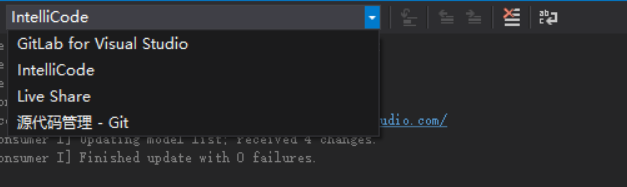

# VisualStudio 扩展开发 获得输出窗口内容

本文告诉大家如何拿到 VisualStudio 输出窗口的内容

<!--more-->
<!-- CreateTime:2019/3/1 9:21:41 -->

<!-- 标签： VisualStudio -->

在上一篇告诉大家如何开发[添加菜单](https://blog.lindexi.com/post/VisualStudio-%E6%89%A9%E5%B1%95%E5%BC%80%E5%8F%91-%E6%B7%BB%E5%8A%A0%E8%8F%9C%E5%8D%95.html ) 点击的时候可以使用方法，如果需要拿到 VisualStudio 的输出窗口的内容，如想要开发一个插件，通过这个工具可以过滤输出

有很多小伙伴在输出的时候，想要将所有的内容输出，然后我就很难看到自己想要看的内容

```csharp
            while (true)
            {
                Debug.WriteLine("林德熙是逗比");
            }
```

我想要做一个工具，需要在输出添加开发者同时只看到自己的输出，如修改一点输出的代码，判断如果使用 `lindexi:` 开始的，就输出，如果不是就不输出

```csharp
            while (true)
            {
                Debug.WriteLine("lindexi: 林德熙是逗比");
            }
```

现在的问题就是如何拿到 Debug.WriteLine 输出到 VisualStudio 窗口，于是我就开始研究这个方法

在上一篇博客的方法通过 Package.GetGlobalService 拿到 DTE 在 VisualStudio 使用了很多事件，输出到窗口就是一个 OutputWindowEvents 方法，这些没有直接在文档说到

先创建一些字段

```csharp
        private DTE _dte;
        private Events _dteEvents;
        private OutputWindowEvents _documentEvents;
```

通过下面的代码就可以拿到输出窗口

```csharp
        private void Execute(object sender, EventArgs e)
        {
            ThreadHelper.ThrowIfNotOnUIThread();
            _dte = (DTE) Package.GetGlobalService(typeof(SDTE));
            _dteEvents = _dte.Events;
            _documentEvents = _dteEvents.OutputWindowEvents;

            _documentEvents.PaneUpdated += GetText;
        }

        private void GetText(OutputWindowPane pane)
        {
        	// 这里的 OutputWindowPane 就是输出窗口
            ThreadHelper.ThrowIfNotOnUIThread();
            TextDocument document = pane.TextDocument;
            EditPoint point = document.StartPoint.CreateEditPoint();

            var str = point.GetText(document.EndPoint);
        }
```

这里通过 PaneUpdated 可以拿到有 Pane 更新的事件，于是在 GetText 方法的 GetText 返回的值就是输出窗口里面的

这里为什么不是输出窗口而是输出窗口的 Pane 因为一个输出窗口是有很多 Pane 的，如源代码管理，调试等

<!--  -->


这里的一个就是一个 Pane 都是在输出窗口里面

那么如何确定监听的是调试窗口？拿到的每个 Pane 都有一个 GUID 可以通过 [IDE GUID](https://docs.microsoft.com/en-us/visualstudio/extensibility/ide-guids?view=vs-2017 ) 找到调试窗口的 GUID 判断当前是调试窗口

微软在 VisualStudio 开发大量使用 GUID 的注入方式，通过这个方式的优点是需要知道有这个 GUID 才能拿到接口，同时可以在任意的地方拿到。

在想要通过判断当前的窗口是调试的时候，但是小伙伴告诉我，现在有这样的插件[Filter Debug Window ](https://marketplace.visualstudio.com/items?itemName=nertilpoci.FilterDebugWindow ) 我用了一下，发现我需要的功能刚好就是这个工具

<a rel="license" href="http://creativecommons.org/licenses/by-nc-sa/4.0/"></a><br />本作品采用<a rel="license" href="http://creativecommons.org/licenses/by-nc-sa/4.0/">知识共享署名-非商业性使用-相同方式共享 4.0 国际许可协议</a>进行许可。欢迎转载、使用、重新发布，但务必保留文章署名[林德熙](http://blog.csdn.net/lindexi_gd)(包含链接:http://blog.csdn.net/lindexi_gd )，不得用于商业目的，基于本文修改后的作品务必以相同的许可发布。如有任何疑问，请与我[联系](mailto:lindexi_gd@163.com)。
