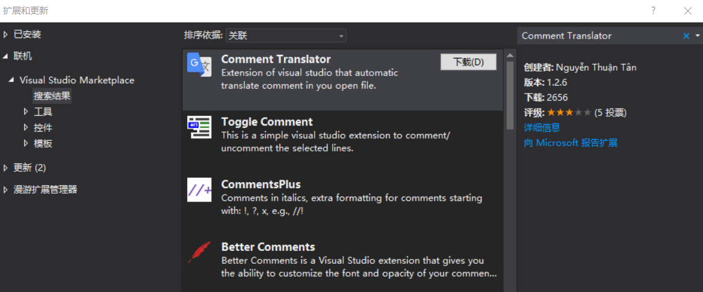
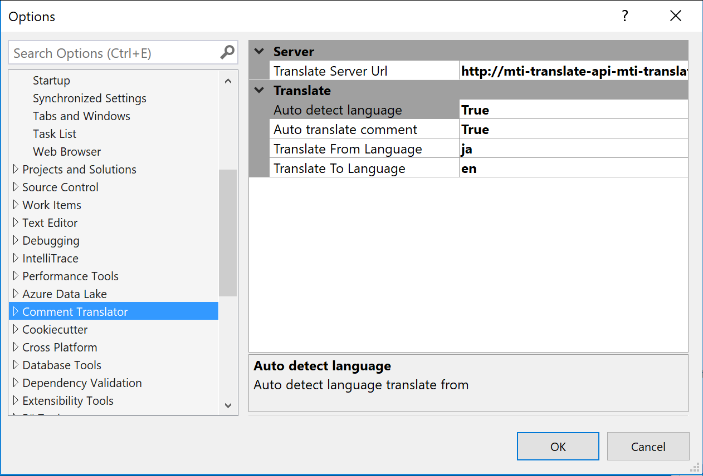
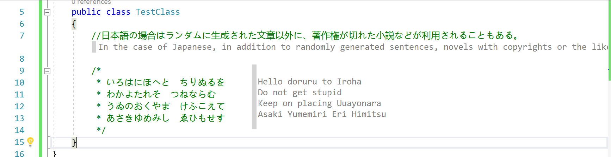

# VisualStudio 插件 翻译注释

有一些项目的注释是使用日文或英文写的，有一些小伙伴看不懂，在 VisualStudio 可以通过插件帮助翻译注释

<!--more-->
<!-- CreateTime:2019/2/27 15:50:33 -->

<!-- csdn -->

<!-- 标签：VisualStudio，VisualStudio插件 -->

通过应用商店下载[Comment Translator](https://marketplace.visualstudio.com/items?itemName=NguynThunTan.CommentTranslator ) 安装需要关闭所有 VisualStudio 软件

<!--  -->

在设置里面可以设置从哪个语言翻译为哪个语言，同时支持调用翻译的 API 在线翻译，默认使用的是谷歌翻译

<!--  -->

现在打开一个项目，就可以看到翻译

<!--  -->

 本作品采用<a rel="license" href="http://creativecommons.org/licenses/by-nc-sa/4.0/">知识共享署名-非商业性使用-相同方式共享 4.0 国际许可协议</a>进行许可。欢迎转载、使用、重新发布，但务必保留文章署名[林德熙](http://blog.csdn.net/lindexi_gd)(包含链接:http://blog.csdn.net/lindexi_gd )，不得用于商业目的，基于本文修改后的作品务必以相同的许可发布。如有任何疑问，请与我[联系](mailto:lindexi_gd@163.com)。
