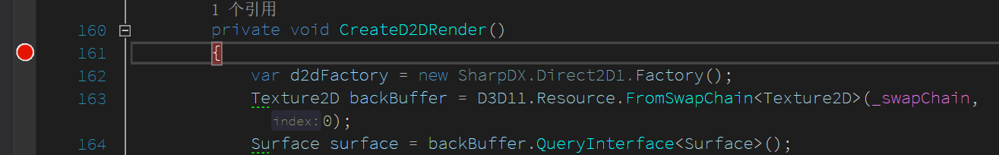
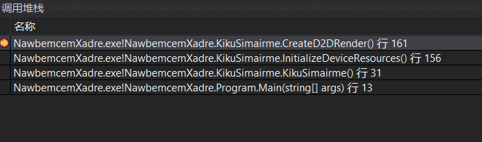
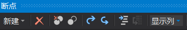
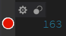
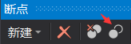
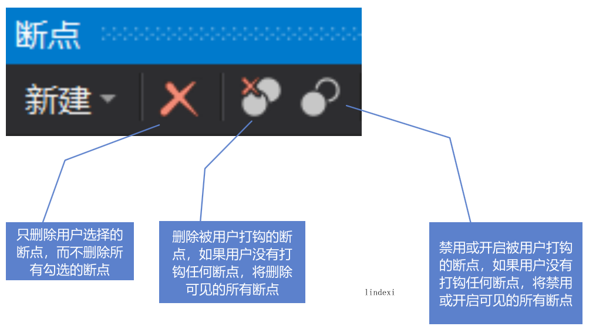
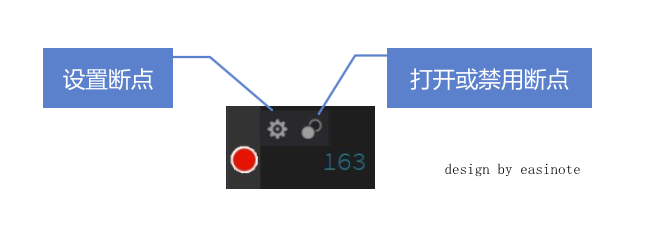
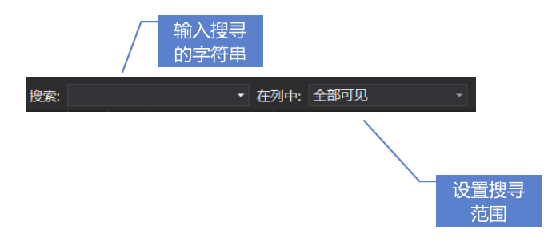
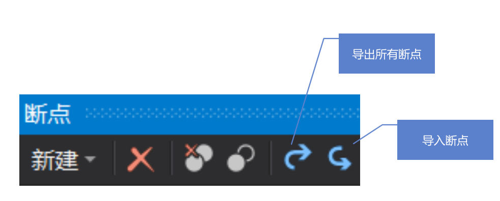

# VisualStudio 断点调试详解

本文详细告诉大家 VisualStudio 断点调试的功能和使用方法，本文使用的是最新 VisualStudio2019 的功能，也许在你看到这篇博客的时候这个版本已经过时

<!--more-->
<!-- CreateTime:2019/12/26 13:01:08 -->

<div id="toc"></div>
<!-- 标签：VisualStudio -->

本文将会按照从简单到复杂，从常用的到不常用的方式，告诉大家断点调试方法

特别推荐微软学习平台[在 Visual Studio 中进行调试的基础知识](https://docs.microsoft.com/zh-cn/learn/modules/get-started-with-visual-studio-for-windows10-app-dev/2-debugging )

## 在代码行添加断点

将光标定位到某一行，在此行的左边，也就是下图显示红色断点的地方，进行点击，此时就可以在此行添加断点。或通过在此行按下 F9 键添加断点

<!--  -->


运行程序，当程序运行到此行的时候，将会进入断点，程序将会暂停进入调试

从代码行添加断点是最常用的方法

## 添加函数断点

点击工具栏的 调试-窗口-断点 打开断点设置

点击添加可以添加函数断点，函数断点需要添加限定符，完全的表达式如下

```csharp
命名空间.类.方法(参数)
```

例如

```csharp
WegaljifoWhelbaichewair.Program.Main(string[])
```

但是一般都可以简写，如不存在重载方法的时候，不需要添加参数，如上面代码可以去掉`string[]`在没有重载的主函数。如不存在多重命名冲突的时候，可以去掉命名空间

## 从调用堆栈添加断点

在 VisualStudio 暂停程序进入断点的时候，可以点击 调试-窗口-调用堆栈 打开调用堆栈窗口，在调用堆栈窗口可以点击某个方法右击添加断点

在调用堆栈可以双击堆栈里面的方法进入此前的调用方法，在进入的时候可以看到进入这个方法的局部变量

<!--  -->


如上图是我的一个程序运行的调用堆栈，在堆栈的每一项就是一次方法调用，在对应的一项上面右击可以选择添加断点

这里可以选择添加断点或追踪点，关于断点或追踪点的不同在哪将会在下文说到

## 添加汇编断点

在 VisualStudio 提供汇编的功能，可以将代码转汇编

在调试汇编的时候也可以在汇编代码添加断点

从 调试-窗口-反汇编 可以打开汇编窗口，在这个页面里面将光标定位到需要添加断点的行，按下快捷键 F9 就可以在这一行添加断点

或者用鼠标在页面的左侧，也就是上一步添加断点时断点显示的行，点击一下就可以添加断点

以上就是添加断点的各个方法

## 从代码行断点转函数断点

对于一个大的项目，想要添加函数断点还是比较难的，原因是写全命名空间是比较大的成本。如果此时可以拿到对应源代码，尝试在源代码上面添加断点，从断点窗口可以将代码行断点转函数断点

<!--  -->


在断点窗口点击 显示列 可以选择函数，此时就可以看到断点窗口显示多了一列是函数，这就是添加断点对应的函数，在这个函数里面会写全命名空间。如果在运行时，将会添加对应的程序文件

鼠标选中对应的断点一行按下快捷键 ctrl+c 进行复制，在文本编辑器进行粘贴，可以看到如下代码

```csharp
名称;标签;条件;命中次数;函数
KikuSimairme.cs，行 161 字符 9;;;总是中断(当前为 1);NawbemcemXadre.exe!NawbemcemXadre.KikuSimairme.CreateD2DRender()

```

最函数对应的一列复制出来，这时这个内容就可以作为断点窗口的新建函数断点的函数表达

## 关闭断点方法

关闭断点的方法有两个，一个是禁用断点一个是删除断点

选禁用断点，可以看到断点变白，删除断点将可以在断点窗口删除这个断点。通过禁用断点可以在下次需要断点时还可以快速开启，而删除断点之后不提供恢复方法

禁用断点有两个方法，第一个方法是在对应的断点的代码行，将鼠标移动到断点上方，此时会显示如下图的两个按钮

<!--  -->


点击右边白色的圆的按钮就可以禁用断点

在断点被禁用的时候，还是将鼠标移动到断点上，但是显示出来的右边的白色的圆的按钮就可以开启断点，这个按钮的功能是开启或禁用断点

另一个禁用断点的方法是通过断点窗口选择对应的断点，右击禁用按钮就可以禁用断点，在断点被禁用的时候

<!--  -->


在断点窗口的禁用或打开断点的按钮的功能是如果用户有勾选某些断点，那么点击的时候对被勾选的断点生效，否则对当前显示的所有断点生效

同样在断点窗口也可以进行删除断点，在禁用或开启断点的按钮旁边就是删除断点，这个按钮的功能和禁用断点按钮的功能一样，如果有用户勾选某些断点的时候就删除被勾选的断点，否则就删除当前显示的所有断点

另外一个删除按钮是只删除当前选中项，对于被勾选的断点不会被删除，几个按钮的功能请看下图

<!--  -->


## 条件断点

如果打上断点每次都进来，有时也会降低调试的速度，例如我在循环的开始打上断点，每次循环都进入断点，刚好这个循环需要循环 1000000000 次，假设一秒能调试一次，请问你调试完成这个循环需要多久

为了让小伙伴可以快速进行调试，忽略自己不关注的断点，在 VisualStudio 提供了条件断点的功能，给断点进入添加条件

给断点添加条件有两个方法，第一个方法和使用代码行添加断点的方法相同，将鼠标移动到断点上，此时可以看到显示了两个按钮，在上文说到禁用或启动断点的时候用到了右边的按钮，现在给断点添加条件需要用到第一个按钮

<!--  -->


这两个按钮的功能如下图

<!--  -->


另一个设置方法是在断点窗口里面右击对应的断点，点击设置就可以显示设置窗口

请勾选条件选项，此时可以添加很多条件

### 命中数

点击条件下拉可以选命中数，可选的是当命中数是多少的时候，或大于多少等，表示在这个断点被经过了多少次的时候进入

如我选择命中数等于 3 那么将会在代码经过这个断点这一行的第三次进入断点

<!--  -->


在断点的中途可以选择重置次数

又如我在进入一个循环，我想在每 100 次的时候进入暂停让我看一下，我可以添加命中数选数倍于 100 就可以

### 条件表达式

在条件表达式是比较复杂的功能，可以将当前的局部变量和实例变量，静态变量添加表达式，可选当表达式的返回值是 true 或者当表达式发生修改时进入断点的方法

在选择表达式为 true 时暂停可以在表达式输入布尔返回值的表达式

在使用的表达式可以使用变量等的属性或字段，或直接使用变量进行判断

例如我当前方法有一个局部变量 `foo` 和一个字段 `_f1` 我需要在这两个都不为空的时候进入断点，此时可以添加一下表达式

<!--  -->


添加表达式可以使用对象的私有字段

多个表达式的与关系使用 `&&` 符号，或关系使用 `||` 和普通表达式相同

### 筛选器

有时候在调试多线程的时候只是需要在某个线程才进入断点，此时可以选择筛选器输入对应的线程号，在筛选器可以选择机器名、进程的 ID 和进程名、线程号和线程名，可以判断当前是等于或不等于

如我需要判断当前的线程是 2 的时候进入断点，我可以这样写

```csharp
ThreadId = 19768
```

这里的等于号写 `=` 或 `==` 都可以，多个条件可以使用 `&` 与和 `||` 或连接

可以选的判断有机器名、进程的 ID 和进程名、线程号和线程名

 - MachineName = "name"
 - ProcessId = value
 - ProcessName = "name"
 - ThreadId = value
 - ThreadName = "name"

如果同时需要添加筛选器和条件表达式可以点击添加条件，多个条件是与关系，需要同时成立才能进入断点

## 值修改断点

在 VisualStudio 2019 支持对 dotnet core 3.0 的程序添加值更改断点，支持对某个属性或字段添加值更改断点，在这个属性或值修改就进入断点

在局部变量和自动窗口等都可以右击某个属性设置值更改中断将会在这个值被修改的时候进入断点

详细请看 [VisualStudio 2019 新特性](https://blog.lindexi.com/post/VisualStudio-2019-%E6%96%B0%E7%89%B9%E6%80%A7.html )

## 断点输出

还记得在调用堆栈右击添加断点的时候可以选追踪点不，其实在断点添加输出就是追踪点的功能，有时候不能进入断点但是希望知道当前程序的运行，例如我在触摸的时候我就不能直接进断点，我需要在方法里面变量输出到控制台，此时就可以用到追踪点功能

和上文的设置条件断点相同的方法进入断点设置，勾选操作，此时可以选择输出到控制台的内容，输出的格式是直接输入的文本将会直接输出，对于变量请使用`{}`包含

如我需要输出 `Foo` 属性的值，那么可以添加下面代码

```csharp
我说的是{Foo}
```

在断点输出和条件断点是没有冲突的可以设置符合某个条件的时候就执行输出

在输出内容可以添加一些预设的值，例如当前的函数，将会输出 命名控件.类.函数 的格式，使用方法如下

```csharp
当前的方法是 $FUNCTION  在这个方法
```

还可以使用的预设的值有很多

- `$ADDRESS` 当前函数和地址，输出如 `lindexi.Foo.F1() + 0x7d3abc380000025c` 比较少使用
- `$CALLER` 调用这个方法的方法名，输出如 `lindexi.Foo.F2` 当前我进入 F1 方法是在 F2 使用的
- `$CALLSTACK` 将会显示调用堆栈，将会从程序的入口到当前方法的调用堆栈一个个显示
- `$FUNCTION` 当前调用的方法，输出如 `lindexi.Foo.F1()` 这个方法会比输出当前函数和地址常用
- `$PID` 当前进程号
- `$TID` 当前线程号
- `$TNAME` 当前线程名
- `$TICK` 系统从开启到现在的毫秒数

在使用输出的时候可以选择继续执行，此时断点不会停下而是会输出继续运行程序

## 管理断点

在断点窗口提供了断点管理的方法，我会在项目里面使用很多的断点但是我需要在调试不同的模块开启或禁用一些断点，此时就需要用到断点的管理功能

在断点窗口提供搜寻的功能，如下图在搜寻输入框输入字符串按下回车将会在窗口显示满足条件的断点，注意此时不满足条件的断点不会失效，只是没有显示

<!--  -->


可以选择 在列中 的数据作为搜寻范围，如选择条件和函数，通过选择函数可以过滤某个命名空间

经常使用的是右击断点添加标签，右击断点点击编辑标签就可以添加标签，可以给一个断点添加多个标签，此后选择 在列中 的标签作为范围，可以直接显示某个标签的断点

此时点击开启或禁用断点按钮或删除断点按钮就可以对当前显示的断点进行全部开启或禁用等

## 保存断点

默认的断点数据保存在哪

默认会保存在 `.vs\**\.suo` 文件里面，也就是断点是不随代码仓库提交的，但是我需要将我的断点发送到另一台设备使用？除了复制一个 `.vs` 文件夹之外，还可以导出断点到文件。在断点窗口提供导出和导入断点的功能，可以通过点击按钮导出当前满足搜寻条件的所有断点，即使你没有对他打钩，或右击某个断点点击导出

<!--  -->


导出的断点是 xml 格式，对于代码行断点用途不大，因为代码行都会不断修改，而对于函数断点倒是有一点用，这个功能用途不是很多，实际我会在代码里面通过 `Debugger.Break` 添加断点如果我觉得这个断点很多小伙伴都需要

[Use breakpoints in the debugger](https://docs.microsoft.com/en-us/visualstudio/debugger/using-breakpoints?view=vs-2019 )

更多调试技巧请看 [Visual Studio 调试技巧 - LightSmaile - 博客园](https://www.cnblogs.com/LightSmile/p/11055665.html#!comments )

我录了一个很无聊的课件视频，欢迎小伙伴点击下面课件

<!--  -->

[](https://r302.cc/xy1ar5)

更多请看 [dotnet 代码调试方法](https://blog.lindexi.com/post/dotnet-%E4%BB%A3%E7%A0%81%E8%B0%83%E8%AF%95%E6%96%B9%E6%B3%95.html) 这是一篇我写了很久的博客，包含了很多有趣的调试方法

<a rel="license" href="http://creativecommons.org/licenses/by-nc-sa/4.0/"></a><br />本作品采用<a rel="license" href="http://creativecommons.org/licenses/by-nc-sa/4.0/">知识共享署名-非商业性使用-相同方式共享 4.0 国际许可协议</a>进行许可。欢迎转载、使用、重新发布，但务必保留文章署名[林德熙](http://blog.csdn.net/lindexi_gd)(包含链接:http://blog.csdn.net/lindexi_gd )，不得用于商业目的，基于本文修改后的作品务必以相同的许可发布。如有任何疑问，请与我[联系](mailto:lindexi_gd@163.com)。
