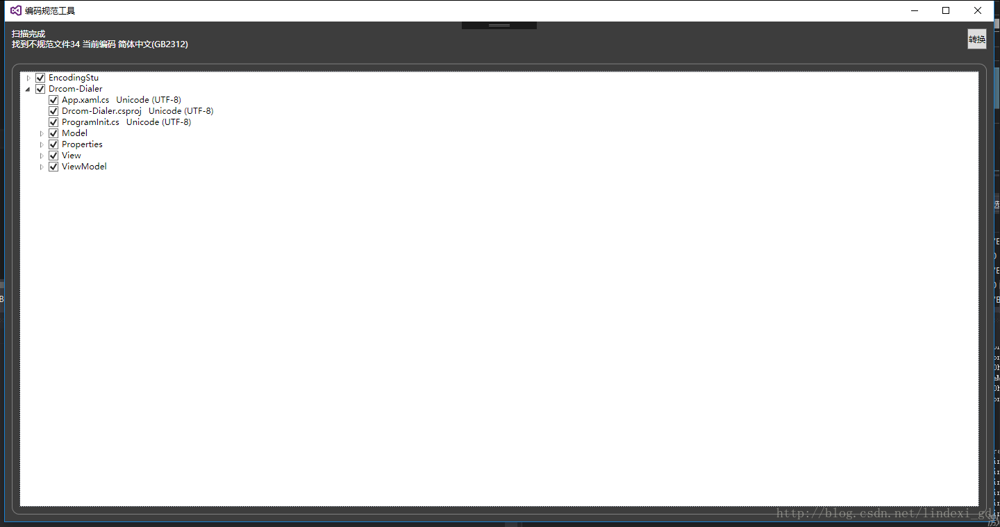

# VisualStudio 编码规范工具 2.6 修改当前文件编码

我的 VisualStudio 插件工具支持修改文件编码，在开发的时候会遇到有逗比小伙伴上传文件使用的是 GBK 编码，他在代码里面使用字符串作为界面显示，于是在用户看到就是乱码

在 VisualStudio 2015 可以另存文件指定编码，而在 VisualStudio 2019 的时候就需要借助外部工具才能转换文件编码

<!--more-->
<!-- CreateTime:2019/4/6 15:31:53 -->

<!-- csdn -->

## 编码检测和修改工具

### 插件使用

请到[VisualStudio 插件商店](https://marketplace.visualstudio.com/items?itemName=lindexigd.vs-extension-18109) 下载最新版本的[编码检测和修改工具](https://marketplace.visualstudio.com/items?itemName=lindexigd.vs-extension-18109) 或通过 VisualStudio 的插件安装

<!--  -->

双击下载的插件进行安装，安装完成之后，如果是 VisualStudio 2017 可以在菜单栏看到菜单

如果是 VisualStudio 2019 需要在二级菜单才能看到菜单

<!--  -->

### 修改当前文件编码

在 2.6 版本新添加的功能是修改当前打开的文件的编码，即使这个文件不在当前的项目里面

因为现在没有一个方法可以知道一个文件是什么编码，所以可以在插件自己手动选当前文件的编码，这样可以解决识别编码错误

选择当前的文件的编码，和需要转换的文件的编码，然后点击 Convert 就可以转换了

<!--  -->

现在能支持的转换的编码是带符号的 Utf-8 和 GBK 编码

### 设置

点击菜单 EncodingNormailzer ，选择 Setting 可以看到下面界面

<!--  -->

首先是可以忽略一些文件或文件夹，默认是忽略一些不是文本的文件和 bin、obj、git文件夹，注意，千万不要去转换 git 文件夹的代码。

然后我们可以设置编码，现在做的是 Utf8 、GBK、Unicode的编码，如果检测工程存在文件的编码和我们设置的不一样，就会提示去转换。

因为 Ascii 的文件，存放为 GBK 和 UTF8不带签名是无法区分的，所以忽略 ASCII 编码文件。

因为对 Unicode-16 的文件是无法使用判断存在 '\0' 来区分文件是不是文本，所以，对于某些文件还是自己手动添加是否一定检测，对于没有被添加到一定需要检测的文件，先判断他是不是文本，如果是的话，就检测。

设置保存在 `我的文档\EncodingNormalizer\Account.json` 文件

### 检查编码

然后在打开完工程，注意要加载完成才使用。

点击 Conform solution encoding ，自动检测方案所有工程的文件编码，如果发现所有的编码都符合规范，那么弹出窗口说所有文件都符合规范。如果有文件不符合规范，那么提示用户是否转换。

<!--  -->

找到所有不符合规范的文件，可以一键点击转换

<!--  -->

## 一起开发

欢迎在 [github](https://github.com/dotnet-campus/EncodingNormalior) 一起开发这个工具

有任何建议和吐槽欢迎在 github 评论

 本作品采用<a rel="license" href="http://creativecommons.org/licenses/by-nc-sa/4.0/">知识共享署名-非商业性使用-相同方式共享 4.0 国际许可协议</a>进行许可。欢迎转载、使用、重新发布，但务必保留文章署名[林德熙](http://blog.csdn.net/lindexi_gd)(包含链接:http://blog.csdn.net/lindexi_gd )，不得用于商业目的，基于本文修改后的作品务必以相同的许可发布。如有任何疑问，请与我[联系](mailto:lindexi_gd@163.com)。
