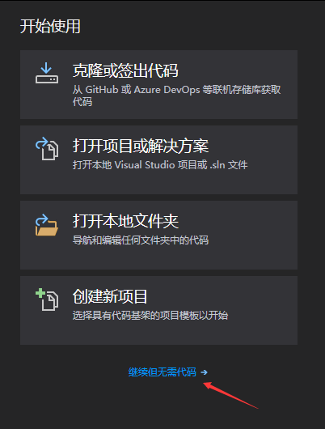
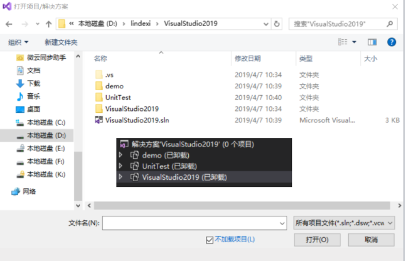
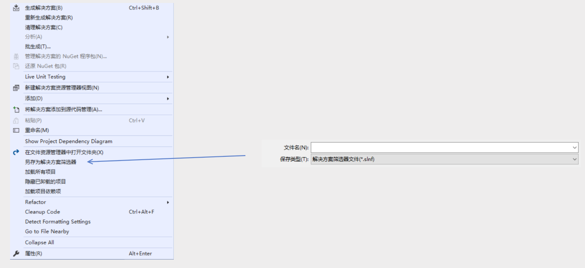
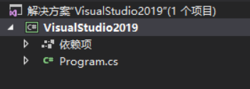
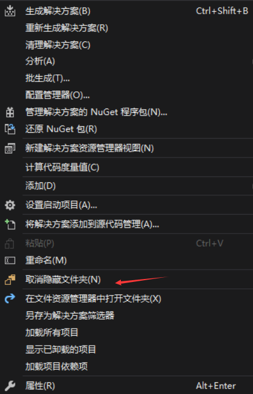

# VisualStudio 解决方案筛选器 slnf 文件

在 VisualStudio 2019 发布的时候，有一个强大的功能是不加载项目打开提升性能，此时可以用到解决方案筛选器 slnf 文件。这个文件将会带来很大的性能提升。本文将会详细告诉大家这个文件的格式以及带来的好处

<!--more-->
<!-- CreateTime:2019/11/29 8:41:13 -->

<!-- csdn -->

在上古时代，我有一个大项目，这个大项目里面有很多单元测试和呆魔，我每次打开这个项目的时候都需要等半天。

于是想到的解决方法是创建两个 sln 文件，一个是作为核心的项目，另一个是核心项目加上测试和呆魔，如果只是需要开发，那么就打开核心的项目。如果是需要同时进行测试什么的，就可以打开另一个带单元测试的项目。

但是这样玩存在一个坑就是小伙伴只是在一个项目添加了新的项目，但是忘了在另一个项目里面添加，于是就会发现发布的版本和实际开发的版本的功能不相同。如果是核心的项目还好，编译不通过，如果是扩展就只有在测试的时候才发现没有这个功能。

于是我就被拉出去了，好在我的小伙伴 walterlv 大大用了这个科技 [VS 编译太慢了吗？新建解决方案配置关闭一部分项目的编译](https://blog.walterlv.com/post/skip-building-using-solution-configuration.html ) 这样就可以提升编译的速度，在编译的时候会忽略测试或呆魔等

但是 walterlv 还没解决我的问题，我在打开工程的时候，还是需要等待 VisualStudio 加载单元测试项目，还是需要等很久。

好在 VisualStudio 2019 有了解决方案筛选器这个功能，这个功能是如何玩的？

在 VisualStudio 2019 新的欢迎界面，有了不加载项目的选择，于是就可以不加载项目打开

<!--  -->


这时打开的项目都是不加载的，虽然打开很快，但是我需要手动加载我需要使用的项目。如果每个小伙伴都需要这样手动加载，估计我又会被拉出去

<!--  -->


在 VisualStudio 2019 可以在第一次手动加载需要的项目之后保存解决方案筛选器 slnf 文件，当然不需要每个项目都点击重新加载，定义指定一个高层的项目，右击点击加载依赖项目，于是所有被他依赖的项目都会加载

<!--  -->


下次小伙伴直接打开 slnf 文件的时候就可以看到只有我上次加载的项目，其他的项目默认是隐藏的

<!--  -->


如果小伙伴忽然需要某个项目，可以右击显示隐藏的项目

<!--  -->


那么使用 slnf 文件有什么好处？

上面说到的，可以加载只需要的项目，于是打开项目的速度很快。同时支持显示隐藏的项目，在大多数的开发都可以使用自己需要的项目，但是在临时需要其他项目的时候也可以右击加载。

那么对比多个 sln 文件的好处就是，多个 sln 可能有小伙伴忘记在多个项目添加项目，而 slnf 文件是依赖于指定的 sln 文件，所以只需要往 sln 或 slnf 里面添加一次项目就可以了。

如我在 sln 项目里面添加了呆魔项目，那么我只需要点击全保存，更新 sln 文件，然后在到 slnf 项目里面就可以看到提示项目已经修改，是否重新加载。点击重新就在就可以看到刚才加入的呆魔项目了。

反过来，如果我在 slnf 项目里面添加一个项目，在点击保存的时候也会在 sln 项目提示重新加载此时就可以看到添加的项目

那么这是如何做到的，下面告诉大家 slnf 的项目文件格式，这是一个 Json 文件，这个 Json 文件里面记录了依赖的 sln 文件和需要过滤打开的项目的相对路径，如我的一个 slnf 文件就是这样

```csharp
{
  "solution": {
    "path": "VisualStudio2019.sln",
    "projects": [
      "VisualStudio2019\\VisualStudio2019.csproj"
    ]
  }
}
```

这个 slnf 文件依赖于 VisualStudio2019.sln 文件，于是所有的添加项目或移除项目实际上是对 VisualStudio2019.sln 文件进行添加或移除项目，不会修改 slnf 文件，于是就可以同步修改一次，不会因为有多个项目忘记添加

同时记录了需要加载的项目的相对路径，这样就可以在启动的时候只加载需要的项目而不需要去读取分析 sln 文件，只有在右击显示隐藏的项目的时候才读取分析 sln 文件找到其他的项目

通过 slnf 文件可以加载只需要的项目，同时解决多个 sln 文件添加项目的同步问题，提升了项目文件打开的性能和编译性能

更多的新功能请看 [VisualStudio 2019 新特性](https://blog.lindexi.com/post/VisualStudio-2019-%E6%96%B0%E7%89%B9%E6%80%A7.html )

[Load a subset of projects - Visual Studio](https://docs.microsoft.com/en-us/visualstudio/ide/filtered-solutions?view=vs-2019 )

<a rel="license" href="http://creativecommons.org/licenses/by-nc-sa/4.0/"></a><br />本作品采用<a rel="license" href="http://creativecommons.org/licenses/by-nc-sa/4.0/">知识共享署名-非商业性使用-相同方式共享 4.0 国际许可协议</a>进行许可。欢迎转载、使用、重新发布，但务必保留文章署名[林德熙](http://blog.csdn.net/lindexi_gd)(包含链接:http://blog.csdn.net/lindexi_gd )，不得用于商业目的，基于本文修改后的作品务必以相同的许可发布。如有任何疑问，请与我[联系](mailto:lindexi_gd@163.com)。
